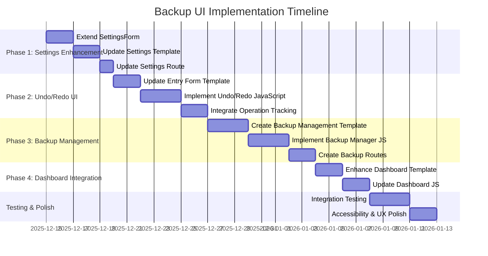

# Backup UI Implementation Plan
## Executive Summary

This document outlines the implementation plan for the missing user interface components of the Lexicographic Curation Workbench backup system. While the backend services and API endpoints are fully implemented, the frontend components for backup management, undo/redo functionality, and settings configuration are missing.

## Current State Analysis

### Implemented Components ✅
- **Backend Services**: OperationHistoryService, BaseXBackupManager, BackupScheduler
- **API Endpoints**: Complete REST API under `/api/backup/*`
- **Dashboard Status**: Basic "Last Backup" indicator in system status
- **Tests**: Comprehensive test coverage for all backend components

### Missing UI Components ❌
1. **Backup Settings in Settings Dialog**: No configuration options for backup behavior
2. **Undo/Redo Controls in Entry Form**: No buttons or tooltips for operation history
3. **Backup Management Interface**: No dedicated UI for backup operations
4. **Operation History Viewer**: No visual representation of undo/redo operations

## Implementation Phases

### Phase 1: Settings Dialog Enhancement (Week 1)

#### 1.1 Extend SettingsForm
**File**: `app/forms/settings_form.py`
- Add backup directory field
- Add automatic backup schedule selector
- Add backup retention policy field
- Add backup compression options

**Form Fields**:
```python
backup_directory = StringField('Backup Directory', validators=[Optional(), Regexp(r'^/.*')])
auto_backup_schedule = SelectField('Auto Backup Schedule',
    choices=[('disabled', 'Disabled'), ('hourly', 'Hourly'), ('daily', 'Daily'), ('weekly', 'Weekly')])
backup_retention = IntegerField('Keep Backups', default=10, validators=[NumberRange(min=1, max=100)])
backup_compression = BooleanField('Compress Backups', default=True)
```

#### 1.2 Update Settings Template
**File**: `app/templates/settings.html`
- Add "Backup Settings" fieldset
- Include form fields with proper validation
- Add tooltips explaining backup options
- Update current settings overview to show backup configuration

#### 1.3 Settings Route Updates
**File**: `app/routes/settings_routes.py`
- Update form handling to include backup settings
- Add validation for backup directory paths
- Save backup settings to configuration

### Phase 2: Entry Form Undo/Redo Controls (Week 2)

#### 2.1 Entry Form Template Updates
**File**: `app/templates/entry_form.html`
- Add undo/redo button group near save buttons
- Include tooltips showing operation descriptions
- Add operation history dropdown
- Position buttons for optimal UX

**Button Implementation**:
```html
<div class="btn-group me-2" role="group" aria-label="Undo/Redo controls">
    <button type="button" id="undo-btn" class="btn btn-outline-secondary"
            title="Undo last operation" disabled>
        <i class="fas fa-undo"></i> Undo
    </button>
    <button type="button" id="redo-btn" class="btn btn-outline-secondary"
            title="Redo last undone operation" disabled>
        <i class="fas fa-redo"></i> Redo
    </button>
    <div class="dropdown">
        <button class="btn btn-outline-secondary dropdown-toggle" type="button"
                id="operationHistoryDropdown" data-bs-toggle="dropdown" aria-expanded="false">
            <i class="fas fa-history"></i>
        </button>
        <ul class="dropdown-menu" aria-labelledby="operationHistoryDropdown" id="operation-history-list">
            <li><a class="dropdown-item disabled">No operations yet</a></li>
        </ul>
    </div>
</div>
```

#### 2.2 JavaScript Integration
**File**: `app/static/js/entry-form-undo-redo.js` (new)
- Implement undo/redo button handlers
- Fetch operation history on form load
- Update button states and tooltips dynamically
- Handle operation conflicts and validation errors

**Key Functions**:
```javascript
async function loadOperationHistory() {
    const response = await fetch('/api/backup/operations');
    const data = await response.json();
    updateUndoRedoButtons(data);
}

async function performUndo() {
    const response = await fetch('/api/backup/operations/undo', { method: 'POST' });
    if (response.ok) {
        await loadOperationHistory();
        // Reload form data or update UI
        location.reload();
    }
}
```

#### 2.3 Operation Tracking Integration
- Integrate with existing form submission to record operations
- Track field-level changes for granular undo/redo
- Handle complex operations (merge/split) appropriately

### Phase 3: Backup Management Interface (Week 3)

#### 3.1 Backup Management Template
**File**: `app/templates/backup_management.html` (new)
- Backup history table with sorting and filtering
- Manual backup creation form
- Scheduled backup management
- Backup validation and restore options

**Template Structure**:
```html



<div class="container mt-4">
    <h2 class="mb-4"><i class="fas fa-shield-alt"></i> Backup Management</h2>

    <!-- Manual Backup Section -->
    <div class="card mb-4">
        <div class="card-header">
            <h5><i class="fas fa-plus-circle"></i> Create Manual Backup</h5>
        </div>
        <div class="card-body">
            <form id="manual-backup-form">
                <div class="row">
                    <div class="col-md-6">
                        <label for="backup-description" class="form-label">Description</label>
                        <input type="text" class="form-control" id="backup-description"
                               placeholder="Optional description for this backup">
                    </div>
                    <div class="col-md-3">
                        <label for="backup-type" class="form-label">Type</label>
                        <select class="form-select" id="backup-type">
                            <option value="full">Full Backup</option>
                            <option value="incremental">Incremental</option>
                        </select>
                    </div>
                    <div class="col-md-3 d-flex align-items-end">
                        <button type="submit" class="btn btn-primary w-100">
                            <i class="fas fa-save"></i> Create Backup
                        </button>
                    </div>
                </div>
            </form>
        </div>
    </div>

    <!-- Backup History Table -->
    <div class="card">
        <div class="card-header d-flex justify-content-between align-items-center">
            <h5><i class="fas fa-history"></i> Backup History</h5>
            <button class="btn btn-outline-secondary btn-sm" id="refresh-backups">
                <i class="fas fa-sync-alt"></i> Refresh
            </button>
        </div>
        <div class="card-body">
            <div class="table-responsive">
                <table class="table table-striped" id="backup-history-table">
                    <thead>
                        <tr>
                            <th>Date</th>
                            <th>Type</th>
                            <th>Size</th>
                            <th>Description</th>
                            <th>Status</th>
                            <th>Actions</th>
                        </tr>
                    </thead>
                    <tbody id="backup-history-body">
                        <!-- Populated by JavaScript -->
                    </tbody>
                </table>
            </div>
        </div>
    </div>
</div>

```

#### 3.2 Backup Management JavaScript
**File**: `app/static/js/backup-manager.js` (new)
- Load and display backup history
- Handle manual backup creation
- Implement backup validation and restore
- Manage scheduled backups

#### 3.3 Backup Management Route
**File**: `app/routes/backup_routes.py` (new)
- Route for backup management page
- Handle backup operations via web interface
- Integrate with existing API endpoints

### Phase 4: Dashboard Integration ✅ COMPLETED (Week 4)

#### 4.1 Enhanced Dashboard Status ✅ COMPLETED
**File**: `app/templates/index.html`
- ✅ Expand system status section with backup details
- ✅ Add quick backup creation button
- ✅ Show backup health indicators

#### 4.2 Dashboard JavaScript Updates ✅ COMPLETED
**File**: `app/static/js/dashboard.js`
- ✅ Real-time backup status updates
- ✅ Quick backup functionality
- ✅ Backup health monitoring alerts

#### 4.3 Navigation Integration ✅ COMPLETED
**File**: `app/templates/base.html`
- ✅ Added Backup Management link to Tools dropdown menu

## Technical Implementation Details

### API Integration Points
- **Operation History**: `GET /api/backup/operations`, `POST /api/backup/operations/undo`, `POST /api/backup/operations/redo`
- **Backup Management**: `POST /api/backup/create`, `GET /api/backup/history`, `POST /api/backup/restore/<id>`
- **Settings**: Existing settings API with backup configuration

### UI/UX Considerations
- **Accessibility**: Proper ARIA labels, keyboard navigation, screen reader support
- **Responsive Design**: Mobile-friendly layouts for all components
- **Loading States**: Progress indicators for long-running operations
- **Error Handling**: User-friendly error messages and recovery options
- **Confirmation Dialogs**: Safeguards for destructive operations

### Testing Strategy
- **Unit Tests**: Form validation, JavaScript functions
- **Integration Tests**: End-to-end backup workflows
- **E2E Tests**: Playwright tests for complete user journeys
- **Accessibility Tests**: Screen reader and keyboard navigation

### Success Criteria
- ✅ Backup settings configurable in Settings dialog
- ✅ Undo/redo buttons functional in entry form with descriptive tooltips
- ✅ Backup management interface allows manual backup creation and history viewing
- ✅ Dashboard shows comprehensive backup status with quick backup functionality
- ✅ Navigation includes Backup Management link in Tools menu
- ✅ All UI components are accessible and responsive
- ✅ Integration tests pass for all backup workflows

## Implementation Timeline



## Resources Required
- **Frontend Development**: HTML, CSS, JavaScript (ES6+)
- **Flask Templates**: Jinja2 templating
- **Bootstrap 5**: UI framework already in use
- **Font Awesome**: Icons already available
- **Testing**: Playwright for E2E, pytest for integration

## Risk Mitigation
- **Incremental Implementation**: Each phase can be tested independently
- **Backward Compatibility**: All changes maintain existing functionality
- **Error Handling**: Comprehensive error handling prevents data loss
- **User Feedback**: Clear messaging for all operations and states

This implementation plan provides a comprehensive roadmap for completing the backup system UI, ensuring users have full control over backup operations and operation history management.</content>
<parameter name="filePath">/mnt/d/Dokumenty/slownik-wielki/flask-app/BACKUP_UI_IMPLEMENTATION_PLAN.md