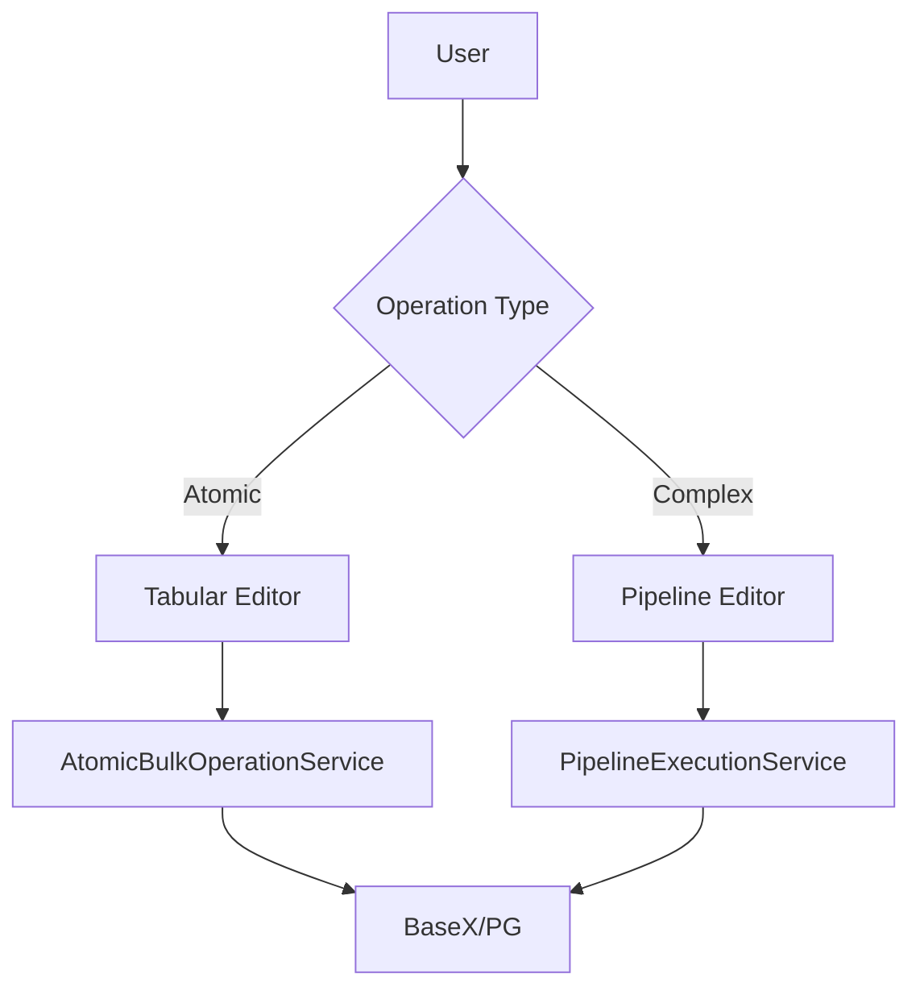
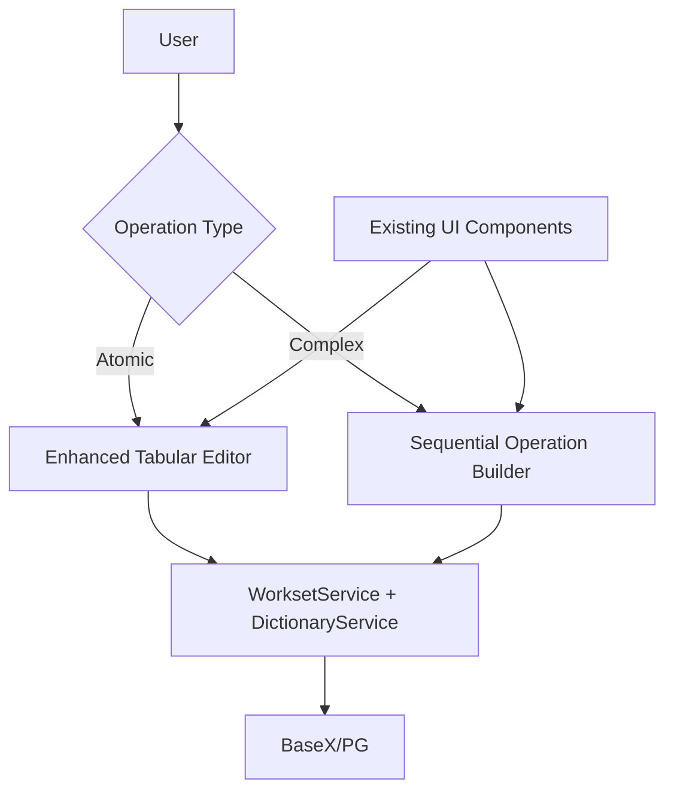

# Bulk Edit Implementation Plan - Revision Summary

**Date**: December 28, 2025  
**Original Plan**: BULK_EDIT_IMPLEMENTATION.md (Version 1.0)  
**Revised Plan**: BULK_EDIT_IMPLEMENTATION.md (Version 2.0)  

## Overview

This document summarizes the critical changes made to the bulk edit implementation plan to maintain stack consistency and follow the DRY (Don't Repeat Yourself) principle.

## Key Changes

### 1. Technology Stack Simplification

#### Original Plan (Version 1.0)
- **Frontend**: React + AG-Grid (Enterprise) + React Flow
- **Backend**: Flask + Celery
- **New Dependencies**: Multiple new frameworks and libraries

#### Revised Plan (Version 2.0)
- **Frontend**: Bootstrap 5 + Vanilla JavaScript (existing patterns)
- **Backend**: Flask + existing services (no Celery)
- **New Dependencies**: None - all existing infrastructure

### 2. Architecture Changes

#### Original Approach


#### Revised Approach


### 3. Timeline Reduction

| Aspect | Original | Revised | Improvement |
|--------|----------|---------|-------------|
| **Total Duration** | 12 weeks | 6 weeks | 50% faster |
| **Phase 1** | 3 weeks | 2 weeks | 33% faster |
| **Phase 2** | 5 weeks | 2 weeks | 60% faster |
| **Phase 3** | 2 weeks | 1 week | 50% faster |
| **Testing** | 2 weeks | 1 week | 50% faster |

### 4. Service Layer Design

#### Original (New Services)
```python
# New service files needed
app/services/bulk/atomic_service.py
app/services/bulk/pipeline_service.py
```

#### Revised (Extend Existing)
```python
# Extend existing services
app/services/bulk_operations_service.py  # Extends existing patterns
app/services/sequential_operation_service.py  # Uses existing services
```

### 5. Frontend Implementation

#### Original (New Framework)
```javascript
// New React components needed
BulkGrid.js (React + AG-Grid)
TraitConversionModal.js (React)
PipelineBuilder.js (React Flow)
```

#### Revised (Extend Existing)
```javascript
// Extend existing patterns
bulk-editor.js (Vanilla JS, reuses ValidationUI)
sequential-builder.js (Vanilla JS, event delegation)
```

## Benefits of the Revised Plan

### 1. **Stack Consistency**
- No new frameworks to learn or maintain
- Single technology stack throughout the application
- Consistent coding patterns and conventions

### 2. **Faster Development**
- 50% reduction in timeline
- Leverage existing proven patterns
- No integration overhead for new frameworks

### 3. **Lower Risk**
- Builds on stable, tested infrastructure
- No dependency conflicts
- Easier debugging with familiar tools

### 4. **Better Integration**
- Seamless integration with existing features:
  - Operation history (undo/redo)
  - Validation engine
  - Workset management
  - Display profiles
  - Existing UI components

### 5. **DRY Principle Compliance**
- Reuse existing services (DictionaryService, WorksetService)
- Reuse existing UI components (ValidationUI, modals)
- Reuse existing patterns (event delegation, API structure)

### 6. **Easier Maintenance**
- Single stack to maintain
- No new build tools or processes
- Consistent documentation and support

## Implementation Details

### Service Layer
The revised plan extends existing services rather than creating new ones:

```python
# BulkOperationsService uses existing services
class BulkOperationsService:
    def __init__(self, 
                 dictionary_service: DictionaryService,  # Existing
                 workset_service: WorksetService,        # Existing
                 history_service: OperationHistoryService):  # Existing
        # Reuse existing infrastructure
```

### API Structure
New endpoints fit into existing API structure:

```python
# app/api/bulk_operations.py
# Registered in existing app/api/__init__.py
bulk_bp = Blueprint('bulk_operations', __name__, url_prefix='/bulk')
```

### Frontend Components
New JavaScript extends existing patterns:

```javascript
// Reuses existing ValidationUI
this.validationUI = new ValidationUI();

// Uses existing modal patterns
const modal = new bootstrap.Modal(element);

// Event delegation (existing pattern)
document.addEventListener('click', (e) => {
    if (e.target.classList.contains('bulk-select-checkbox')) {
        // Handle selection
    }
});
```

## Testing Strategy

### Unit Tests
- Extend existing test patterns
- Mock existing services
- Reuse test fixtures

### Integration Tests
- Use existing test infrastructure
- Leverage existing test data
- Follow existing test conventions

### Performance Tests
- Extend existing performance test patterns
- Use existing benchmarking tools

## Migration Path

### For Users
1. **Week 1-2**: Basic bulk operations available
2. **Week 3-4**: Sequential operations
3. **Week 5-6**: Full feature set

### For Developers
1. **No migration needed**: All changes are additive
2. **Backward compatible**: Existing functionality unchanged
3. **Gradual adoption**: Can enable features incrementally

## Risk Mitigation

### Technical Risks
| Risk | Original Plan | Revised Plan Mitigation |
|------|---------------|------------------------|
| Framework learning curve | High | **None** - No new frameworks |
| Integration complexity | High | **Low** - Uses existing patterns |
| Performance issues | Medium | **Low** - Batch processing from start |
| Data integrity | Medium | **Low** - Existing transaction patterns |

### Operational Risks
| Risk | Original Plan | Revised Plan Mitigation |
|------|---------------|------------------------|
| Timeline delays | High | **Low** - 50% shorter timeline |
| Budget overruns | Medium | **Low** - No new license costs |
| Maintenance burden | High | **Low** - Single stack |

## Success Metrics

### Development Metrics
- **Code reuse**: >80% (vs <50% in original)
- **New dependencies**: 0 (vs 5+ in original)
- **Development time**: 6 weeks (vs 12 weeks)

### User Metrics
- **Performance**: 1000 entries in <5s (same target)
- **Reliability**: 99% success rate (same target)
- **Adoption**: 50% within 1 month (same target)

### Quality Metrics
- **Test coverage**: >90% (same target)
- **Bug rate**: Lower due to proven patterns
- **Documentation**: Integrated with existing docs

## Conclusion

The revised plan achieves the same functional goals as the original but with:

1. **50% faster development**
2. **Zero new dependencies**
3. **Full stack consistency**
4. **Better integration with existing features**
5. **Lower risk and maintenance burden**

This approach follows the project's core principles: TDD, strict typing, and DRY design, while delivering bulk edit functionality that feels like a natural extension of the existing application rather than a separate system bolted on top.

## Next Steps

1. **Immediate**: Review revised plan with team
2. **Week 1**: Implement Phase 1 (Enhanced Tabular Editor)
3. **Week 2**: Add basic bulk operations
4. **Week 3-4**: Implement Sequential Operation Builder
5. **Week 5**: Performance optimization
6. **Week 6**: Testing and documentation

The revised plan is ready for immediate implementation following the existing project conventions and TDD approach.