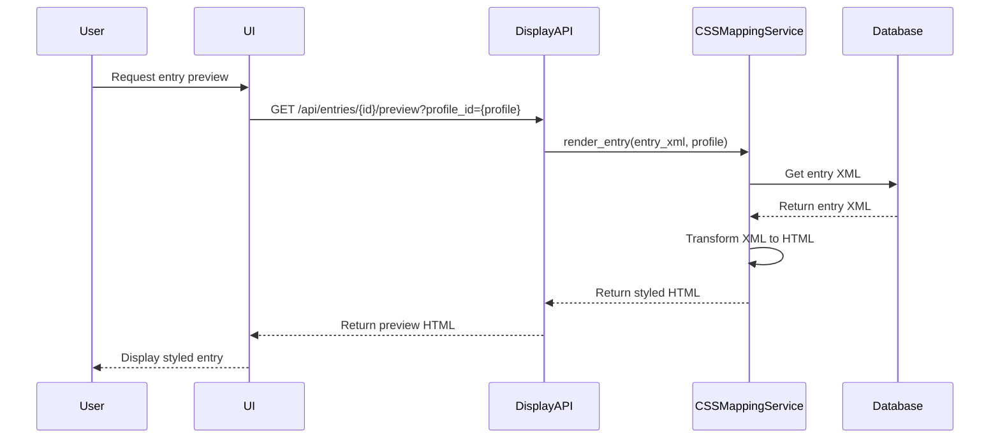

# CSS-Based Editor Implementation Plan for Display API

## Current State Analysis

Based on my analysis of the codebase, I've identified the following existing components:

### Existing Infrastructure
1. **Display Profile System**: Already implemented with:
   - `app/models/display_profile.py` - DisplayProfile model
   - `app/services/css_mapping_service.py` - CSSMappingService with basic CRUD operations
   - `app/api/display.py` - API endpoints for profile management
   - `tests/integration/test_display_api.py` - Test suite (currently skipped)

2. **CSS Mapping Specification**: Comprehensive documentation in:
   - `docs/css_specification_plan.md` - Detailed specification for LIFT-to-CSS mapping
   - `specs/css_mapping_system/tasks.md` - Implementation tasks

3. **Current Limitations**:
   - Display API tests are skipped (not implemented)
   - CSS mapping service has placeholder implementation
   - No visual editor UI exists yet
   - No integration with entry visualization

## Implementation Plan

### Phase 1: Complete Display API Implementation

#### 1.1 Enhance CSS Mapping Service
**Files to create/modify**:
- `app/services/css_mapping_service.py` - Complete the `render_entry()` method
- `app/utils/lift_to_html_transformer.py` - New XML-to-HTML transformation engine
- `app/utils/css_profile_parser.py` - Profile parsing and validation

**Implementation Details**:
```python
# Enhanced render_entry method
def render_entry(self, entry_xml: str, profile: DisplayProfile) -> str:
    """Transform LIFT XML to styled HTML using display profile."""
    # Parse XML
    root = ET.fromstring(entry_xml)

    # Apply profile transformations
    html_builder = HTMLBuilder(profile)

    # Process elements according to profile order
    for element_config in sorted(profile.elements, key=lambda x: x.display_order):
        html_builder.process_element(root, element_config)

    return html_builder.get_html()
```

#### 1.2 Complete Display API Endpoints
**Files to modify**:
- `app/api/display.py` - Implement missing endpoints
- Add preview endpoint: `GET /api/entries/{id}/preview?profile_id={profile_id}`

#### 1.3 Create Default CSS Styles
**Files to create**:
- `app/static/css/dictionary.css` - Default styling
- `app/static/css/print-export.css` - Print-specific styles
- `app/static/css/kindle-export.css` - Kindle-compatible styles

### Phase 2: CSS-Based Visual Editor

#### 2.1 Admin Interface for Profile Management
**Files to create**:
- `app/templates/admin/display_profiles.html` - Main editor template
- `app/static/js/display_profile_editor.js` - Interactive editor
- `app/routes/admin_routes.py` - Admin route handlers

**Editor Features**:
- Drag-and-drop element reordering
- CSS class assignment interface
- Live preview pane
- Profile save/load functionality

#### 2.2 Element Configuration System
**Files to create**:
- `app/api/lift_schema.py` - LIFT element metadata API
- `app/utils/element_registry.py` - LIFT element registry

**Element Configuration**:
```json
{
  "lift_element": "lexical-unit",
  "display_order": 1,
  "css_class": "headword",
  "prefix": "",
  "suffix": "",
  "visibility": "always",
  "children": []
}
```

### Phase 3: Entry Visualization Integration

#### 3.1 Visual Entry Preview System
**Files to create**:
- `app/templates/entry_preview.html` - Preview template
- `app/static/js/entry_visualizer.js` - Interactive visualizer

#### 3.2 CSS Profile Selection
**Files to modify**:
- `app/templates/entry_form.html` - Add profile selector
- `app/views.py` - Add profile context to entry views

### Phase 4: Advanced Features

#### 4.1 Structural Grouping Logic
**Files to create**:
- `app/utils/entry_grouping.py` - Root-based entry grouping
- `app/utils/relation_analyzer.py` - Relation-based structure analysis

#### 4.2 Export Integration
**Files to modify**:
- `app/services/export_service.py` - Use CSS profiles for exports
- `app/utils/kindle_optimizer.py` - Kindle-specific CSS optimization

## Technical Architecture

### Component Diagram
```mermaid
classDiagram
    class DisplayProfile {
        +profile_id: str
        +profile_name: str
        +view_type: str
        +elements: List[ElementConfig]
        +dict() Dict[str, Any]
    }

    class CSSMappingService {
        +create_profile(profile_data: Dict) DisplayProfile
        +get_profile(profile_id: str) DisplayProfile
        +list_profiles() List[DisplayProfile]
        +update_profile(profile_id: str, update_data: Dict) DisplayProfile
        +delete_profile(profile_id: str) bool
        +render_entry(entry_xml: str, profile: DisplayProfile) str
    }

    class DisplayAPI {
        +POST /api/display-profiles
        +GET /api/display-profiles/{id}
        +GET /api/display-profiles
        +PUT /api/display-profiles/{id}
        +DELETE /api/display-profiles/{id}
        +GET /api/entries/{id}/preview
    }

    class DisplayProfileEditor {
        +load_profiles()
        +save_profile(profile: DisplayProfile)
        +render_preview(entry_id: str, profile: DisplayProfile)
        +update_element_order(new_order: List[str])
    }

    DisplayProfile "1" -- "1" CSSMappingService : uses
    CSSMappingService "1" -- "1" DisplayAPI : exposed via
    DisplayProfileEditor "1" -- "1" CSSMappingService : uses
    DisplayProfileEditor "1" -- "1" DisplayAPI : calls
```

### Data Flow


## Implementation Timeline

### Week 1: Core Services
- [ ] Complete CSSMappingService implementation
- [ ] Implement LIFT-to-HTML transformation
- [ ] Create default CSS stylesheets
- [ ] Implement all Display API endpoints

### Week 2: Admin Interface
- [ ] Build profile management UI
- [ ] Implement drag-and-drop reordering
- [ ] Create live preview functionality
- [ ] Add profile CRUD operations

### Week 3: Integration & Testing
- [ ] Integrate with entry visualization
- [ ] Add profile selection to entry forms
- [ ] Implement structural grouping logic
- [ ] Write comprehensive tests

### Week 4: Advanced Features
- [ ] Export system integration
- [ ] Kindle optimization
- [ ] Performance tuning
- [ ] Documentation

## Key Technical Decisions

1. **Storage**: Use JSON files for initial implementation, migrate to PostgreSQL later
2. **XML Processing**: Use `lxml` for robust XML parsing and transformation
3. **CSS Framework**: Bootstrap 5 as base, custom CSS for dictionary-specific styling
4. **UI Framework**: Vanilla JavaScript with SortableJS for drag-and-drop
5. **Preview System**: Client-side rendering with server-generated HTML

## Risk Assessment

1. **Complexity Risk**: XML-to-HTML transformation may be complex
   - Mitigation: Start with simple elements, gradually add complexity

2. **Performance Risk**: Large entries may cause rendering delays
   - Mitigation: Implement caching and incremental rendering

3. **Compatibility Risk**: CSS may not work across all export formats
   - Mitigation: Create format-specific CSS processors

## Next Steps

1. Complete the CSSMappingService implementation
2. Build the admin interface for profile management
3. Integrate with existing entry display system
4. Create comprehensive test suite
5. Document the system for users and developers