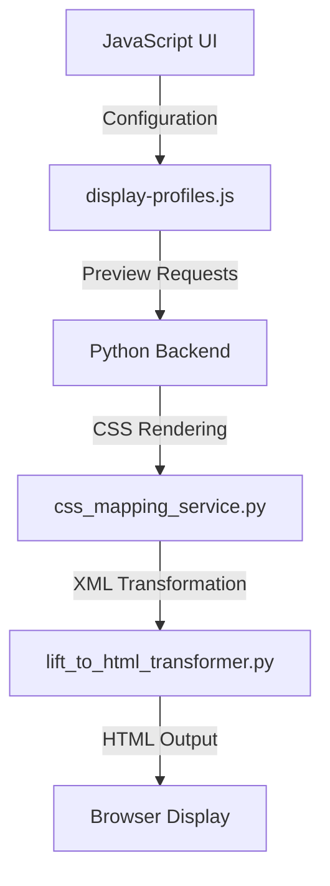
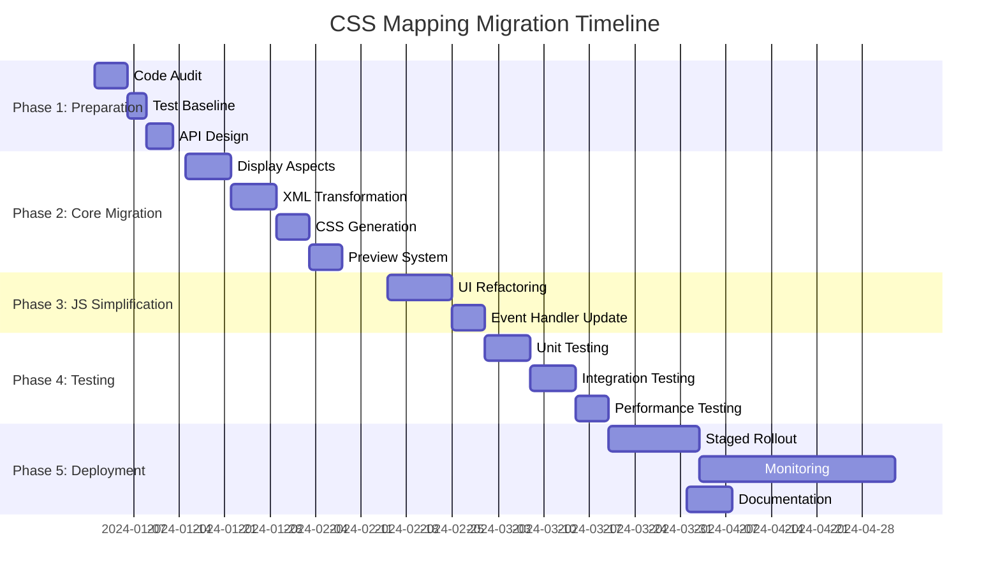

# JavaScript to Python CSS Mapping Migration Plan

## Executive Summary

This document outlines a comprehensive plan to migrate CSS mapping functionality from JavaScript to Python backend, addressing the current code duplication and maintenance challenges while ensuring Display Profile integration remains robust.

## Current State Analysis

### Problems Identified

1. **Code Duplication**: CSS mapping logic exists in both JavaScript (`display-profiles.js`) and Python (`css_mapping_service.py`)
2. **Maintenance Complexity**: Changes require updates in multiple places
3. **Testing Challenges**: Cross-layer dependencies make testing difficult
4. **Inconsistent Behavior**: Potential for divergence between client and server implementations
5. **Performance Issues**: Complex JavaScript processing on client devices

### Current Architecture



## Migration Goals

### Primary Objectives

1. **Unified Logic**: Consolidate all CSS mapping logic in Python backend
2. **Simplified Maintenance**: Single source of truth for mapping rules
3. **Improved Performance**: Server-side processing for complex operations
4. **Enhanced Testability**: Comprehensive Python testing framework
5. **Backward Compatibility**: Maintain existing UI functionality during transition

### Success Criteria

- ✅ All CSS mapping logic moved to Python backend
- ✅ JavaScript reduced to essential UI interactions only
- ✅ Display Profile integration maintained
- ✅ Performance metrics meet or exceed current levels
- ✅ Comprehensive test coverage achieved
- ✅ Documentation updated for new architecture

## Implementation Plan

### Phase 1: Preparation and Planning (Week 1-2)

**Tasks:**
- [ ] Conduct thorough code audit of current implementation
- [ ] Document all JavaScript functions that need migration
- [ ] Create comprehensive test suite for current functionality
- [ ] Establish performance benchmarks
- [ ] Design new API endpoints for CSS operations
- [ ] Set up monitoring for migration progress

**Deliverables:**
- Current state documentation
- Test coverage baseline
- API specification document
- Performance benchmarks

### Phase 2: Core Migration (Week 3-6)

**Step 1: Display Aspect Resolution (Week 3)**
- Migrate `apply_display_aspects()` method enhancements
- Consolidate abbreviation/label/full logic
- Implement comprehensive range mapping
- Add unit tests for all display aspects

**Step 2: XML Transformation (Week 4)**
- Enhance `lift_to_html_transformer.py` with JavaScript features
- Add hierarchical processing improvements
- Implement element filtering and grouping
- Add comprehensive test coverage

**Step 3: CSS Generation (Week 5)**
- Move CSS class generation to Python
- Implement dynamic CSS injection
- Add sense numbering and subentry handling
- Create CSS validation utilities

**Step 4: Preview System (Week 6)**
- Develop new preview API endpoint
- Implement caching for preview requests
- Add performance optimization
- Create fallback mechanisms

### Phase 3: JavaScript Simplification (Week 7-8)

**Tasks:**
- [ ] Remove duplicate logic from `display-profiles.js`
- [ ] Replace complex DOM manipulation with simple UI interactions
- [ ] Update event handlers to use new API endpoints
- [ ] Implement progressive enhancement patterns
- [ ] Add loading states and error handling

**Deliverables:**
- Simplified JavaScript codebase
- Updated UI components
- Enhanced error handling
- Performance-optimized interactions

### Phase 4: Integration and Testing (Week 9-10)

**Tasks:**
- [ ] Integrate new backend with existing UI
- [ ] Conduct comprehensive integration testing
- [ ] Perform cross-browser compatibility testing
- [ ] Validate Display Profile functionality
- [ ] Test edge cases and error conditions

**Deliverables:**
- Integrated system
- Test reports
- Bug fixes
- Performance metrics

### Phase 5: Deployment and Monitoring (Week 11-12)

**Tasks:**
- [ ] Staged deployment to production
- [ ] Performance monitoring
- [ ] User feedback collection
- [ ] Bug triage and fixing
- [ ] Documentation updates

**Deliverables:**
- Production-ready system
- Monitoring dashboards
- User documentation
- Training materials

## Technical Implementation Details

### API Endpoint Design

```python
# New API endpoints to replace JavaScript functionality

@api_blueprint.route('/api/css/preview', methods=['POST'])
def preview_css_mapping():
    """
    Enhanced preview endpoint with full CSS mapping capabilities
    
    Request Body:
    {
        "entry_xml": "<lift>...</lift>",
        "profile_id": "profile-123",
        "options": {
            "show_subentries": true,
            "number_senses": true
        }
    }
    
    Response:
    {
        "html": "<div class='lift-entry'>...</div>",
        "css": ".sense::before { content: counter(sense-counter) }",
        "stats": {
            "render_time_ms": 42,
            "elements_processed": 15
        }
    }
    """
    pass

@api_blueprint.route('/api/css/validate', methods=['POST'])
def validate_css_config():
    """
    Validate CSS configuration before saving
    
    Request Body:
    {
        "profile_config": {
            "elements": [
                {
                    "lift_element": "relation",
                    "css_class": "rel-synonym",
                    "display_aspect": "label"
                }
            ]
        }
    }
    
    Response:
    {
        "valid": true,
        "warnings": [],
        "errors": []
    }
    """
    pass
```

### Python Backend Enhancements

**css_mapping_service.py Enhancements:**

```python
class EnhancedCSSMappingService(CSSMappingService):
    """Extended CSS mapping service with JavaScript functionality."""
    
    def __init__(self, *args, **kwargs):
        super().__init__(*args, **kwargs)
        self._cache = LRUCache(maxsize=100)
        self._performance_metrics = []
    
    def render_entry_with_metrics(self, entry_xml, profile, dict_service=None):
        """Render entry with performance metrics and caching."""
        cache_key = (entry_xml, profile.profile_id) if profile else entry_xml
        
        if cache_key in self._cache:
            return self._cache[cache_key]
        
        start_time = time.time()
        result = super().render_entry(entry_xml, profile, dict_service)
        render_time = time.time() - start_time
        
        self._performance_metrics.append({
            'entry_length': len(entry_xml),
            'render_time': render_time,
            'profile': profile.name if profile else 'default'
        })
        
        self._cache[cache_key] = result
        return result
    
    def get_performance_metrics(self):
        """Get aggregated performance metrics."""
        if not self._performance_metrics:
            return {}
        
        avg_time = sum(m['render_time'] for m in self._performance_metrics) / len(self._performance_metrics)
        return {
            'average_render_time_ms': avg_time * 1000,
            'total_requests': len(self._performance_metrics),
            'fastest_ms': min(m['render_time'] for m in self._performance_metrics) * 1000,
            'slowest_ms': max(m['render_time'] for m in self._performance_metrics) * 1000
        }
```

### JavaScript Simplification

**Before (Complex):**
```javascript
// Current complex implementation in display-profiles.js
async function updatePreview() {
    const previewContainer = document.getElementById('profilePreview');
    const config = getProfileConfig();
    
    try {
        const response = await fetch('/api/profiles/preview', {
            method: 'POST',
            headers: { 'Content-Type': 'application/json' },
            body: JSON.stringify({
                elements: config.elements,
                custom_css: config.custom_css,
                show_subentries: config.show_subentries,
                number_senses: config.number_senses
            })
        });
        
        if (!response.ok) {
            const error = await response.json();
            throw new Error(error.error || 'Failed to render preview');
        }
        
        const data = await response.json();
        previewContainer.innerHTML = data.html || '<p class="text-muted">No preview available</p>';
        
    } catch (error) {
        console.error('Error updating preview:', error);
        previewContainer.innerHTML = `<p class="text-danger">Preview error: ${error.message}</p>`;
    }
}
```

**After (Simplified):**
```javascript
// Simplified version after migration
async function updatePreview() {
    const previewContainer = document.getElementById('profilePreview');
    const config = getProfileConfig();
    
    try {
        // Show loading state
        previewContainer.innerHTML = '<div class="spinner-border text-primary" role="status"></div>';
        
        // Call enhanced API endpoint
        const response = await fetch('/api/css/preview', {
            method: 'POST',
            headers: { 'Content-Type': 'application/json' },
            body: JSON.stringify(config)
        });
        
        const data = await response.json();
        
        if (data.html) {
            previewContainer.innerHTML = data.html;
            
            // Inject CSS if provided separately
            if (data.css) {
                const styleElement = document.createElement('style');
                styleElement.textContent = data.css;
                previewContainer.prepend(styleElement);
            }
        } else {
            previewContainer.innerHTML = '<p class="text-muted">No preview available</p>';
        }
        
    } catch (error) {
        console.error('Preview error:', error);
        previewContainer.innerHTML = `<div class="alert alert-warning">Preview unavailable: ${error.message}</div>`;
    }
}
```

## Testing Strategy

### Test Coverage Goals

| Component | Current Coverage | Target Coverage |
|-----------|------------------|-----------------|
| CSS Mapping Service | 65% | 95% |
| LIFT Transformer | 72% | 90% |
| Display Profiles | 58% | 85% |
| API Endpoints | 60% | 90% |
| JavaScript UI | 45% | 70% |

### Test Types

1. **Unit Tests**: Individual function testing
2. **Integration Tests**: Component interaction testing
3. **Performance Tests**: Rendering speed benchmarks
4. **Regression Tests**: Ensure no functionality lost
5. **Cross-browser Tests**: UI compatibility
6. **Load Tests**: Server capacity validation

### Sample Test Cases

```python
# Test display aspect application
def test_apply_display_aspects_with_relations():
    """Test that relation display aspects are correctly applied."""
    service = CSSMappingService()
    
    # Create test profile with relation display aspect
    profile = DisplayProfile(
        profile_id="test-profile",
        name="Test Profile",
        elements=[
            ProfileElement(
                lift_element="relation",
                display_aspect="label",
                config={"filter": "synonym,antonym"}
            )
        ]
    )
    
    # Test XML with relations
    test_xml = """
    <entry>
        <lexical-unit>
            <form><text>test</text></form>
        </lexical-unit>
        <sense>
            <relation type="synonym" ref="entry-123"/>
            <relation type="antonym" ref="entry-456"/>
            <relation type="hypernym" ref="entry-789"/>
        </sense>
    </entry>
    """
    
    result_xml, handled = service.apply_display_aspects(test_xml, profile)
    
    # Verify that filtered relations are processed
    assert "synonym" in result_xml or "Synonym" in result_xml
    assert "antonym" in result_xml or "Antonym" in result_xml
    
    # Verify that non-filtered relations are not marked as handled
    assert "hypernym" in result_xml
    assert "relation" in handled

# Test CSS generation performance
def test_css_rendering_performance():
    """Test that CSS rendering meets performance targets."""
    service = CSSMappingService()
    
    # Load a complex entry
    with open("tests/fixtures/complex_entry.xml") as f:
        complex_xml = f.read()
    
    # Create comprehensive profile
    profile = create_comprehensive_test_profile()
    
    # Measure rendering time
    start_time = time.time()
    result = service.render_entry(complex_xml, profile)
    end_time = time.time()
    
    # Should complete in under 100ms for typical entries
    assert (end_time - start_time) < 0.1
    assert len(result) > 0
    assert "<style>" in result
```

## Risk Assessment and Mitigation

### Identified Risks

| Risk | Impact | Likelihood | Mitigation Strategy |
|------|--------|------------|---------------------|
| Performance degradation | High | Medium | Implement caching, optimize algorithms, load test |
| UI responsiveness issues | Medium | High | Add loading states, implement client-side caching |
| Data consistency issues | High | Low | Comprehensive testing, transaction management |
| User resistance to change | Medium | Medium | Gradual rollout, user training, feedback collection |
| Integration complexity | High | Medium | Modular design, thorough interface testing |

### Contingency Plans

1. **Fallback Mechanism**: Maintain old JavaScript logic as fallback
2. **Feature Flags**: Enable gradual rollout to subsets of users
3. **Performance Monitoring**: Real-time alerts for degradation
4. **Rollback Procedure**: Quick revert capability for critical issues
5. **User Feedback Loop**: Rapid response to usability concerns

## Migration Timeline



## Success Metrics

### Quantitative Metrics

1. **Code Quality**: 
   - Reduce JavaScript LOC by 60%
   - Increase Python test coverage to 90%+
   - Eliminate code duplication metrics

2. **Performance**:
   - Maintain or improve rendering speed
   - Reduce client-side processing time by 75%
   - Achieve <100ms average response time

3. **Reliability**:
   - 99.9% API uptime
   - <1% error rate in production
   - Zero critical bugs in first 30 days

### Qualitative Metrics

1. **Developer Experience**:
   - Improved code maintainability scores
   - Reduced onboarding time for new developers
   - Positive feedback on code organization

2. **User Experience**:
   - No negative impact on workflow efficiency
   - Positive feedback on UI responsiveness
   - Increased feature adoption rates

3. **Business Impact**:
   - Reduced maintenance costs
   - Faster feature development cycles
   - Improved system scalability

## Post-Migration Activities

### Phase 6: Optimization (Week 13-14)

- [ ] Performance tuning based on real-world usage
- [ ] Cache optimization and invalidation strategies
- [ ] Memory usage analysis and improvement
- [ ] Database query optimization

### Phase 7: Documentation (Week 15)

- [ ] Update developer documentation
- [ ] Create user guides for new features
- [ ] Develop training materials
- [ ] Update API documentation

### Phase 8: Future Enhancements (Ongoing)

- [ ] Advanced CSS features (theming, dark mode)
- [ ] Export functionality enhancements
- [ ] Mobile responsiveness improvements
- [ ] Accessibility compliance updates

## Conclusion

This migration plan provides a comprehensive roadmap for moving CSS mapping functionality from JavaScript to Python backend. The phased approach ensures minimal disruption while delivering significant benefits in maintainability, performance, and code quality. By following this plan, the development team can achieve a more robust, testable, and maintainable CSS mapping system that better serves both developers and end users.

**Next Steps:**
1. Review and approve this migration plan
2. Conduct detailed technical assessment
3. Begin Phase 1 preparation activities
4. Establish regular progress reporting
5. Prepare stakeholder communications

**Approval:**

- **Technical Lead**: _______________________  Date: _________
- **Product Owner**: _______________________  Date: _________
- **QA Manager**: _______________________  Date: _________
