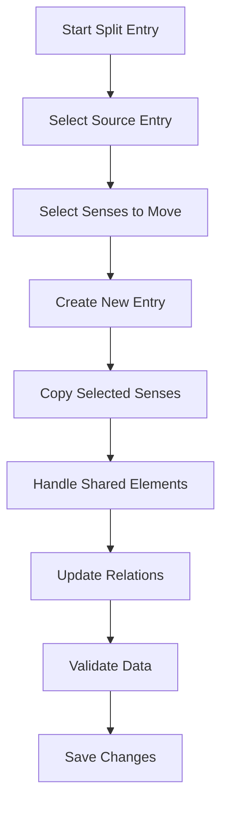
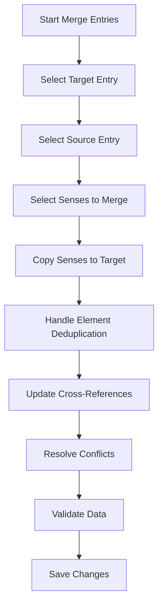
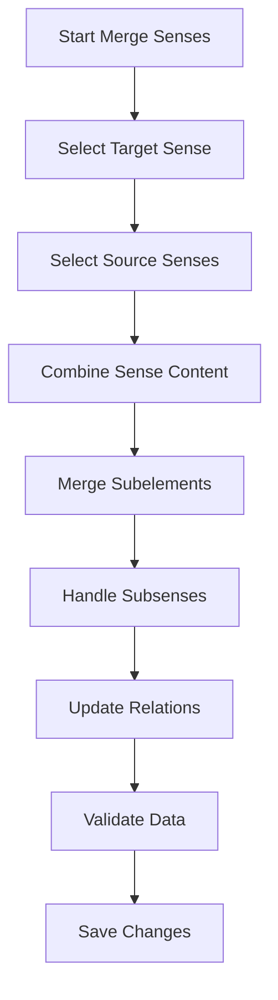

# Merge/Split Operations Specification for LIFT Editors

## 1. Introduction

This specification defines the merge and split operations for entries and senses in the LIFT (Lexicon Interchange Format) editors. These operations enable users to reorganize and restructure dictionary content while maintaining data integrity and avoiding duplication.

## 2. Data Structures Overview

### 2.1 Entry Structure
Based on the LIFT schema and sample data, an entry contains:
- Lexical unit (main word/form)
- Pronunciations
- Grammatical information
- Senses (with definitions, examples, relations, etc.)
- Notes
- Relations
- Variants
- Etymologies
- Traits and annotations

### 2.2 Sense Structure
A sense contains:
- Grammatical information
- Glosses
- Definitions
- Relations
- Notes
- Examples
- Reversals
- Illustrations
- Subsenses
- Traits and annotations

## 3. Split Entry Operation

### 3.1 Definition
Split entry operation moves one or more senses from an existing entry to create a new entry.

### 3.2 Use Cases
- When a word has multiple distinct meanings that warrant separate entries
- When reorganizing dictionary content for better semantic grouping
- When separating homonyms or polysemous words

### 3.3 Algorithm



### 3.4 Implementation Details

#### 3.4.1 Sense Selection
- Allow selection of one or more senses from the source entry
- Preserve sense order in both source and target entries
- Maintain sense IDs and hierarchical relationships (subsenses)

#### 3.4.2 New Entry Creation
- Create new entry with unique GUID
- Copy lexical unit from source entry (can be modified)
- Preserve original entry's metadata (dateCreated, etc.)

#### 3.4.3 Element Handling
- **Pronunciations**: Copy only if specifically associated with moved senses
- **Grammatical Info**: Copy only if applicable to moved senses
- **Relations**: Update relation references to point to new entry
- **Notes**: Copy only sense-specific notes
- **Examples**: Move with their associated senses
- **Traits**: Copy only if relevant to moved senses

#### 3.4.4 Duplicate Prevention
- Avoid duplicating shared elements (pronunciations, grammatical info)
- Use reference system to maintain single source of truth
- Implement conflict resolution for identical elements

### 3.5 User Interface Requirements
- Visual indication of senses being moved
- Preview of resulting entries
- Confirmation dialog with summary of changes
- Undo functionality

## 4. Merge Entries Operation

### 4.1 Definition
Merge entries operation combines senses from one entry into another, joining all subelements without duplication.

### 4.2 Use Cases
- Combining related entries with similar meanings
- Consolidating duplicate or near-duplicate entries
- Merging variant forms into a single entry

### 4.3 Algorithm



### 4.4 Implementation Details

#### 4.4.1 Sense Integration
- Append senses from source to target entry
- Preserve sense order and hierarchy
- Maintain original sense IDs for reference integrity

#### 4.4.2 Deduplication Strategy
- **Pronunciations**: Compare forms and languages, keep unique ones
- **Grammatical Info**: Merge identical values, preserve distinct ones
- **Relations**: Update references, remove duplicates
- **Notes**: Keep all unique notes, merge identical content
- **Examples**: Preserve all examples, associate with correct senses

#### 4.4.3 Conflict Resolution
- When identical elements exist in both entries:
  - Prefer elements from target entry
  - Provide user choice for critical conflicts
  - Log conflicts for review

#### 4.4.4 Cross-Reference Updates
- Update all relations pointing to source entry
- Maintain referential integrity throughout dictionary
- Handle complex relation chains

### 4.5 User Interface Requirements
- Side-by-side comparison of entries
- Visual mapping of sense integration
- Conflict resolution interface
- Preview of merged result
- Detailed change summary

## 5. Merge Senses Operation

### 5.1 Definition
Merge senses operation combines two or more senses within the same entry into a single sense.

### 5.2 Use Cases
- Consolidating similar or redundant senses
- Merging closely related meanings
- Simplifying complex sense hierarchies

### 5.3 Algorithm



### 5.4 Implementation Details

#### 5.4.1 Content Integration
- Combine definitions, glosses, and examples
- Merge grammatical information
- Preserve all unique relations and notes
- Handle multilingual content appropriately

#### 5.4.2 Subsense Handling
- Reparent subsenses to merged sense
- Preserve subsense hierarchy
- Update all references to subsenses

#### 5.4.3 Element Deduplication
- Remove duplicate examples and notes
- Consolidate identical grammatical info
- Preserve all unique relations

### 5.5 User Interface Requirements
- Visual sense selection interface
- Content preview with highlighting
- Subsense hierarchy visualization
- Conflict resolution for overlapping content

## 6. Technical Implementation

### 6.1 Data Model Extensions
```python
class MergeSplitOperation:
    def __init__(self, operation_type, source_id, target_id=None, sense_ids=None):
        self.operation_type = operation_type  # 'split_entry', 'merge_entries', 'merge_senses'
        self.source_id = source_id
        self.target_id = target_id
        self.sense_ids = sense_ids or []
        self.timestamp = datetime.now()
        self.user_id = current_user.id
        self.status = 'pending'

class SenseTransfer:
    def __init__(self, sense_id, original_entry_id, new_entry_id):
        self.sense_id = sense_id
        self.original_entry_id = original_entry_id
        self.new_entry_id = new_entry_id
        self.transfer_date = datetime.now()
```

### 6.2 API Endpoints

#### 6.2.1 Split Entry
```
POST /api/entries/{entry_id}/split
{
  "sense_ids": ["sense_id_1", "sense_id_2"],
  "new_entry_data": {
    "lexical_unit": "modified form",
    "pronunciations": [...]
  }
}
```

#### 6.2.2 Merge Entries
```
POST /api/entries/{target_id}/merge
{
  "source_entry_id": "source_entry_id",
  "sense_ids": ["sense_id_1", "sense_id_2"],
  "conflict_resolution": {
    "pronunciation": "keep_target",
    "grammatical_info": "merge"
  }
}
```

#### 6.2.3 Merge Senses
```
POST /api/entries/{entry_id}/senses/{target_sense_id}/merge
{
  "source_sense_ids": ["sense_id_1", "sense_id_2"],
  "merge_strategy": "combine_all"
}
```

### 6.3 Validation Rules
- Ensure source and target entries exist
- Validate sense IDs belong to specified entries
- Prevent circular references
- Maintain LIFT schema compliance
- Preserve data integrity constraints

## 7. Error Handling and Recovery

### 7.1 Error Conditions
- Invalid entry or sense references
- Schema validation failures
- Data integrity violations
- Concurrent modification conflicts
- Permission errors

### 7.2 Recovery Strategies
- Transaction rollback on failure
- Detailed error logging
- User notification with specific issues
- Partial operation completion where possible
- Data consistency checks post-operation

## 8. Performance Considerations

### 8.1 Optimization Strategies
- Batch processing for large operations
- Indexed lookups for related elements
- Minimal DOM updates in UI
- Background processing for complex merges
- Caching of frequently accessed data

### 8.2 Scalability
- Handle entries with hundreds of senses
- Support dictionaries with thousands of entries
- Efficient memory management
- Optimized database queries

## 9. Testing Requirements

### 9.1 Test Cases
- Basic split/merge operations
- Complex hierarchical sense structures
- Duplicate element handling
- Cross-reference updates
- Conflict resolution scenarios
- Error conditions and recovery

### 9.2 Test Data
- Sample entries with various complexity levels
- Entries with shared elements
- Circular reference scenarios
- Large-scale test cases

## 10. Documentation and User Guidance

### 10.1 User Documentation
- Step-by-step guides for each operation
- Visual examples and screenshots
- Best practices and recommendations
- Troubleshooting guide

### 10.2 Technical Documentation
- API reference with examples
- Data flow diagrams
- Error code reference
- Performance characteristics

## 11. Future Enhancements

### 11.1 Potential Features
- Batch operations for multiple entries
- Automated similarity detection
- Merge/split history and undo
- Collaborative conflict resolution
- AI-assisted operation suggestions

### 11.2 Integration Points
- Version control system integration
- Change tracking and auditing
- Export/import functionality
- Plugin architecture for custom rules

## 12. Compliance and Standards

### 12.1 LIFT Standard Compliance
- Maintain valid LIFT XML structure
- Preserve all required attributes
- Handle optional elements appropriately
- Support all LIFT versions

### 12.2 Data Integrity
- Maintain referential integrity
- Preserve semantic relationships
- Ensure consistent data representation
- Validate against schema

This specification provides a comprehensive framework for implementing merge and split operations in LIFT editors, ensuring robust functionality while maintaining data integrity and user experience.