# Merge/Split Operations Wireframes and Component Diagrams

## 🎨 Wireframes

### 1. Entries List with Merge/Split Actions

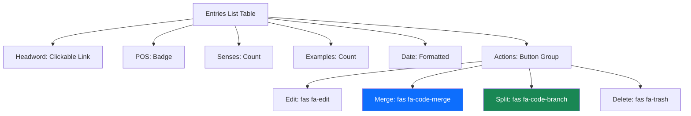

### 2. Merge Entries Flow - Entry Search Dialog

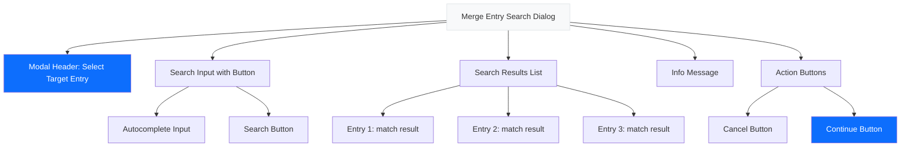

### 3. Merge Entries Flow - Sense Selection Dialog

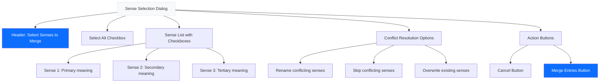

### 4. Split Entry Dialog

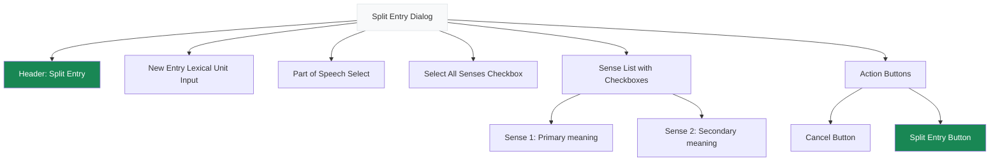

### 5. Merge Senses Dialog

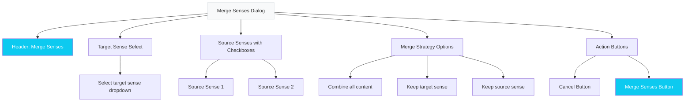

## 🔧 Component Architecture

### 1. Action Button Component

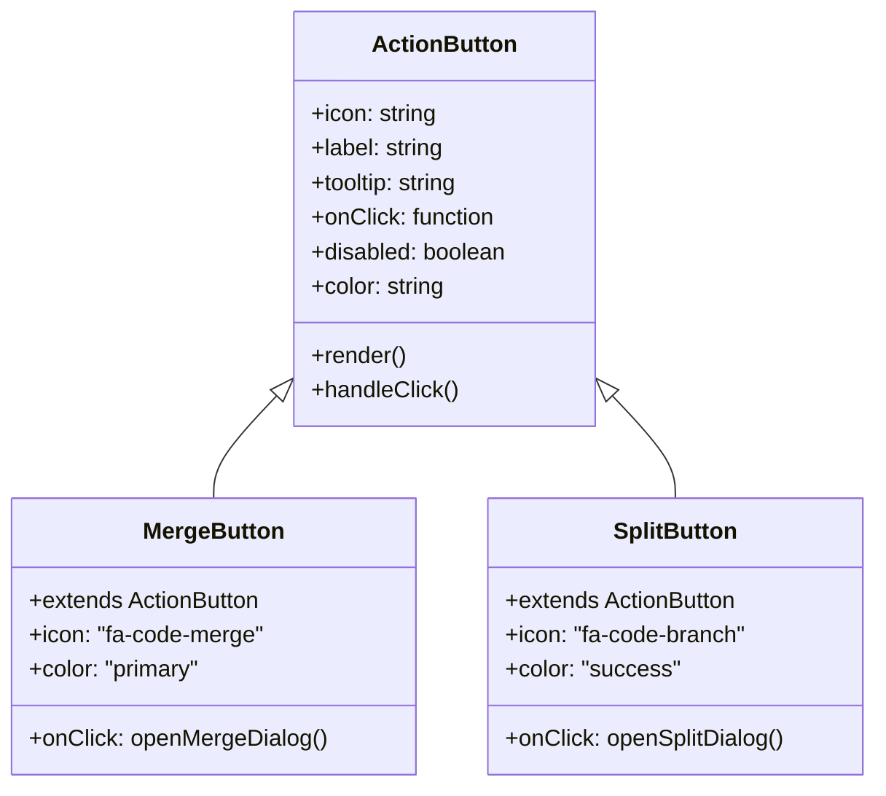

### 2. Modal Dialog Component

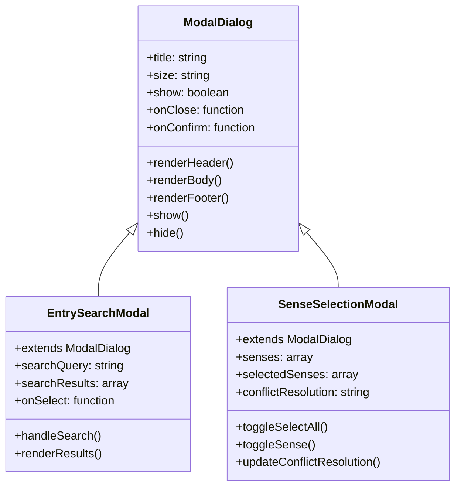

### 3. Sense List Component

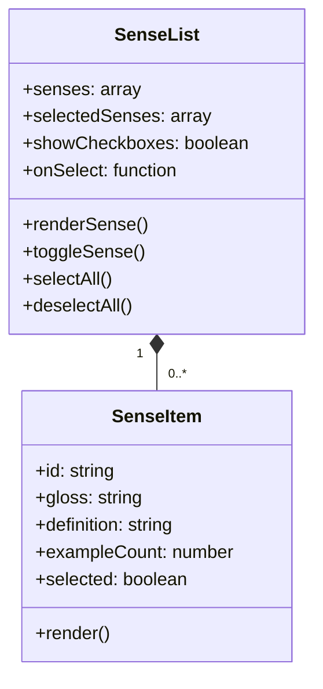

### 4. Conflict Resolution Component

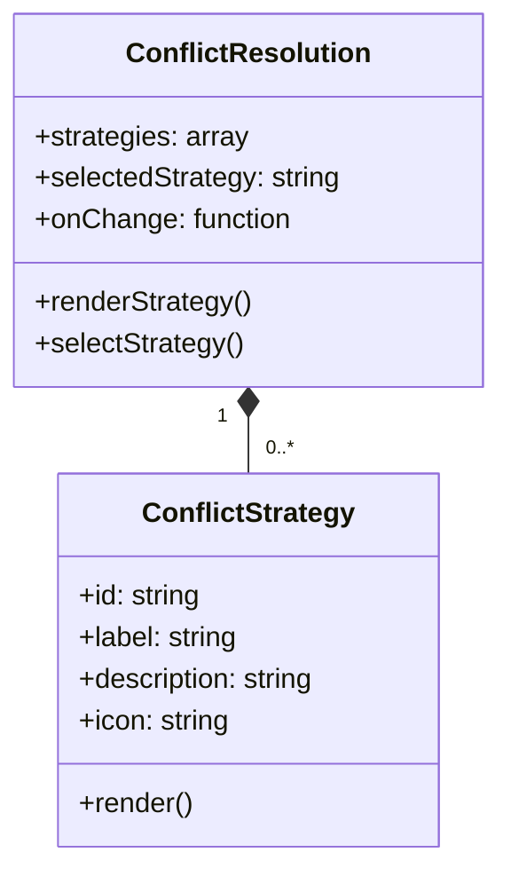

## 📊 State Management Diagram

```mermaid
stateDiagram-v2
    [*] --> Idle
    Idle --> EntrySearch: User clicks merge button
    EntrySearch --> SenseSelection: User selects target entry
    SenseSelection --> Processing: User confirms selection
    Processing --> Success: Operation succeeds
    Processing --> Error: Operation fails
    Success --> Idle: User dismisses success
    Error --> Idle: User dismisses error
    Error --> SenseSelection: User tries again

    state EntrySearch {
        [*] --> Searching
        Searching --> ResultsFound: Results available
        Searching --> NoResults: No results
        ResultsFound --> Selecting: User selects entry
        Selecting --> SenseSelection: User confirms
        NoResults --> EntrySearch: User modifies search
    }

    state SenseSelection {
        [*] --> Loading
        Loading --> Ready: Senses loaded
        Ready --> Selecting: User selects senses
        Selecting --> Confirming: User confirms
        Confirming --> Processing: User submits
    }
```

## 🔗 Component Interaction Flow

### Merge Entries Flow

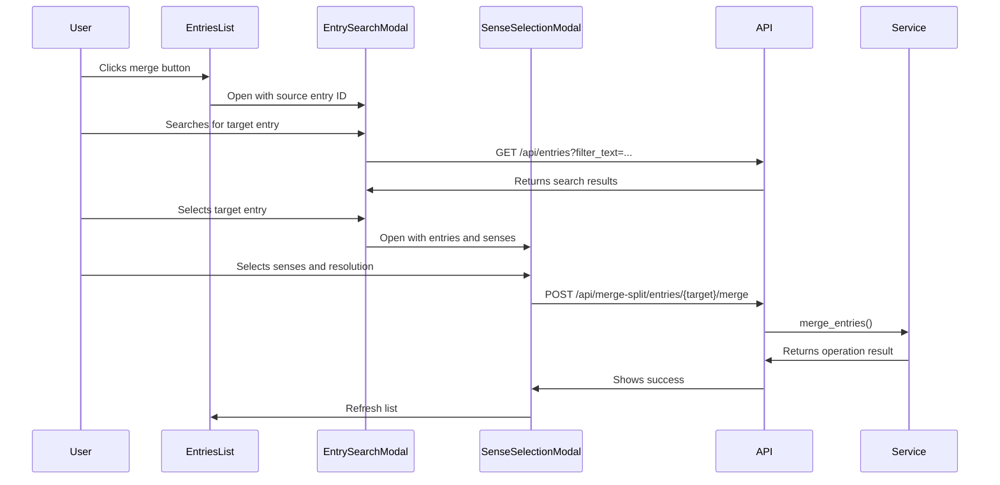

### Split Entry Flow

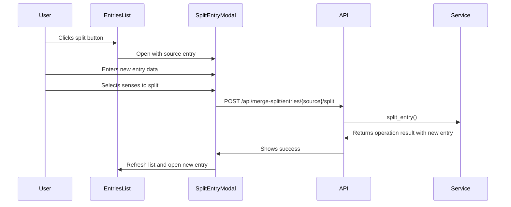

## 🎨 Visual Design System

### Color Palette

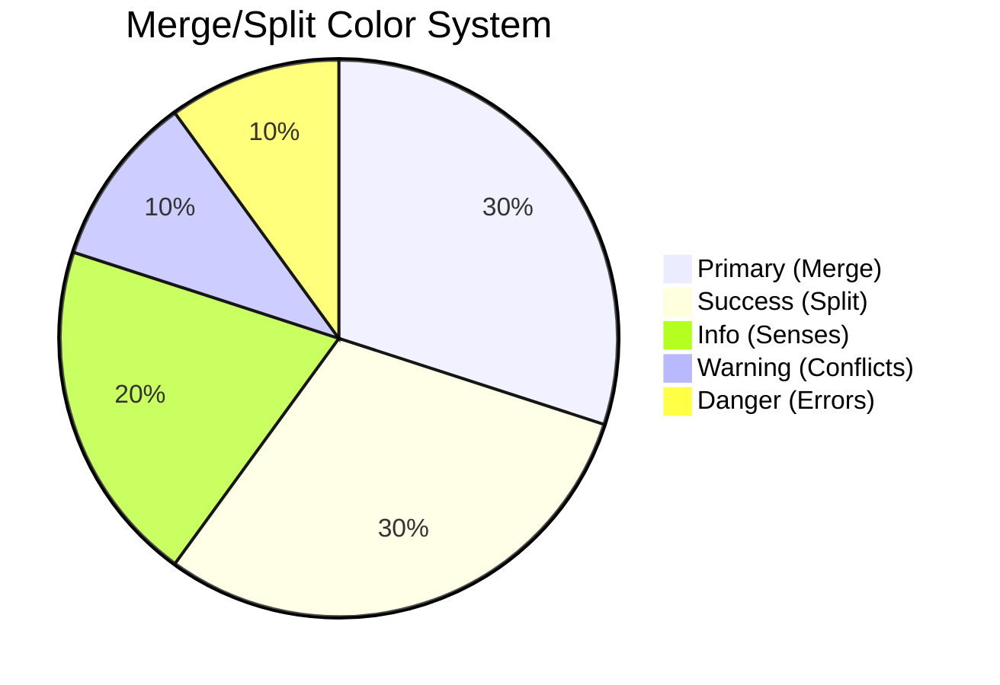

### Typography Scale

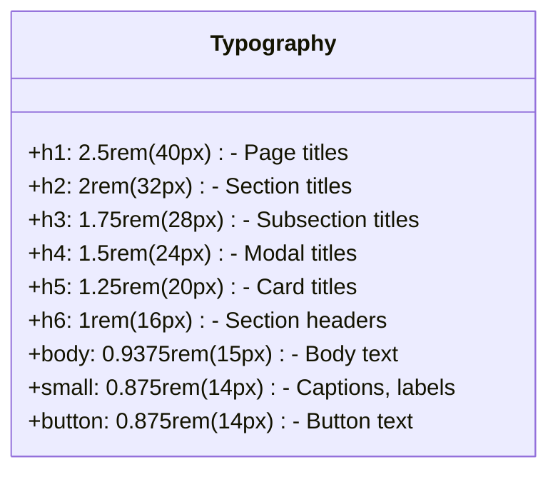

## 📋 Implementation Checklist

### UI Components to Implement

- [ ] `ActionButton` component with icon support
- [ ] `ModalDialog` base component
- [ ] `EntrySearchModal` for target entry selection
- [ ] `SenseSelectionModal` for sense selection
- [ ] `SplitEntryModal` for split operations
- [ ] `MergeSensesModal` for sense merging
- [ ] `SenseList` component with checkboxes
- [ ] `ConflictResolution` component
- [ ] `LoadingSpinner` component
- [ ] `SuccessAlert` component
- [ ] `ErrorAlert` component

### Integration Points

- [ ] Update entries list template with merge/split buttons
- [ ] Add modal containers to base template
- [ ] Connect UI events to API endpoints
- [ ] Implement state management
- [ ] Add accessibility features
- [ ] Implement responsive design

### Testing Requirements

- [ ] Unit tests for all components
- [ ] Integration tests for workflows
- [ ] Accessibility testing
- [ ] Responsive design testing
- [ ] Performance testing
- [ ] User acceptance testing

## 🎯 Conclusion

This wireframe and component documentation provides a comprehensive blueprint for implementing the merge/split operations UI. The design follows modern UI/UX best practices while integrating seamlessly with the existing Lexicographic Curation Workbench architecture.

Key features include:

1. **Intuitive Workflows**: Step-by-step dialogs guide users through complex operations
2. **Visual Feedback**: Clear indicators of selection states and operation results
3. **Accessibility**: Full keyboard navigation and screen reader support
4. **Responsive Design**: Works on desktop and tablet devices
5. **Consistent Design**: Follows existing LCW design patterns

The implementation will significantly enhance the user experience for lexicographers by providing intuitive tools for reorganizing dictionary content while maintaining data integrity.