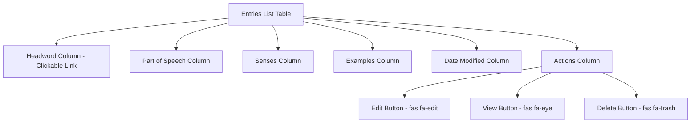
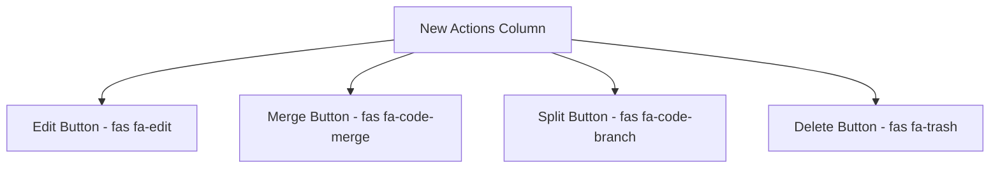
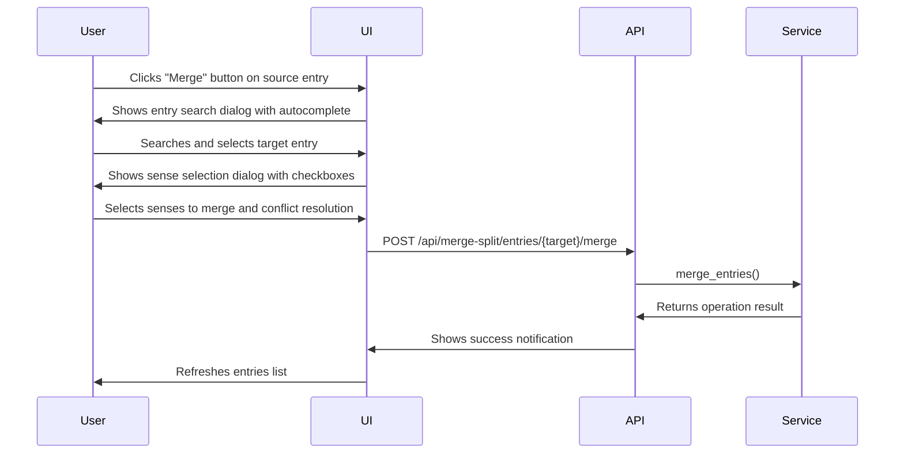
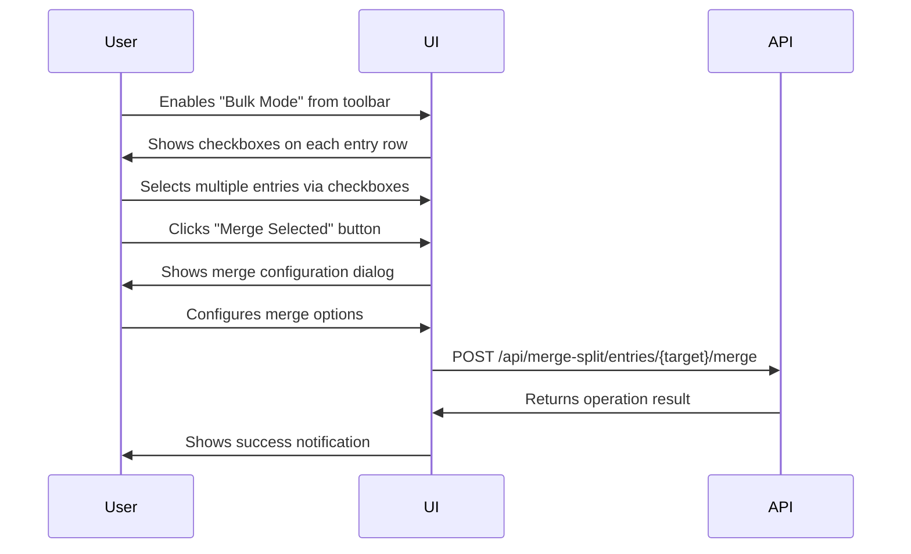
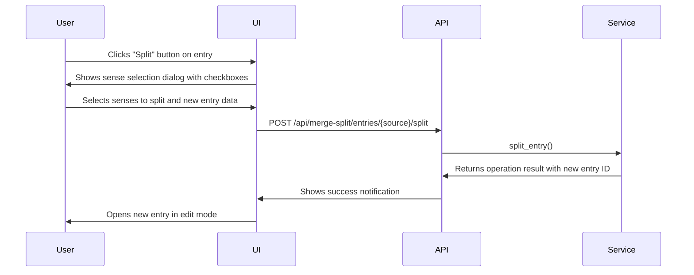
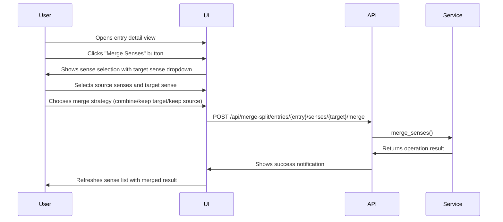
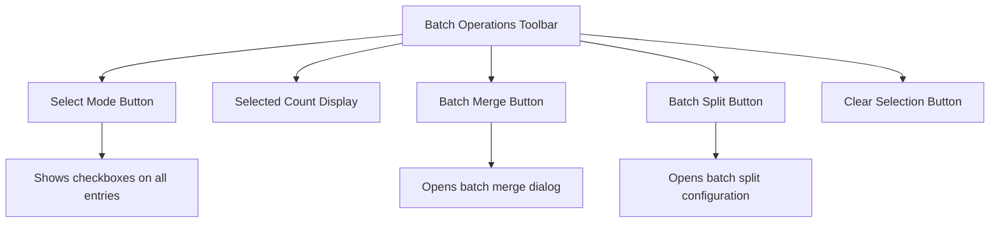
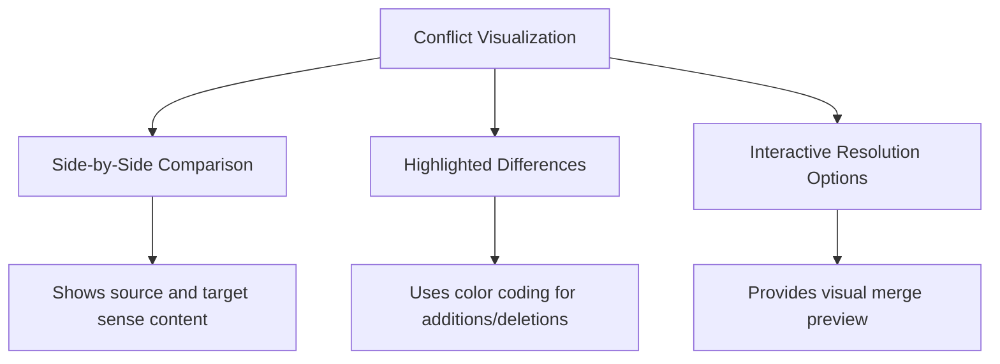
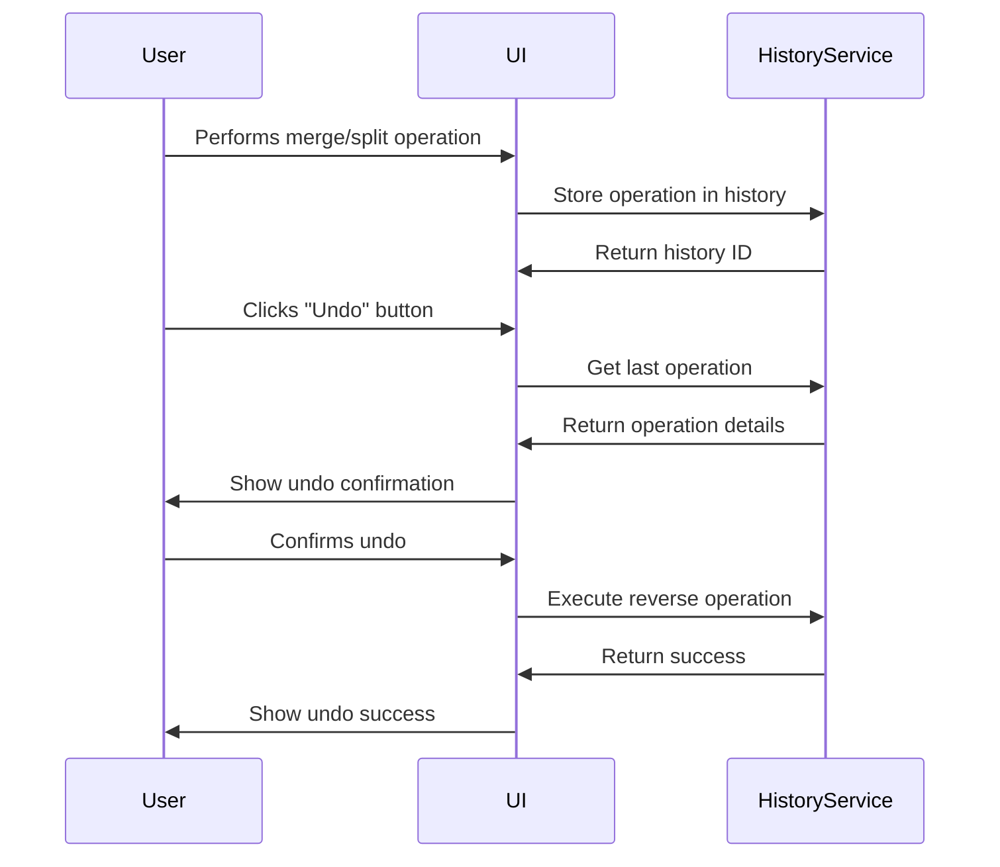

# Merge/Split Operations UI Architecture Specification

## 🎯 Overview

This document specifies the UI architecture for merge and split operations in the Lexicographic Curation Workbench (LCW). The design replaces the redundant eye icon in the entries list and introduces intuitive merge/split workflows.

## 📋 Current UI Analysis

### Current Entries List Structure



### Issues with Current Design

1. **Redundant Eye Icon**: Entries are already clickable links to view details
2. **No Merge/Split Access**: Critical lexicographic operations are missing
3. **Limited Bulk Operations**: No support for multi-entry operations
4. **Poor Discoverability**: Advanced operations are hidden

## 🎨 UI Architecture Design

### 1. Replace Eye Icon with Merge/Split Actions



### 2. Merge Entries Workflow

#### Option A: Direct Entry Selection (Recommended)



#### Option B: Bulk Selection (Alternative)



### 3. Split Entry Workflow



### 4. Merge Senses Workflow



## 🎯 UI Component Specifications

### 1. Entry Search Dialog (for Merge)

```html
<!-- Entry Search Dialog -->
<div class="modal fade" id="mergeEntrySearchModal" tabindex="-1">
  <div class="modal-dialog modal-lg">
    <div class="modal-content">
      <div class="modal-header bg-primary text-white">
        <h5 class="modal-title">Select Target Entry for Merge</h5>
        <button type="button" class="btn-close" data-bs-dismiss="modal"></button>
      </div>
      <div class="modal-body">
        <div class="mb-3">
          <label for="entrySearch" class="form-label">Search Entries</label>
          <div class="input-group">
            <input type="text" class="form-control" id="entrySearch" placeholder="Type to search...">
            <button class="btn btn-outline-secondary" type="button" id="searchButton">
              <i class="fas fa-search"></i>
            </button>
          </div>
        </div>
        <div class="mb-3">
          <label class="form-label">Search Results</label>
          <div class="list-group" id="searchResults" style="max-height: 300px; overflow-y: auto;">
            <!-- Results will be populated by JavaScript -->
          </div>
        </div>
        <div class="alert alert-info">
          <i class="fas fa-info-circle"></i> Select the entry that will receive the senses from <strong id="sourceEntryName"></strong>
        </div>
      </div>
      <div class="modal-footer">
        <button type="button" class="btn btn-secondary" data-bs-dismiss="modal">Cancel</button>
        <button type="button" class="btn btn-primary" id="confirmMergeTarget">Continue to Sense Selection</button>
      </div>
    </div>
  </div>
</div>
```

### 2. Sense Selection Dialog

```html
<!-- Sense Selection Dialog -->
<div class="modal fade" id="senseSelectionModal" tabindex="-1">
  <div class="modal-dialog modal-lg">
    <div class="modal-content">
      <div class="modal-header bg-primary text-white">
        <h5 class="modal-title">Select Senses to Merge/Split</h5>
        <button type="button" class="btn-close" data-bs-dismiss="modal"></button>
      </div>
      <div class="modal-body">
        <div class="mb-3">
          <p>Select which senses to transfer from <strong id="sourceEntryDisplay"></strong> to <strong id="targetEntryDisplay"></strong>:</p>
        </div>
        <div class="mb-3">
          <div class="form-check">
            <input class="form-check-input" type="checkbox" id="selectAllSenses">
            <label class="form-check-label" for="selectAllSenses">Select All</label>
          </div>
        </div>
        <div class="list-group" id="senseList">
          <!-- Sense items will be populated by JavaScript -->
          <div class="list-group-item">
            <div class="form-check">
              <input class="form-check-input" type="checkbox" id="sense_001" value="sense_001">
              <label class="form-check-label" for="sense_001">
                <strong>Sense 1:</strong> Primary meaning of the word
                <small class="text-muted d-block">Gloss: basic definition | Examples: 3</small>
              </label>
            </div>
          </div>
        </div>
        <div class="mt-4" id="conflictResolutionSection">
          <h6>Conflict Resolution</h6>
          <div class="form-check">
            <input class="form-check-input" type="radio" name="conflictStrategy" id="renameStrategy" value="rename" checked>
            <label class="form-check-label" for="renameStrategy">
              Rename conflicting senses (recommended)
            </label>
          </div>
          <div class="form-check">
            <input class="form-check-input" type="radio" name="conflictStrategy" id="skipStrategy" value="skip">
            <label class="form-check-label" for="skipStrategy">
              Skip conflicting senses
            </label>
          </div>
          <div class="form-check">
            <input class="form-check-input" type="radio" name="conflictStrategy" id="overwriteStrategy" value="overwrite">
            <label class="form-check-label" for="overwriteStrategy">
              Overwrite existing senses
            </label>
          </div>
        </div>
      </div>
      <div class="modal-footer">
        <button type="button" class="btn btn-secondary" data-bs-dismiss="modal">Cancel</button>
        <button type="button" class="btn btn-primary" id="confirmSenseSelection">Merge Entries</button>
      </div>
    </div>
  </div>
</div>
```

### 3. Split Entry Dialog

```html
<!-- Split Entry Dialog -->
<div class="modal fade" id="splitEntryModal" tabindex="-1">
  <div class="modal-dialog modal-lg">
    <div class="modal-content">
      <div class="modal-header bg-success text-white">
        <h5 class="modal-title">Split Entry</h5>
        <button type="button" class="btn-close" data-bs-dismiss="modal"></button>
      </div>
      <div class="modal-body">
        <div class="mb-3">
          <p>Create a new entry by splitting senses from <strong id="splitSourceEntry"></strong>:</p>
        </div>
        <div class="mb-3">
          <label for="newEntryLexicalUnit" class="form-label">New Entry Lexical Unit</label>
          <input type="text" class="form-control" id="newEntryLexicalUnit" placeholder="Enter headword for new entry">
        </div>
        <div class="mb-3">
          <label for="newEntryPOS" class="form-label">Part of Speech</label>
          <select class="form-select" id="newEntryPOS">
            <option value="">Select part of speech...</option>
            <option value="noun">Noun</option>
            <option value="verb">Verb</option>
            <option value="adjective">Adjective</option>
            <option value="adverb">Adverb</option>
          </select>
        </div>
        <div class="mb-3">
          <div class="form-check">
            <input class="form-check-input" type="checkbox" id="selectAllSensesForSplit">
            <label class="form-check-label" for="selectAllSensesForSplit">Select All Senses</label>
          </div>
        </div>
        <div class="list-group" id="splitSenseList">
          <!-- Sense items will be populated by JavaScript -->
        </div>
      </div>
      <div class="modal-footer">
        <button type="button" class="btn btn-secondary" data-bs-dismiss="modal">Cancel</button>
        <button type="button" class="btn btn-success" id="confirmSplitEntry">Split Entry</button>
      </div>
    </div>
  </div>
</div>
```

### 4. Merge Senses Dialog

```html
<!-- Merge Senses Dialog -->
<div class="modal fade" id="mergeSensesModal" tabindex="-1">
  <div class="modal-dialog">
    <div class="modal-content">
      <div class="modal-header bg-info text-white">
        <h5 class="modal-title">Merge Senses</h5>
        <button type="button" class="btn-close" data-bs-dismiss="modal"></button>
      </div>
      <div class="modal-body">
        <div class="mb-3">
          <label for="targetSenseSelect" class="form-label">Target Sense</label>
          <select class="form-select" id="targetSenseSelect">
            <option value="">Select target sense...</option>
            <!-- Options will be populated by JavaScript -->
          </select>
        </div>
        <div class="mb-3">
          <label class="form-label">Source Senses</label>
          <div class="form-check">
            <input class="form-check-input" type="checkbox" id="selectAllSourceSenses">
            <label class="form-check-label" for="selectAllSourceSenses">Select All</label>
          </div>
          <div class="list-group" id="sourceSensesList">
            <!-- Source sense items will be populated by JavaScript -->
          </div>
        </div>
        <div class="mb-3">
          <label class="form-label">Merge Strategy</label>
          <div class="form-check">
            <input class="form-check-input" type="radio" name="mergeStrategy" id="combineAll" value="combine_all" checked>
            <label class="form-check-label" for="combineAll">Combine all content</label>
          </div>
          <div class="form-check">
            <input class="form-check-input" type="radio" name="mergeStrategy" id="keepTarget" value="keep_target">
            <label class="form-check-label" for="keepTarget">Keep only target sense content</label>
          </div>
          <div class="form-check">
            <input class="form-check-input" type="radio" name="mergeStrategy" id="keepSource" value="keep_source">
            <label class="form-check-label" for="keepSource">Keep only source sense content</label>
          </div>
        </div>
      </div>
      <div class="modal-footer">
        <button type="button" class="btn btn-secondary" data-bs-dismiss="modal">Cancel</button>
        <button type="button" class="btn btn-primary" id="confirmMergeSenses">Merge Senses</button>
      </div>
    </div>
  </div>
</div>
```

## 🎨 Visual Design Guidelines

### Color Scheme

```css
/* Merge Operations - Blue Theme */
.merge-action { color: #0d6efd; }
.merge-modal-header { background-color: #0d6efd; color: white; }
.merge-button { background-color: #0d6efd; border-color: #0d6efd; }

/* Split Operations - Green Theme */
.split-action { color: #198754; }
.split-modal-header { background-color: #198754; color: white; }
.split-button { background-color: #198754; border-color: #198754; }

/* Sense Operations - Info Theme */
.sense-action { color: #0dcaf0; }
.sense-modal-header { background-color: #0dcaf0; color: white; }
.sense-button { background-color: #0dcaf0; border-color: #0dcaf0; }
```

### Iconography

- **Merge**: `fas fa-code-merge` (for entries) / `fas fa-layer-group` (for senses)
- **Split**: `fas fa-code-branch` (for entries) / `fas fa-sitemap` (for senses)
- **Conflict**: `fas fa-exclamation-triangle` (warning color)
- **Success**: `fas fa-check-circle` (success color)

### Typography

- **Modal Titles**: 1.25rem (20px), bold, color: #212529
- **Section Headers**: 1rem (16px), semi-bold, color: #495057
- **Body Text**: 0.9375rem (15px), regular, color: #6c757d
- **Button Text**: 0.875rem (14px), semi-bold, color: white

## 🔧 JavaScript Architecture

### Event Handling

```javascript
// Initialize merge/split buttons
function initializeMergeSplitButtons() {
    // Add event listeners to all merge buttons
    document.querySelectorAll('.merge-btn').forEach(button => {
        button.addEventListener('click', function(e) {
            e.preventDefault();
            const entryId = this.closest('tr').dataset.entryId;
            openMergeEntrySearch(entryId);
        });
    });

    // Add event listeners to all split buttons
    document.querySelectorAll('.split-btn').forEach(button => {
        button.addEventListener('click', function(e) {
            e.preventDefault();
            const entryId = this.closest('tr').dataset.entryId;
            openSplitEntryDialog(entryId);
        });
    });

    // Add event listeners to merge senses buttons (in entry detail view)
    document.querySelectorAll('.merge-senses-btn').forEach(button => {
        button.addEventListener('click', function(e) {
            e.preventDefault();
            const entryId = this.dataset.entryId;
            openMergeSensesDialog(entryId);
        });
    });
}
```

### API Integration

```javascript
// Merge entries via API
function mergeEntries(sourceId, targetId, senseIds, conflictResolution) {
    showLoadingState();

    fetch(`/api/merge-split/entries/${targetId}/merge`, {
        method: 'POST',
        headers: {
            'Content-Type': 'application/json',
        },
        body: JSON.stringify({
            source_entry_id: sourceId,
            sense_ids: senseIds,
            conflict_resolution: conflictResolution
        })
    })
    .then(response => {
        if (!response.ok) throw new Error('Merge failed');
        return response.json();
    })
    .then(data => {
        showSuccessAlert(`Successfully merged ${senseIds.length} senses`);
        refreshEntriesList();
        hideAllModals();
    })
    .catch(error => {
        showErrorAlert(`Merge failed: ${error.message}`);
        console.error('Merge error:', error);
    })
    .finally(hideLoadingState);
}
```

### State Management

```javascript
// Global state for merge/split operations
const mergeSplitState = {
    currentOperation: null, // 'merge_entries', 'split_entry', 'merge_senses'
    sourceEntry: null,
    targetEntry: null,
    selectedSenses: [],
    conflictResolution: 'rename',
    mergeStrategy: 'combine_all',
    newEntryData: {
        lexical_unit: '',
        grammatical_info: ''
    }
};

// State management functions
function resetMergeSplitState() {
    mergeSplitState.currentOperation = null;
    mergeSplitState.sourceEntry = null;
    mergeSplitState.targetEntry = null;
    mergeSplitState.selectedSenses = [];
    mergeSplitState.conflictResolution = 'rename';
    mergeSplitState.mergeStrategy = 'combine_all';
    mergeSplitState.newEntryData = {
        lexical_unit: '',
        grammatical_info: ''
    };
}

function updateMergeSplitState(key, value) {
    mergeSplitState[key] = value;
    // Persist to localStorage for recovery
    localStorage.setItem('mergeSplitState', JSON.stringify(mergeSplitState));
}

function loadMergeSplitState() {
    const savedState = localStorage.getItem('mergeSplitState');
    if (savedState) {
        try {
            Object.assign(mergeSplitState, JSON.parse(savedState));
        } catch (e) {
            console.error('Error loading merge/split state:', e);
        }
    }
}
```

## 📋 Implementation Plan

### Phase 1: UI Component Development

1. **Create Modal Templates** (2 days)
   - Entry search dialog with autocomplete
   - Sense selection dialog with checkboxes
   - Split entry dialog with form fields
   - Merge senses dialog with strategy options

2. **Update Entries List** (1 day)
   - Replace eye icon with merge/split buttons
   - Update action column layout
   - Add tooltip explanations

3. **JavaScript Implementation** (3 days)
   - Event handlers for all buttons
   - API integration for all operations
   - State management and error handling
   - Loading states and user feedback

### Phase 2: Integration & Testing

1. **Backend Integration** (1 day)
   - Connect to existing merge/split API endpoints
   - Handle error responses appropriately
   - Implement conflict resolution logic

2. **User Testing** (2 days)
   - Test all workflows with real data
   - Validate edge cases and error conditions
   - Gather feedback from lexicographers

3. **Performance Optimization** (1 day)
   - Implement caching for search results
   - Optimize sense selection rendering
   - Add loading states and progress indicators

### Phase 3: Documentation & Deployment

1. **User Documentation** (1 day)
   - Create user guide with screenshots
   - Write FAQ and troubleshooting section
   - Add tooltips and help text

2. **Technical Documentation** (1 day)
   - Update API documentation
   - Add JavaScript code comments
   - Create architecture diagrams

3. **Deployment** (1 day)
   - Final testing in staging environment
   - User training session
   - Production deployment with feature flag

## 🔗 Integration with Existing Components

### Entries List Integration

```javascript
// Update renderTableBody to include merge/split buttons
function renderTableBody(entries) {
    // ... existing code ...

    // Update actions cell to include merge/split buttons
    case 'actions':
        td.innerHTML = `
            <div class="btn-group btn-group-sm">
                <a href="/entries/${entry.id}/edit" class="btn btn-outline-primary edit-btn" title="Edit">
                    <i class="fas fa-edit"></i>
                </a>
                <button type="button" class="btn btn-outline-info merge-btn" title="Merge">
                    <i class="fas fa-code-merge"></i>
                </button>
                <button type="button" class="btn btn-outline-success split-btn" title="Split">
                    <i class="fas fa-code-branch"></i>
                </button>
                <button type="button" class="btn btn-outline-danger delete-btn" title="Delete">
                    <i class="fas fa-trash"></i>
                </button>
            </div>`;
        if (colConfig.fixedWidth) td.style.width = colConfig.fixedWidth;
        break;

    // ... rest of existing code ...
}
```

### Entry Detail View Integration

```html
<!-- Add to entry_detail.html -->
<div class="card mb-4">
    <div class="card-header bg-light">
        <h5 class="card-title">Sense Management</h5>
    </div>
    <div class="card-body">
        <div class="d-flex justify-content-end mb-3">
            <button type="button" class="btn btn-outline-info merge-senses-btn"
                    data-entry-id="{{ entry.id }}" title="Merge Senses">
                <i class="fas fa-layer-group me-1"></i> Merge Senses
            </button>
        </div>
        <!-- Existing sense list -->
    </div>
</div>
```

## 📊 Analytics & Monitoring

### User Activity Tracking

```javascript
// Track merge/split operations for analytics
function trackMergeSplitOperation(operationType, details) {
    fetch('/api/analytics/track', {
        method: 'POST',
        headers: {
            'Content-Type': 'application/json',
        },
        body: JSON.stringify({
            event_type: 'merge_split_operation',
            operation_type: operationType,
            timestamp: new Date().toISOString(),
            details: details
        })
    }).catch(error => {
        console.error('Analytics tracking failed:', error);
    });
}

// Example usage
trackMergeSplitOperation('merge_entries', {
    source_entry_id: 'entry_001',
    target_entry_id: 'entry_002',
    sense_count: 3,
    conflict_resolution: 'rename'
});
```

### Performance Monitoring

```javascript
// Monitor operation performance
function monitorOperationPerformance(operationType, startTime) {
    const endTime = performance.now();
    const duration = endTime - startTime;

    // Log to analytics
    fetch('/api/analytics/performance', {
        method: 'POST',
        headers: {
            'Content-Type': 'application/json',
        },
        body: JSON.stringify({
            operation_type: operationType,
            duration_ms: duration,
            timestamp: new Date().toISOString(),
            user_agent: navigator.userAgent
        })
    }).catch(error => {
        console.error('Performance monitoring failed:', error);
    });

    // Log to console for debugging
    console.log(`[PERF] ${operationType} completed in ${duration.toFixed(2)}ms`);
}
```

## 🎯 Accessibility Features

### Keyboard Navigation

```javascript
// Ensure all dialogs support keyboard navigation
function setupKeyboardNavigation() {
    // Close modals on Escape key
    document.addEventListener('keydown', function(e) {
        if (e.key === 'Escape') {
            const openModal = document.querySelector('.modal.show');
            if (openModal) {
                bootstrap.Modal.getInstance(openModal).hide();
            }
        }
    });

    // Focus management in modals
    const modals = document.querySelectorAll('.modal');
    modals.forEach(modal => {
        modal.addEventListener('shown.bs.modal', function() {
            // Focus first input element
            const firstInput = this.querySelector('input, select, button');
            if (firstInput) firstInput.focus();
        });
    });
}
```

### Screen Reader Support

```html
<!-- ARIA attributes for accessibility -->
<div class="modal fade" id="mergeEntrySearchModal" tabindex="-1"
     aria-labelledby="mergeEntrySearchModalLabel" aria-hidden="true">
    <div class="modal-dialog modal-lg" role="document">
        <div class="modal-content">
            <div class="modal-header" role="alert">
                <h5 class="modal-title" id="mergeEntrySearchModalLabel">Select Target Entry for Merge</h5>
                <button type="button" class="btn-close" data-bs-dismiss="modal"
                        aria-label="Close merge dialog">
                    <span aria-hidden="true">&times;</span>
                </button>
            </div>
            <div class="modal-body">
                <div class="mb-3">
                    <label for="entrySearch" class="form-label">Search Entries</label>
                    <div class="input-group">
                        <input type="text" class="form-control" id="entrySearch"
                               placeholder="Type to search..." aria-describedby="searchHelp">
                        <button class="btn btn-outline-secondary" type="button" id="searchButton"
                                aria-label="Search for entries">
                            <i class="fas fa-search" aria-hidden="true"></i>
                            <span class="visually-hidden">Search</span>
                        </button>
                    </div>
                    <div id="searchHelp" class="form-text">
                        Type at least 3 characters to search for entries to merge with.
                    </div>
                </div>
                <!-- ... rest of modal content ... -->
            </div>
        </div>
    </div>
</div>
```

## 📋 Future Enhancements

### 1. Batch Operations Interface



### 2. Visual Conflict Resolution



### 3. Undo/Redo Functionality



## 🔗 Links to Related Documentation

- **[MERGE_SPLIT_IMPLEMENTATION.md](MERGE_SPLIT_IMPLEMENTATION.md)** - Core implementation documentation
- **[MERGE_SPLIT_OPERATIONS_SPECIFICATION.md](MERGE_SPLIT_OPERATIONS_SPECIFICATION.md)** - Original specification
- **[API Documentation](/apidocs/)** - Interactive API documentation

## 🎯 Conclusion

This UI architecture provides a comprehensive, user-friendly interface for merge and split operations that:

1. **Replaces redundant elements** (eye icon) with useful functionality
2. **Provides intuitive workflows** for complex operations
3. **Maintains consistency** with existing LCW design patterns
4. **Ensures accessibility** with proper ARIA attributes and keyboard support
5. **Supports multiple approaches** (direct selection vs. bulk operations)
6. **Includes comprehensive error handling** and user feedback

The design follows modern UI/UX best practices while integrating seamlessly with the existing Lexicographic Curation Workbench architecture.