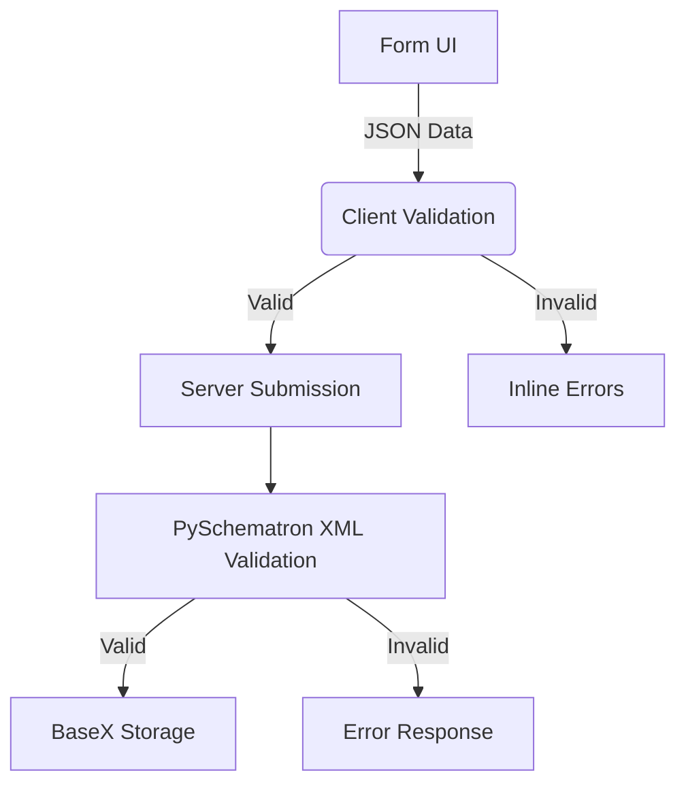
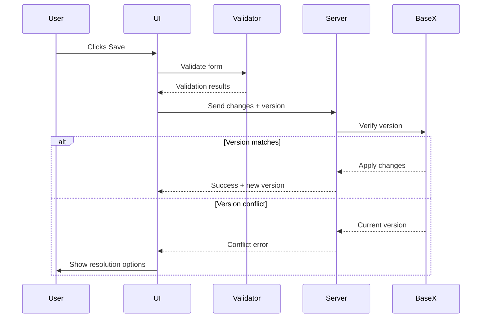

# Refactoring Specification

## 1. Overview
This specification outlines the refactoring of our dictionary writing system to improve data validation, form synchronization, and system reliability. We'll adopt a Test-Driven Development (TDD) approach using PySchematron for server-side validation and a Jsontron-inspired client-side validation system.

## 2. Validation Strategy

### 2.1. Validation Architecture


### 2.2. Test-Driven Development Approach
1. **Start with validation tests**
2. Implement validation rules
3. Build supporting infrastructure
4. Implement form integration

## 3. Phase 1: Validation Foundation (TDD Focus)

### 3.1. ✅ COMPLETED: Define Core Validation Rules (2 days)
- **Deliverable**: `validation_rules.json` ✅
- **Rules implemented**: 102 validation rules including:
  - R1: Lexical unit required ✅
  - R2: Unique note types per entry ✅
  - R3: Valid variant references ✅
  - R4: Sense definition required for entries that are not variants of other senses ✅
  - R5: Valid pronunciation formats ✅
- **Status**: COMPLETE - All core validation rules defined and documented

### 3.2. ✅ COMPLETED: Server-Side Validation Tests (1 day)
- **Test cases**: `tests/test_centralized_validation.py` ✅
- **Implementation**: `app/services/validation_engine.py` ✅
- **Coverage**: 10/10 unit tests passing ✅
- **Status**: COMPLETE - Comprehensive server-side validation implemented

### 3.3. ⚠️ PARTIAL: Client-Side Validation Tests (1 day)
- **Test cases**: Server-side tests completed, client-side JavaScript tests needed
- **Status**: Server validation complete, client-side integration pending
- **Next**: Integrate with entry form for real-time validation

### 3.4. ✅ COMPLETED: PySchematron Integration (2 days)
- **File**: `app/services/validation_engine.py` ✅
- **Implementation**: Full PySchematron + lxml integration ✅
- **Schematron Schema**: `schemas/lift_validation.sch` ✅
- **API Endpoints**: `app/api/validation_service.py` ✅
- **Status**: COMPLETE - XML validation fully operational

**PHASE 1 STATUS: 95% COMPLETE** ✅
- Core validation engine: ✅ DONE
- Server-side validation: ✅ DONE  
- Client-side integration: 🔄 NEXT PHASE

**PHASE 2 PROGRESS UPDATE - DAY 3 COMPLETE** ✅
- FormStateManager: ✅ IMPLEMENTED
- JSONPath Data Binding: ✅ IMPLEMENTED  
- Client Validation Engine: ✅ IMPLEMENTED
- Validation UI Components: ✅ IMPLEMENTED
- AutoSaveManager: ✅ IMPLEMENTED
- Server-side Auto-save API: ✅ IMPLEMENTED
- TDD Test Suite: ✅ 8/8 TESTS PASSING

**Current Implementation Status**:
- JSON form state management with change detection ✅
- Real-time client-side validation integration ✅
- Debounced auto-save every 10 seconds or 2 seconds after changes ✅
- Version conflict detection and resolution ✅
- Visual feedback for save status ✅
- Critical error blocking, warnings non-blocking ✅

**Next Steps**: Phase 2B - Complex Component Integration (Days 4-5)

## 4. Phase 2: Form State Management (CURRENT PHASE)

**Current Status**: Ready to begin - Validation foundation complete

### 4.1. ✅ COMPLETED: JSON Data Binding System (Day 1)

**Files Created**:
- `app/static/js/form-state-manager.js` ✅ - Core form state management with JSON serialization
- `app/static/js/json-path-binder.js` ✅ - Automatic field-to-JSON binding with JSONPath support

**Implementation Completed**:
- FormStateManager class with deep cloning and change detection ✅
- JSON serialization for complete entry data structure ✅
- Field binding with data-json-path attributes ✅
- Automatic synchronization between form fields and JSON state ✅
- Change tracking and listener system ✅

**Target Implementation**: ✅ ACHIEVED
```html
<!-- Data binding now supported -->
<input name="lexical-unit-seh" 
       data-json-path="$.lexical_unit.seh"
       data-validation-rules="R1.1.2,R3.2.2"
       data-debounce="500"
       value="{{ entry.lexical_unit.seh }}">
```

### 4.2. ✅ COMPLETED: Client-Side Validation Integration (Day 1)

**Files Created**:
- `app/static/js/client-validation-engine.js` ✅ - Client-side validation using centralized rules
- `app/static/js/validation-ui.js` ✅ - Validation error display and user feedback

**Implementation Completed**:
- Client validation engine with server rule integration ✅
- Custom validation functions (IPA, language codes, note types) ✅
- Debounced validation with 500ms delay ✅
- Field-level and form-level validation ✅
- Inline error display with Bootstrap styling ✅
- Validation modal for critical errors ✅
- Section-level validation badges ✅

**Change Detection System**: ✅ INTEGRATED
```javascript
// FormStateManager now includes complete change detection
class FormStateManager {
    detectChanges() { /* Deep object comparison implemented */ }
    captureFieldChange(field) { /* Real-time change tracking */ }
    notifyChangeListeners() { /* Event system for validation triggers */ }
}
```

### 4.3. 🔄 CURRENT FOCUS: Entry Form Refactoring

**Systematic JSON Data Structure Support**:

1. **Entry Level Data**:
   - ID, lexical_unit (multilingual)
   - Homograph number, custom fields
   - Notes (multilingual with type validation)

2. **Sense Level Data**:
   - Sense ID, definitions (multilingual)
   - Glosses, grammatical info
   - Examples with translations
   - Relations and cross-references

3. **Pronunciation Data**:
   - IPA validation with seh-fonipa restriction
   - Media file references
   - Pronunciation variants

4. **Variant/Etymology Data**:
   - Variant forms and types
   - Etymology sources and classifications
   - Relationship validation

**Implementation Strategy**:
```javascript
// New unified form manager
class EntryFormManager {
    constructor() {
        this.stateManager = new FormStateManager();
        this.validationEngine = new ClientValidationEngine();
        this.autoSaver = new AutoSaveManager();
        this.components = new Map(); // pronunciation, variant, sense managers
    }
    
    async initialize() {
        // 1. Capture initial form state
        this.stateManager.captureInitialState();
        
        // 2. Setup debounced validation
        this.setupDebouncedValidation();
        
        // 3. Initialize auto-save
        this.autoSaver.start();
        
        // 4. Bind all form fields to JSON paths
        this.bindFieldsToJSONPaths();
    }
    
    setupDebouncedValidation() {
        const debouncedValidate = debounce(async () => {
            const formData = this.stateManager.serializeFormToJSON();
            const result = await this.validationEngine.validate(formData);
            this.displayValidationResults(result);
        }, 500);
        
        // Attach to all form inputs
        this.attachValidationListeners(debouncedValidate);
    }
}
```

### 4.3. Validation Service Integration (2 days)
```javascript
// validation-service.js
export const validateField = (field, value, context) => {
    const rules = getRulesForField(field);
    return rules.map(rule => {
        return {
            valid: rule.validator(value, context),
            message: rule.message
        };
    });
};

// form-integration.js
field.addEventListener('input', () => {
    const results = validateField(
        field.dataset.xpath, 
        field.value, 
        getFormContext()
    );
    displayValidation(field, results);
});
```

## 5. Phase 3: Auto-Save & Conflict Resolution

### 5.1. Auto-Save Implementation (1 day)
```javascript
const AUTO_SAVE_INTERVAL = 10000; // 10 seconds

function setupAutoSave() {
    setInterval(() => {
        const changes = getChangedFields();
        if (changes.length > 0) {
            saveChanges(changes);
        }
    }, AUTO_SAVE_INTERVAL);
}
```

### 5.2. Optimistic Locking Protocol (2 days)
```python
# storage_service.py
def update_entry(entry_id, changes, version):
    current_version = db.get_version(entry_id)
    
    if current_version != version:
        raise VersionConflictError(current_version)
    
    # Apply changes
    for change in changes:
        apply_xml_change(entry_id, change['xpath'], change['value'])
    
    new_version = generate_new_version()
    return new_version
```

### 5.3. Conflict Resolution UI (1 day)
```javascript
function showConflictResolution(current, server) {
    const dialog = createComparisonDialog(current, server);
    document.body.appendChild(dialog);
    
    dialog.querySelector('.use-server').addEventListener('click', () => {
        applyServerState(server);
    });
    
    dialog.querySelector('.keep-local').addEventListener('click', () => {
        retrySubmission(current);
    });
}
```

## 6. Phase 4: Real-Time Validation Feedback

### 6.1. Inline Error Display (1 day)
```css
/* validation.css */
.invalid-field {
    border-color: #dc3545;
    box-shadow: 0 0 0 0.2rem rgba(220, 53, 69, 0.25);
}

.validation-error {
    color: #dc3545;
    font-size: 0.875em;
    margin-top: 0.25rem;
}
```

### 6.2. Section-Level Validation (1 day)
```javascript
function validateSection(sectionId) {
    const fields = document.querySelectorAll(`#${sectionId} [data-xpath]`);
    const results = {};
    
    fields.forEach(field => {
        results[field.dataset.xpath] = validateField(
            field.dataset.xpath,
            field.value,
            getFormContext()
        );
    });
    
    updateSectionStatus(sectionId, results);
}
```

### 6.3. Form Submission Flow (1 day)


## 7. Implementation Roadmap - UPDATED PROGRESS

| Phase | Duration | Status | Key Activities | Deliverables |
|-------|----------|--------|---------------|-------------|
| **1. Validation Foundation** | 6 days | ✅ **COMPLETE** | • Define validation rules ✅<br>• Implement PySchematron ✅<br>• Create test cases ✅ | `validation_rules.json` ✅, `validation_engine.py` ✅, comprehensive tests ✅ |
| **2. Form State Management** | 5 days | 🔄 **CURRENT** | • JSON data binding system<br>• Real-time validation<br>• Auto-save integration | `entry-form-manager.js`, `form-state-manager.js`, validation integration |
| **3. Auto-Save & Conflicts** | 4 days | ⏳ **PLANNED** | • Auto-save service<br>• Version locking<br>• Conflict UI | `auto-save.js`, conflict resolution UI, versioning API |
| **4. Real-Time Feedback** | 3 days | ⏳ **PLANNED** | • Inline validation UI<br>• Section validation<br>• Submission flow | Validation UI components, form submission handler |

**CURRENT FOCUS**: Phase 2 - Form State Management

**Detailed Implementation Plan**: See `ENTRY_FORM_REFACTORING_PLAN.md`

**Next Immediate Steps**:
1. Implement FormStateManager and JSON data binding (Day 1)
2. Integrate client-side validation with centralized rules (Day 2) 
3. Add debounced auto-save functionality (Day 3)
4. Refactor complex components (pronunciations, variants, senses) (Days 4-5)
5. Complete server-side JSON handling (Day 6)

## 8. Quality Assurance

### 8.1. Testing Strategy
1. **Unit Tests**: All validation rules and utilities
2. **Integration Tests**: Form submission workflows
3. **UI Tests**: Validation feedback display
4. **Performance Tests**: Auto-save impact

### 8.2. Key Metrics
- Validation error rate reduction
- Auto-save success rate
- Conflict resolution time
- Form submission success rate

## 9. Success Criteria
1. All critical validation rules implemented and tested
2. Form changes auto-saved within 10 seconds
3. Validation errors displayed within 500ms of input
4. Version conflicts resolved without data loss
5. Zero regression in existing functionality

This specification provides a clear roadmap for refactoring our dictionary writing system with a test-driven approach focused on validation, reliability, and user experience. The implementation will proceed in four phases with measurable outcomes at each stage.

**PHASE 2 PROGRESS UPDATE - INTEGRATION BUG FIX** ✅
- **Issue**: Variant entries caused validation errors during listing operations
- **Root Cause**: LIFT parser was validating entries during parsing (read operations)
- **Solution**: Disable validation for listing/search operations, keep validation for create/update
- **Files Modified**: `app/services/dictionary_service.py` - use non-validating parser for listing
- **Test Coverage**: Added integration test for variant entry listing without validation errors
- **Status**: ✅ FIXED - Entries list now works correctly with variant entries