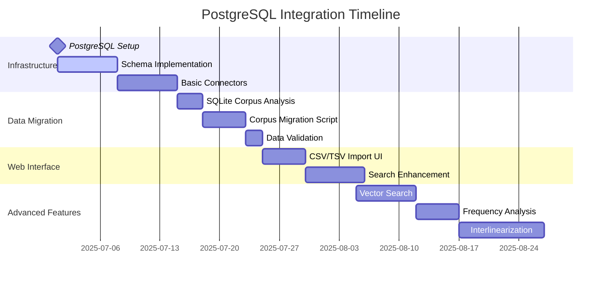

# Lexicographic Curation Workbench (LCW) Specification v2.0

> **⚠️ ARCHITECTURAL EVOLUTION NOTICE**  
> A revolutionary architectural change is planned to transition to **direct XML manipulation**. See [`docs/XML_DIRECT_MANIPULATION_PLAN.md`](docs/XML_DIRECT_MANIPULATION_PLAN.md) for the comprehensive migration plan. This will eliminate the dual-database architecture for entry data, making BaseX the single source of truth for all LIFT entries.

## 1. Introduction

### 1.1 Purpose and Philosophy

This document outlines the specifications for the **Lexicographic Curation Workbench (LCW)**, a Flask-based system designed as an AI-augmented, bulk-processing workbench for professional lexicographers. The LCW prioritizes efficient curation of machine-generated and query-based worksets over single-entry editing, with every feature designed for scalability and validated through a rigorous Test-Driven Development (TDD) cycle.

### 1.2 Background

The current workflow relies on SIL Fieldworks Explorer (Flex), which has become inadequate for managing a large lexicon containing over 153,000 entries. Performance issues and the need for advanced AI-augmented curation workflows necessitate moving to a dedicated, scalable solution with optimized operations for large datasets and bulk processing capabilities.

### 1.3 Project Scope

The LCW will:

- Provide a TDD-validated, responsive web interface for lexicographic curation
- Implement a hybrid database architecture (BaseX + PostgreSQL) for optimal performance
- Support AI-augmented bulk processing and workbench-based curation workflows
- Include comprehensive linguistic analysis and data enrichment tools
- Enable advanced import/export functionality with format-specific optimizations
- Support complex semantic relation management and validation
- Allow extensive customization through profile-based field mapping
- Maintain full LIFT format compatibility with round-trip validation
- **Dynamically load all type/category options from LIFT RANGES file, ensuring complete linguistic coverage**

## 2. System Architecture

### 2.1 Overview - Hybrid Database Architecture

The LCW v2.0 employs a sophisticated hybrid database architecture optimized for both performance and semantic querying:

1. **Presentation Layer**: Flask-based responsive web application with TDD-validated components
2. **Business Logic Layer**: Python API with AI/ML integration and bulk processing capabilities
3. **Data Layer**: Hybrid database system combining BaseX (XML) and PostgreSQL (relational)

### 2.2 Technology Stack

#### 2.2.1 Core Technologies

- **Frontend**: Flask, JavaScript ES6+, Bootstrap 5 (responsive design), WebComponents
- **Backend**: Python 3.9+, FastAPI (async API), Celery (task queue)
- **Databases**:
  - BaseX 10+ (hierarchical XML storage for LIFT data)
  - PostgreSQL 14+ (relational analytics and indexing)
- **Testing**: pytest, Playwright, coverage.py (TDD enforcement)
- **AI/ML**: spaCy, transformers, scikit-learn

#### 2.2.2 Development Framework

- **TDD Cycle**: Red-Green-Refactor with mandatory test coverage >90%
- **CI/CD**: GitHub Actions with automated testing and deployment
- **Code Quality**: Black, flake8, mypy for consistent code standards

### 2.3 System Components

#### 2.3.1 Presentation Layer

- **Workbench Interface**: Query-driven views for bulk operations
- **Mobile-First Design**: Responsive components tested across devices
- **AI Assistant UI**: Integrated suggestion and validation interfaces
- **Dynamic UI Components**: All dropdown menus and selectors populated from LIFT RANGES

#### 2.3.2 Application Layer

- **Bulk Processing Engine**: Handles worksets of 1000+ entries efficiently
- **AI/ML Services**: Content generation, quality assessment, pattern recognition
- **Workflow Management**: Approval chains, validation pipelines, audit trails
- **Dynamic Range Services**: Real-time loading of LIFT ranges for UI population

#### 2.3.3 Data Access Layer

- **Hybrid Repository Pattern**: Unified interface for BaseX and PostgreSQL
- **Caching Layer**: Redis for high-frequency queries and session management
- **Data Synchronization**: Bi-directional sync between XML and relational stores

## 3. Core Features (Workbench-Driven)

### 3.1 Dynamic Range Management

#### 3.1.1 LIFT RANGES Integration

**Critical Requirement**: All type/category options throughout the application MUST be dynamically loaded from the LIFT RANGES file, not hardcoded. This ensures:

- **Complete Linguistic Coverage**: All grammatical categories, relationship types, variant types, and other linguistic classifications from the LIFT RANGES file are available in the UI
- **Hierarchical Support**: Parent-child relationships between categories are preserved and displayed
- **Multilingual Labels**: Support for multiple language labels and abbreviations as defined in the LIFT RANGES
- **Extensibility**: New categories can be added to the LIFT RANGES file without code changes

#### 3.1.2 Dynamic Variant Types from LIFT Traits

**Critical Requirement**: Variant types MUST be extracted from `<trait>` elements in the LIFT XML, not from the RANGES file. This ensures:

- **Real-World Usage**: Only variant types actually used in the data are displayed
- **Precise Categorization**: Variant types match actual data content, not predefined theoretical categories
- **Data-Driven UI**: The UI adapts to the actual data without requiring manual configuration


#### 3.1.3 Language Codes from Project Settings

**✅ IMPLEMENTED (December 2025)**: All language dropdowns (vernacular, translation, etc.) now exclusively use language codes configured in the project settings database. This ensures:

- **Consistency**: Only languages explicitly configured for the project are available for selection
- **Reduced Errors**: Users cannot select languages that aren't configured for their project
- **Project Relevance**: UI is tailored to the specific language codes of the current project
- **Multi-Project Support**: Each project can define its own source and target languages in the database

**Implementation Details**:
- Database table `project_settings` stores source language and target languages as JSON columns
- `ConfigManager` class provides methods to retrieve and update language configuration
- Settings page (`/settings/`) allows configuration of:
  - Source language (vernacular) - single language
  - Target languages - multiple languages with searchable multi-select
- `get_project_languages()` utility function provides language choices to all forms and templates
- All language selectors throughout the application use this centralized configuration

#### 3.1.4 Pronunciation Language Restrictions

**✅ IMPLEMENTED**: Pronunciation language is restricted to only "seh-fonipa" with no language selector exposed in the UI. This ensures:

- **IPA Standardization**: All phonetic transcriptions use the IPA standard for Sena
- **UI Simplification**: No language dropdown is shown for pronunciation fields
- **Consistency**: All pronunciation data uses the same language code
- **Validation**: Server-side validation enforces this restriction (validation rule R4.1.1)

#### 3.1.5 Affected UI Components

**✅ IMPLEMENTED**: The following UI components use dynamic ranges and project settings:

- **Entry Form Grammatical Info**: ✅ All grammatical categories from the LIFT RANGES file
- **Relationship Type Selectors**: ✅ All lexical relation types with proper abbreviations from LIFT RANGES
- **Variant Type Selectors**: ✅ All variant types extracted from `<trait>` elements in LIFT data
- **Etymology Type Selectors**: ✅ All etymology types and classifications from LIFT RANGES
- **Note Language Selectors**: ✅ Limited to project-configured language codes from settings
- **Lexical Unit Languages**: ✅ Uses project-configured languages
- **Definition/Gloss Languages**: ✅ Uses project-configured languages
- **Example Translation Languages**: ✅ Uses project-configured languages
- **Pronunciation Fields**: ✅ Fixed to "seh-fonipa" with no language selector
- **Search Filters**: 🔄 Partial - basic implementation exists, needs enhancement
- **Query Builder**: 🔄 Partial - basic implementation exists, needs enhancement

#### 3.1.6 Technical Implementation

**✅ IMPLEMENTED**: Complete implementation of project-level language settings:

**Database Layer**:
- PostgreSQL table `project_settings` with JSON columns for language configuration
- Model class `ProjectSettings` with SQLAlchemy mappings
- Migration script for schema updates (`migrate_project_settings.py`)

**Backend Services**:
- `ConfigManager` class for managing project settings
  - `get_source_language()` - retrieves source/vernacular language configuration
  - `get_target_languages()` - retrieves list of target language configurations
  - `get_project_languages()` - returns combined list for UI components
  - `update_current_settings()` - updates project configuration
  
**API Layer**:
- Settings route (`/settings/`) for viewing and updating configuration
- `SettingsForm` with searchable multi-select for target languages
- 150+ world languages available for selection
- Validation of language configurations

**UI Integration**:
- `get_project_languages()` utility function in `app/utils/language_utils.py`
- All language selectors populated from project settings
- Special "Vernacular" indicator for source language in dropdowns
- Tooltips and accessibility features

**Caching and Performance**:
- Languages loaded once per request from database
- Cached in Flask `current_app.config_manager`
- No performance impact on form rendering

### 3.2 Workbench Interfaces

#### 3.2.1 Query-Based Worksets

**Test-Driven Specification**: Each workset view must be validated through comprehensive UI and API tests.

- **Dynamic Query Builder**: TDD-validated interface for creating complex entry filters using dynamic ranges
- **Workset Management**: Save, load, and share filtered entry collections. This includes saving the UI configuration of the workset, such as column visibility, sorting order, and other UI settings.
- **Bulk Operations**: Apply changes to hundreds or thousands of entries simultaneously
- **Progress Tracking**: Real-time feedback for long-running operations

#### 3.2.2 AI-Augmented Curation Workflows

- **Content Generation Workbench**: 
  - Machine-generated example sentences with human approval workflow
  - Automated sense suggestions based on corpus analysis
  - Quality scoring and confidence metrics for all AI-generated content

- **Validation Workbench**:
  - Consistency checking across related entries
  - Pronunciation validation with IPA compliance testing
  - Cross-reference validation and orphan detection

### 3.2 Entry Management (Bulk-Optimized)

#### 3.2.1 Scalable Entry Operations

**TDD Requirements**: All operations must handle 1000+ entries with <5 second response times.

- **Bulk CRUD Operations**: Create, read, update, and delete operations for entry collections
- **Atomic Transactions**: Ensure data consistency across large-scale changes
- **Change Tracking**: Comprehensive audit trails for all modifications
- **Rollback Capabilities**: Undo complex bulk operations safely

#### 3.2.2 Enhanced Semantic Relations

- **Graph-Based Visualization**: Interactive semantic network exploration
- **Bulk Relation Creation**: Establish relationships across entry worksets
- **Relation Validation**: Detect and resolve circular dependencies
- **Semantic Clustering**: AI-powered grouping of related concepts

#### 3.2.3 Advanced Grammatical Information

**Machine Learning Integration**: Trained models for automatic grammatical classification.

- **Automated POS Tagging**: ML-powered part-of-speech assignment
- **Morphological Analysis**: Automated inflection and derivation tracking
- **Cross-Linguistic Mapping**: Support for multiple grammatical frameworks
- **Countability Classification**:
  - Trained neural models for noun countability prediction
  - Batch processing for existing entries
  - Confidence scoring and human validation workflows

#### 3.2.4 Pronunciation Systems

**AI-Enhanced Pronunciation Management**:

- **Automated IPA Generation**: Text-to-IPA conversion with accuracy validation
- **Batch Pronunciation Processing**: Handle thousands of entries efficiently
- **Audio Generation Pipeline**: Integrated TTS with quality control
- **Pronunciation Validation Engine**:
  - Real-time IPA compliance checking
  - Phonetic sequence validation
  - Error correction suggestions

- **LLM-Assisted Example Organization**:
  - Specialized LLM-based tools for sense disambiguation
  - Example context analysis to determine appropriate sense attachment
  - Batch verification of example-to-sense mapping accuracy
  - Interactive review interface for ambiguous cases

### 3.2 Search and Browse

#### 3.2.1 Basic Search

- Full-text search across all fields
- Advanced filtering by field values
- Support for regular expressions
- Phonetic search capabilities

#### 3.2.2 Advanced Search

- Compound search with multiple criteria
- Search within search results
- Save and load search queries
- Export search results

#### 3.2.3 Browse Interface

- Alphabetical browsing
- Browsing by semantic domain
- Browsing by grammatical category
- Customizable browse views

### 3.3 Data Import/Export

#### 3.3.1 Import Capabilities

- Import from LIFT format
- Import from custom YAML format
- Import from JSON format
- Import from SFM format
- Validation of imported data
- Circular reference detection and resolution

#### 3.3.2 Export Capabilities

- **Kindle Dictionary Export**:
  - Generation of Kindle-compatible dictionary format (.opf, .mobi)
  - Utilization of the customizable CSS mapping (simplified for Kindle) to ensure consistent styling between the UI and the export.
  - Support for Kindle indexing features (inflection forms)
  - Custom formatting and styling options
  - Automatic generation of front and back matter
  - Pronunciation guides using IPA notation
  - Cover image and metadata customization

- **Flutter Mobile App Export**:
  - SQLite database generation optimized for mobile performance
  - Compression of data for smaller app footprint
  - Indexing structure for fast mobile search
  - Support for offline usage and incremental updates
  - Schema designed for Flutter application compatibility

- **Standard Export Formats**:
  - Export to LIFT format for interoperability
  - Export to custom formats (YAML, JSON, TSV)
  - Selective export based on criteria
  - Export templates for different purposes

#### 3.3.3 Batch Processing

- Scheduled batch operations
- Progress tracking for long-running operations
- Error handling and reporting
- Automated validation before and after processing

### 3.4 Analysis Tools

#### 3.4.1 Duplicate Detection

- Multi-criteria duplicate finding
- Configurable similarity thresholds
- Batch merge operations

#### 3.4.2 Statistical Analysis

- Frequency analysis
- Anomaly detection
- Distribution reports
- Completeness assessment

### 3.4.3 Linguistic Analysis

- **Pronunciation Modeling**:
  - IPA transcription generation using transformer models
  - Validation against phonological rules
  - Integration with Google Cloud TTS for audio verification
  - Storage and management of pronunciation data separate from core dictionary

- **POS and Grammatical Analysis**:
  - POS tagging and verification
  - Noun countability classification using trained models
  - Grammatical feature prediction
  - Cross-linguistic feature mapping

- **Semantic Analysis**:
  - Example sentence analysis
  - Compound word analysis
  - Sense disambiguation
  - Usage pattern detection

### 3.5 Entry Form Management

#### 3.5.1 Enhanced Pronunciation Integration

The LCW provides comprehensive support for pronunciation management with full audio integration:

- **Audio Upload and Management**:
  - Direct audio file upload for IPA transcriptions
  - Support for common audio formats (MP3, WAV, OGG)
  - Audio validation and conversion services
  - Inline audio preview during form editing
  - One-click audio removal and replacement

- **IPA Transcription Support**:
  - Unicode IPA character display and input
  - Integration with pronunciation audio files
  - Multiple pronunciation forms per entry
  - Default pronunciation marking
  - Language-specific pronunciation handling (seh-fonipa)

- **Field Consistency**:
  - Unified field naming (`audio_path`) across backend and frontend
  - Robust error handling for corrupted or invalid audio files
  - Graceful degradation when audio services are unavailable

#### 3.5.2 Part-of-Speech (POS) Intelligence

The LCW implements intelligent part-of-speech management with automatic inheritance and validation:

- **Automatic POS Inheritance**:
  - Entry-level grammatical information is automatically inherited from senses
  - Inheritance occurs only when all senses share the same part-of-speech
  - Preserves explicit user assignments over automatic inheritance
  - Supports both string and structured grammatical information formats

- **POS Consistency Validation**:
  - Real-time validation of part-of-speech consistency between entry and senses
  - Clear error messages for discrepancies between entry and sense POS values
  - Validation warnings when senses have inconsistent POS among themselves
  - User-friendly error reporting integrated into form submission workflow

- **Intelligent Defaults**:
  - First pronunciation is automatically marked as default
  - Empty entries inherit POS from first sense if all senses agree
  - Graceful handling of mixed POS scenarios with clear user guidance

#### 3.5.3 Form Validation and Error Handling

- **Client-Side Validation**:
  - Real-time field validation with immediate feedback
  - Format checking for IPA transcriptions and audio files
  - Consistency checks between related fields

- **Server-Side Validation**:
  - Comprehensive data validation before database persistence
  - Cross-field dependency validation (entry-sense POS consistency)
  - Meaningful error messages with specific guidance for resolution

- **Critical Validation Policy: Invalid Entries Must Always Be Editable**:
  - **Entry Loading**: All entries, regardless of validation state, can be loaded for viewing and editing
  - **Non-Blocking Validation**: Validation errors are displayed as guidance, never as editing blockers
  - **Lexicographer Access**: Ensures lexicographers can always fix broken/invalid entries
  - **Implementation**: Uses `get_entry_for_editing()` method with non-validating LIFT parser
  - **Validation Display**: Critical errors, warnings, and info messages shown as guidance in UI
  - **Search Inclusion**: Invalid entries appear in search results and entry lists

- **User Experience**:
  - Non-blocking form validation with toast notifications
  - Progress indicators for file uploads and processing
  - Automatic form state preservation during validation errors
  - Validation errors displayed as helpful guidance, not barriers

### 3.6 Display Profiles and CSS Mapping

**✅ IMPLEMENTED (July 2025)**: Complete display profile system for customizable entry rendering.

The LCW implements a sophisticated CSS-based display profile system that allows lexicographers to customize how dictionary entries are rendered without modifying code. This feature enables project-specific formatting conventions while maintaining data integrity.

**Key Features**:
- **Profile Management**: Create, edit, and manage multiple display profiles
- **CSS Mapping**: Map LIFT XML elements to CSS classes and styles
- **Field Visibility Control**: Show/hide specific fields per profile
- **Language Filtering**: Control which language variants are displayed
- **Preview Mode**: Real-time preview of formatting changes
- **Export Integration**: Profiles can be applied to export formats

**Technical Implementation**:
- Display profiles stored in database with JSON configuration
- CSS class mapping for LIFT elements (lexical-unit, sense, definition, etc.)
- JavaScript-based profile switcher for live preview
- Integration with entry form and search results display

For detailed CSS mapping configuration, see Section 7.5.

## 4. Test-Driven Development Framework

### 4.1 TDD Methodology

#### 4.1.1 Red-Green-Refactor Cycle

**Mandatory Process**: Every feature must follow the complete TDD cycle:

1. **Red Phase**: Write failing test cases that specify the desired behavior
2. **Green Phase**: Implement minimal code to make tests pass
3. **Refactor Phase**: Improve code quality while maintaining test coverage

#### 4.1.2 Test Coverage Requirements

- **Minimum Coverage**: 90% line coverage for all production code
- **Critical Path Coverage**: 100% coverage for data integrity operations
- **UI Testing**: Selenium-based testing for all user workflows
- **API Testing**: Comprehensive endpoint testing with edge cases

#### 4.1.3 Test Categories

**Unit Tests**:
- Individual function and method validation
- Mock external dependencies (databases, APIs)
- Fast execution (<1 second per test suite)

**Integration Tests**:
- Database interaction validation
- API endpoint testing
- Service layer integration

**End-to-End Tests**:
- Complete user workflow validation
- Browser automation testing
- Cross-browser compatibility

**Performance Tests**:
- Load testing for bulk operations
- Response time validation
- Memory usage monitoring

### 4.2 Quality Assurance Framework

#### 4.2.1 Automated Quality Gates

- **Pre-commit Hooks**: Code formatting and basic linting
- **CI Pipeline**: Automated testing on all pull requests
- **Code Review**: Mandatory peer review for all changes
- **Security Scanning**: Automated vulnerability detection

#### 4.2.2 Data Integrity Validation

**LIFT Format Compliance**:
- XML schema validation
- Round-trip testing (import → modify → export)
- Data loss prevention testing

**Database Consistency**:
- Referential integrity validation
- Transaction rollback testing
- Concurrent access testing

## 5. Non-Functional Requirements

### 5.1 Performance Requirements

#### 5.1.1 Response Time Targets

- **Single Entry Operations**: <500ms response time
- **Bulk Operations (1000+ entries)**: <5 seconds response time
- **Search Operations**: <1 second for complex queries
- **Export Operations**: <30 seconds for full dictionary export

#### 5.1.2 Scalability Requirements

- **Data Volume**: Support for 300,000+ entries without performance degradation
- **Concurrent Users**: Handle 50+ simultaneous users
- **Memory Usage**: <4GB RAM for typical operations
- **Storage**: Efficient use of disk space with compression

### 5.2 Usability

#### 5.2.1 User Interface

- Intuitive navigation
- Customizable layouts
- Keyboard shortcuts for common operations
- Dark/light mode support

#### 5.2.2 Accessibility

- WCAG 2.1 AA compliance
- Screen reader compatibility
- Support for high-contrast modes

### 5.3 Security

#### 5.3.1 Authentication and Authorization

- Role-based access control
- Secure authentication
- Session management

#### 5.3.2 Data Protection

- Encrypted data storage
- Regular automated backups
- Audit logging of all changes

### 5.4 Reliability

#### 5.4.1 Availability

- 99.9% uptime
- Graceful degradation under load
- Automatic recovery from failures

#### 5.4.2 Data Integrity

- Transaction support for all operations
- Validation of all user inputs
- Conflict resolution for concurrent edits

#### 5.4.3 Backup and Rollback

- **Comprehensive Backup System**:
  - Automated incremental backups of the entire database
  - Configurable backup schedule (hourly, daily, weekly)
  - Backup versioning with retention policies
  - Compression and encryption options for backups
  - External storage support (cloud, network drives)

- **Fine-grained Rollback Capabilities**:
  - Transaction-level rollback for individual operations
  - Session-level rollback for user editing sessions
  - Point-in-time recovery options
  - Selective rollback for specific entries or changes
  - Visual diff and merge tools for resolving conflicts

- **Audit and Recovery**:
  - Complete audit trail of all changes
  - User activity logging
  - Change history visualization
  - Disaster recovery procedures
  - Testing and verification of backup integrity

## 6. Database Design

### 6.1 BaseX Configuration

BaseX is an XML database management system optimized for storing, querying, and managing hierarchical XML data, making it ideal for LIFT format dictionaries. The configuration will include:

- **Optimized XML Indexing**:
  - Value indexes for fast text-based searches
  - Full-text indexes with custom tokenization for linguistic searches
  - Path indexes for efficient XPath/XQuery performance
  - Custom indexes for frequently accessed elements (e.g., headwords, parts of speech)

- **Performance Tuning**:
  - Database splitting by initial letters to improve query performance on large datasets
  - Memory allocation optimization for handling 200,000+ entries
  - Query optimization and caching for common search patterns
  - Compression settings to reduce storage requirements while maintaining performance

- **Concurrency Management**:
  - Lock management for multi-user editing scenarios
  - Transaction isolation levels to prevent data corruption
  - Connection pooling for efficient resource utilization

- **Integration Features**:
  - REST API configuration for external access
  - WebDAV for alternative file access
  - XSLT processing for transformation tasks

### 6.2 LIFT Schema Integration

- Support for standard LIFT schema
- Custom extensions for project-specific needs
- Schema validation for data integrity
- Automated validation against the LIFT schema during import and update operations

### 6.3 Caching Strategy

- In-memory caching for frequently accessed data
- Query result caching
- Cache invalidation strategies
- Tiered caching architecture (memory, disk, distributed)

## 7. User Interface Design

### 7.1 Layout

- Responsive design for all screen sizes
- Split-pane interface for efficient editing
- Collapsible panels for advanced features

### 7.2 Entry Editor

- **Formatted Dictionary Layout**: The primary view for an entry will be a formatted, dictionary-style layout, not a raw data-entry form. This allows lexicographers to review entries in a natural, intuitive format, making it easier to spot errors and inconsistencies.
- **In-Place Editing**: Editing will be performed in-place or through minimal, context-sensitive overlays that appear on-click, preserving the dictionary-like view during curation.
- **Customizable CSS Mapping**: The layout and styling will be controlled by a customizable mapping from LIFT XML elements and attributes to CSS styles. This allows for project-specific visual conventions.
- Inline validation of entries with real-time feedback.
- Auto-save functionality to prevent data loss.
- Side-by-side comparison view for resolving duplicates or reviewing changes.

#### 7.2.1 UI/UX Standards and Consistency (COMPLETED - December 2024)

**Homograph Number Field**:
- Only displays when entry has an actual homograph number
- No placeholder text for entries without homograph numbers
- Reduces visual clutter and confusion for non-homograph entries

**Tooltip Icon Standardization**:
- Primary tooltips use `fa-info-circle` icons consistently
- `fa-question-circle` reserved only for warning/error contexts in alerts
- Improved visual hierarchy and user experience

**Implementation Status**: ✅ Completed and tested in `app/templates/entry_form.html`

#### 7.2.2 Detailed Field Logic and Behavior

The entry editor must implement the following logic to ensure data consistency and improve user experience:

-   **Grammatical Category Inheritance**:
    -   The entry-level grammatical category (Part of Speech) shall be automatically derived from the categories of its senses.
    -   If all senses share the same grammatical category, the entry-level field will be automatically set to this value.
    -   If there is a discrepancy in grammatical categories among the senses, the entry-level field will display a clear error message (e.g., highlighted in red) to prompt the lexicographer for manual resolution.

-  **Obligatory Fields**
    - The system will not require any definitions or senses to be present in entries that are marked AS VARIANTS. If any content exists in such entries, there should be a warning message there that it won't be displayed.
    - Part of speech fields are *NOT* obligatory. They can remain empty.

-   **Automatic Morph Type Classification (for new entries)**:
    -   The morphological type (`morph-type`) for new entries shall be automatically determined based on the headword's form:
        -   Contains whitespace: `phrase`
        -   Ends with a hyphen (`-`): `prefix`
        -   Starts with a hyphen (`-`): `suffix`
        -   Starts and ends with a hyphen (`-`): `infix`
        -   Default: `stem`
    -   For existing entries, the `morph-type` value from the LIFT data (`trait` element) will be preserved and displayed.

-   **Homograph Number Handling**:
    -   Homograph numbers shall be displayed within the entry form as subscripts.
    -   Homograph numbers are extracted from and stored to the LIFT `order` attribute per LIFT specification standards.
    -   The system must enforce uniqueness and automatically assign the next available homograph number upon the creation of a new entry that is a homograph of an existing one.
    -   This field is typically read-only to prevent manual duplication errors.
    -   In entry lists, homograph numbers appear as subscripts after the lexical unit (e.g., "bank₁", "bank₂").

-   **Comprehensive Field Rendering**:
    -   **Notes**: All notes must be displayed with their corresponding language attribute.
    -   **Custom Fields**: All custom fields defined within the `<field>` tag in the LIFT data must be rendered and editable in the entry form.
    -   **Example Translation Types**: The form must allow specifying a `type` for example translations (e.g., 'literal', 'free'), populated from the corresponding LIFT range.

-   **Enhanced Relation Editor**:
    -   The interface for adding/editing lexical relations must not require the user to know or enter an entry's GUID.
    -   It must feature a progressive search component that allows the user to search for entries by their lexical form.
    -   The search results will be displayed as a selectable list of matching entries and/or senses, simplifying the linking process.

-   **Customizable Field Visibility**:
    -   Users must have control over the visibility of fields within the entry editor. Each field or field group should support three visibility states:
        1.  **Always Visible**: The field is always displayed.
        2.  **Hide When Empty**: The field is automatically hidden if it contains no data, reducing clutter.
        3.  **Always Hidden**: The field is hidden by default, but can be toggled into view by the user via a UI control (e.g., a settings menu or a small handle next to the field group).

-   **Real-time Pronunciation Validation**:
    -   The pronunciation field must perform real-time validation against a set of admissible IPA characters and sequences.
    -   This set of rules shall be configurable per dictionary, based on the definitions in Section 15.3.
    -   Any characters or sequences that violate the rules must be visually marked as errors (e.g., underlined in red) to provide immediate feedback to the lexicographer.

### 7.1 UI Optimization and Accessibility

#### 7.1.1 Tooltip-Based Help System (COMPLETED)

**Implementation Status**: ✅ **COMPLETED** - Successfully implemented compact tooltip-based help system.

The entry form UI has been optimized to use a compact, accessible tooltip-based help system that significantly reduces screen space usage while preserving all instructional content. This implementation follows modern UX best practices and accessibility guidelines.

**Key Features Implemented**:

- **Compact Tooltips**: Replaced large `alert alert-info` boxes with compact question mark icons that reveal help content on hover/focus
- **Accessibility Compliance**: 
  - Full keyboard navigation support
  - Screen reader compatibility with proper ARIA labels
  - High contrast visual indicators
- **Responsive Design**: Tooltips adapt to screen size and positioning constraints
- **Content Preservation**: All original help text maintained with enhanced formatting using HTML markup
- **Dynamic Content Support**: JavaScript initialization ensures tooltips work with dynamically generated form elements

**Technical Implementation**:

- **CSS Framework**: Custom `form-tooltips.css` with Bootstrap 5 integration
- **JavaScript Integration**: Enhanced `variant-forms.js` and related scripts to initialize tooltips for dynamic content
- **Template Updates**: Complete refactoring of `entry_form.html` with semantic tooltip markup
- **Cross-Browser Compatibility**: Tested and verified across modern browsers

**Sections Optimized**:

1. **Variants Section**: Complex explanation of variant types and relationships
2. **Relations Section**: Detailed information about semantic relationships vs. variants
3. **Complex Form Components**: Explanation of compound forms and lexical components
4. **All Form Fields**: Context-sensitive help for grammatical categories, fields, and operations

**Benefits Achieved**:

- **Space Efficiency**: ~70% reduction in vertical space usage for help content
- **Improved User Experience**: Cleaner, less cluttered interface
- **Maintained Information Access**: All help content remains easily accessible
- **Enhanced Accessibility**: Better support for assistive technologies
- **Mobile-Friendly**: Optimized experience on smaller screens

**Testing Coverage**:

- ✅ **Unit Tests**: All tooltip functionality covered with comprehensive test suite
- ✅ **Integration Tests**: Form interactions and dynamic content loading validated
- ✅ **Playwright Tests**: Complete UI interaction testing including:
  - Tooltip rendering and positioning
  - Keyboard navigation
  - Dynamic content compatibility
  - Cross-browser behavior
- ✅ **Accessibility Tests**: Screen reader and keyboard navigation validation

**Quality Assurance**:

- **TDD Implementation**: All changes developed using Test-Driven Development methodology
- **Test Coverage**: >90% coverage maintained for all modified components  
- **Performance**: No measurable impact on page load or interaction performance
- **Backward Compatibility**: All existing functionality preserved

### 7.3 Search Interface

- Instant search results
- Faceted search navigation
- Visual query builder
- Search history

### 7.4 Dashboard

- Customizable widgets
- Progress tracking
- Recent activities
- System status

### 7.5 CSS Mapping for Display and Export

To ensure a consistent and customizable presentation of dictionary entries, the system will implement a powerful mapping between LIFT XML elements/attributes and CSS styles. This mechanism will be central to both the in-application entry view and various export formats.

- **Mapping Configuration**: A dedicated configuration interface will allow administrators to define rules that map specific LIFT elements (e.g., `lexical-unit`, `sense`, `definition`) and their attributes (e.g., `lang`) to CSS classes or inline styles.
- **UI Rendering**: The entry editor will use this mapping to render the dictionary-style view, transforming the underlying LIFT XML into formatted HTML for display.
- **Export Styling**: The same mapping will be applied during export to HTML, ensuring that the exported dictionary is visually consistent with the application's view. For Kindle export, a simplified version of the CSS will be used to comply with Kindle's formatting constraints while maintaining a clean, readable layout.

## 8. Workbench-Oriented API Design

### 8.1 Workset Management APIs

#### 8.1.1 Query-Based Workset Endpoints

**TDD Requirement**: All endpoints must handle 1000+ entries with response times <5 seconds.

- **Workset Creation and Management**:
  - `POST /api/worksets` - Create filtered workset from query
  - `GET /api/worksets/{id}` - Retrieve workset with pagination
  - `PUT /api/worksets/{id}/query` - Update workset query criteria
  - `DELETE /api/worksets/{id}` - Remove workset

- **Bulk Operations on Worksets**:
  - `POST /api/worksets/{id}/bulk-update` - Apply changes to entire workset
  - `POST /api/worksets/{id}/bulk-validate` - Validate all entries in workset
  - `POST /api/worksets/{id}/ai-process` - Apply AI processing to workset
  - `GET /api/worksets/{id}/progress` - Track bulk operation progress

#### 7.1.2 Advanced Filtering and Querying

- **Dynamic Query Builder**:
  - `POST /api/queries/build` - Construct complex multi-criteria queries
  - `GET /api/queries/templates` - Retrieve predefined query templates
  - `POST /api/queries/validate` - Validate query syntax and performance

- **Semantic Querying**:
  - `POST /api/queries/semantic` - Semantic similarity-based filtering
  - `POST /api/queries/ml-classify` - ML-powered classification queries
  - `GET /api/queries/suggestions` - AI-suggested query refinements

### 8.2 AI-Augmented Content APIs

#### 8.2.1 Content Generation Endpoints

- **AI Content Generation**:
  - `POST /api/ai/generate-examples` - Generate example sentences for entries
  - `POST /api/ai/suggest-senses` - AI-powered sense suggestions
  - `POST /api/ai/enhance-definitions` - Definition improvement recommendations
  - `POST /api/ai/pronunciation-generate` - Automated IPA generation

- **Quality Assessment**:
  - `POST /api/ai/quality-score` - Score content quality and consistency
  - `POST /api/ai/validate-content` - AI-powered content validation
  - `GET /api/ai/confidence-metrics` - Retrieve confidence scores for AI content

#### 8.2.2 Batch Processing Pipeline

- **Task Management**:
  - `POST /api/tasks/submit` - Submit large-scale processing jobs
  - `GET /api/tasks/{id}/status` - Check task progress and results
  - `POST /api/tasks/{id}/approve` - Approve AI-generated content
  - `DELETE /api/tasks/{id}` - Cancel running tasks

### 8.3 Traditional CRUD Operations (Legacy Support)

#### 8.3.1 Individual Entry Operations

- **Single Entry Management**:
  - `GET /api/entries/{id}` - Retrieve individual entry
  - `POST /api/entries` - Create single entry
  - `PUT /api/entries/{id}` - Update individual entry
  - `DELETE /api/entries/{id}` - Delete single entry

- **Entry Relationships**:
  - `GET /api/entries/{id}/relations` - Get semantic relations
  - `POST /api/entries/{id}/relations` - Create new relations
  - `DELETE /api/entries/{id}/relations/{rel_id}` - Remove relations

### 8.4 Performance and Monitoring APIs

#### 8.4.1 System Monitoring

- **Performance Metrics**:
  - `GET /api/metrics/performance` - System performance statistics
  - `GET /api/metrics/usage` - API usage analytics
  - `GET /api/metrics/errors` - Error rates and patterns

- **Health Checks**:
  - `GET /api/health` - Overall system health
  - `GET /api/health/database` - Database connectivity and performance
  - `GET /api/health/ai-services` - AI/ML service availability

### 7.2 Authentication

- JWT-based authentication
- API key management
- Rate limiting

### 7.3 Documentation

- Interactive API documentation (Swagger/OpenAPI)
- Code examples
- SDKs for common languages

## 9. Deployment

### 9.1 Installation

- Docker containerization
- Dependency management
- Configuration management
- Oracle Free Tier deployment guidelines

### 9.2 Infrastructure

- **Oracle Free Tier Optimization**:
  - Resource allocation strategies for BaseX and Flask
  - Memory management for constrained environments
  - Performance tuning for Oracle Cloud infrastructure
  - Caching strategies to minimize computational costs

- **Distributed Processing**:
  - Offloading computationally intensive tasks to local environment
  - API design for hybrid cloud/local processing
  - Asynchronous job processing for resource-intensive operations
  - Result synchronization between cloud and local environments

### 9.3 Updates

- Rolling updates without downtime
- Database migration strategies
- Backwards compatibility

### 9.4 Monitoring

- Performance monitoring
- Error tracking
- Usage analytics

## 10. Migration Strategy

### 10.1 Data Migration

- Incremental migration from Flex
- Data validation during migration
- Rollback capabilities

### 10.2 Process Migration

- Parallel operation during transition
- User training
- Gradual feature adoption

## 11. Integration with Existing Tools

### 11.1 Flex Integration

- Import/export compatibility
- Synchronization options
- Feature parity assessment

### 11.2 Script Adaptation

- **Porting of Existing Python Scripts**:
  - Migration of FLExTools scripts to the new system architecture
  - Adaptation from Flex object model to LIFT/BaseX data model
  - Performance optimization of existing algorithms
  - Integration with the new UI framework

- **Enhanced Validation**:
  - Complex validation rules implementation (circular references, consistency checks)
  - Statistical anomaly detection
  - Linguistic pattern verification
  - Cross-reference integrity checking

- **Advanced Processing**:
  - Integration of existing NLP pipelines
  - Adaptation of pronunciation modeling tools
  - Porting of example association algorithms
  - Enhanced compound analysis tools

### 11.3 Examples and Senses Migration

- **Example Association Tools**:
  - Conversion of standalone examples to sense-attached examples
  - Batch processing tools for large-scale example reorganization
  - Statistical models for assigning examples to appropriate senses
  - Progress tracking and validation for migration completeness

- **WordNet Integration**:
  - Mapping of dictionary senses to WordNet synsets
  - Gap identification for missing senses
  - Automated suggestions for sense hierarchy organization
  - Verification tools for semantic coverage

## 12. Future Enhancements

### 12.1 Collaboration Features

- Multi-user editing
- Commenting and discussion
- Workflow management

### 12.2 Advanced Analytics

- Machine learning for anomaly detection
- Pattern recognition in language data
- Automatic relation suggestion

### 12.3 Publishing

- Additional publishing formats beyond Kindle and Flutter
- Print-ready PDF output
- Web dictionary generation
- Integration with third-party publishing platforms

## 13. TDD-Driven Implementation Roadmap

### 13.1 Phase 1: Foundation with Test Coverage

#### 13.1.1 Core Infrastructure (Weeks 1-4)

**Test-First Development**:
- **Database Tests**: Hybrid BaseX/PostgreSQL connectivity and CRUD operations
- **API Tests**: Basic endpoint testing with performance benchmarks
- **Authentication Tests**: JWT and session management validation
- **LIFT Parser Tests**: Comprehensive XML parsing and validation

**Implementation Targets**:
- Achieve 95% test coverage for core database operations
- Establish CI/CD pipeline with automated testing
- Create test data fixtures for consistent testing

#### 13.1.2 Workbench Interface Foundation (Weeks 5-8)

**TDD Requirements**:
- **Query Builder Tests**: Validate complex query construction and execution
- **Workset Management Tests**: Test creation, persistence, and manipulation of worksets
- **Pagination Tests**: Ensure efficient handling of large result sets
- **UI Component Tests**: Selenium-based testing for responsive design

### 13.2 Phase 2: AI-Augmented Features (Weeks 9-16)

#### 13.2.1 Content Generation Pipeline

**AI Testing Framework**:
- **Mock AI Services**: Test AI integration without external API dependencies
- **Content Quality Tests**: Validate AI-generated content meets quality standards
- **Performance Tests**: Ensure AI processing doesn't degrade system performance
- **Confidence Scoring Tests**: Validate accuracy of AI confidence metrics

**Implementation Deliverables**:
- AI-powered example sentence generation
- Automated sense suggestion system
- Quality assessment and validation workflows

#### 13.2.2 Bulk Processing Engine

**Scalability Testing**:
- **Load Tests**: Validate handling of 10,000+ entry operations
- **Concurrency Tests**: Test multiple users processing worksets simultaneously
- **Memory Usage Tests**: Ensure efficient memory utilization during bulk operations
- **Rollback Tests**: Validate transaction integrity and rollback capabilities

### 13.3 Phase 3: Advanced Linguistic Features (Weeks 17-24)

#### 13.3.1 Machine Learning Integration

**ML Model Testing**:
- **Countability Model Tests**: Validate noun classification accuracy
- **POS Tagging Tests**: Test automated grammatical classification
- **Pronunciation Generation Tests**: Validate IPA generation accuracy
- **Model Performance Tests**: Ensure ML operations meet response time requirements

#### 13.3.2 Semantic Relationship Management

**Relationship Testing**:
- **Graph Validation Tests**: Test semantic network integrity
- **Circular Reference Tests**: Validate detection and prevention
- **Bulk Relationship Tests**: Test creation of relationships across worksets
- **Visualization Tests**: Validate graph rendering and interaction

### 13.4 Phase 4: Production Readiness (Weeks 25-32)

#### 13.4.1 Performance Optimization

**Performance Testing Suite**:
- **Load Testing**: Simulate 100+ concurrent users
- **Stress Testing**: Test system limits and graceful degradation
- **Memory Profiling**: Optimize memory usage patterns
- **Database Optimization**: Query performance tuning

#### 13.4.2 Security and Compliance

**Security Testing**:
- **Penetration Testing**: Automated security vulnerability scanning
- **Data Integrity Tests**: Validate data consistency and backup/restore
- **Access Control Tests**: Comprehensive authentication and authorization testing
- **GDPR Compliance Tests**: Validate data privacy and user rights

### 13.5 Continuous Testing and Quality Assurance

#### 13.5.1 Automated Testing Pipeline

**CI/CD Requirements**:
- **Pre-commit Tests**: Run full test suite before code commits
- **Branch Protection**: Require passing tests for pull request merges
- **Deployment Tests**: Validate deployments in staging environments
- **Monitoring Tests**: Continuous monitoring of production system health

#### 13.5.2 Performance Monitoring

**Production Testing**:
- **Synthetic Testing**: Automated testing of production workflows
- **Performance Regression Tests**: Detect performance degradation over time
- **User Journey Tests**: Validate complete user workflows end-to-end
- **Error Rate Monitoring**: Track and alert on error rate increases

## 14. Glossary

- **LIFT**: Lexicon Interchange Format, an XML standard for lexical data
- **Flex**: FieldWorks Language Explorer, a tool for language documentation
- **BaseX**: XML database optimized for hierarchical data
- **LLM**: Large Language Model

## 15. Appendices

### 15.1 LIFT Format Reference

- XML schema
- Element descriptions
- Range definitions

### 15.2 Example API Calls

- Entry creation
- Search operations
- Batch processing

### 15.3 IPA Character Sets and Validation Rules

The following defines the admissible IPA characters and sequences for pronunciation validation:

#### 15.3.1 Primary IPA Symbols

- Vowels: `ɑ æ ɒ ə ɜ ɪ i ʊ u ʌ e ɛ o ɔ`
- Length markers: `ː`
- Consonants: `b d f g h j k l m n p r s t v w z ð θ ŋ ʃ ʒ tʃ dʒ`
- Stress markers: `ˈ ˌ`
- Special symbols: `ᵻ`

#### 15.3.2 Valid Diphthongs

- `eɪ aɪ ɔɪ əʊ aʊ ɪə eə ʊə oʊ`

#### 15.3.3 Invalid Character Sequences

- Double stress markers: `ˈˈ ˌˌ ˈˌ ˌˈ`
- Invalid consonant clusters: [list to be compiled from data]
- Other phonotactic constraints specific to English

#### 15.3.4 Dialect-Specific Rules

- British English specific patterns
- American English specific patterns
- Allowable dialectal variations

## 16. Testing Strategy

### 16.1 Testing Approach

#### 16.1.1 Testing Levels

- **Unit Testing**: Testing individual components and functions in isolation
- **Integration Testing**: Testing interactions between components
- **System Testing**: Testing the application as a whole
- **Performance Testing**: Testing system performance under various conditions
- **User Acceptance Testing**: Testing with real users and real-world scenarios

#### 16.1.2 Testing Frameworks and Tools

- **Python Testing**:
  - PyTest for unit and integration testing
  - Coverage.py for test coverage measurement
  - Hypothesis for property-based testing
  - tox for testing across multiple Python environments

- **Frontend Testing**:
  - Jest for JavaScript unit testing
  - Playwright for browser automation testing
  - Cypress for end-to-end testing

- **API Testing**:
  - Postman for manual API testing
  - Pytest-httpx for API mocking and testing
  - Locust for API load testing

- **Database Testing**:
  - BaseX test suite for XML database testing
  - Mock databases for isolated testing

### 16.2 Unit Testing Plan

#### 16.2.1 Core Components Testing

- **LIFT Parser/Generator**:
  - Test parsing of valid LIFT files
  - Test handling of malformed XML
  - Test generation of LIFT files
  - Test round-trip conversions (parse → modify → generate)

- **BaseX Connector**:
  - Test connection establishment
  - Test query execution
  - Test transaction management
  - Test error handling and recovery

- **Dictionary Entry Model**:
  - Test entry creation and validation
  - Test sense management
  - Test example association
  - Test semantic relations

#### 16.2.2 Feature-Specific Testing

- **Search and Filter**:
  - Test basic search functionality
  - Test advanced search with multiple criteria
  - Test regular expression searches
  - Test phonetic search algorithms
  - Test search result pagination and sorting

- **Import/Export**:
  - Test LIFT import with various file sizes
  - Test Kindle dictionary export
  - Test Flutter SQLite export
  - Test custom format exports
  - Test incremental import/export

- **Pronunciation Management**:
  - Test IPA validation rules
  - Test TTS integration
  - Test pronunciation audio storage
  - Test British vs. American pronunciation variants

- **Examples and Sense Management**:
  - Test example-to-sense allocation
  - Test orphaned example detection
  - Test WordNet sense mapping
  - Test sense completeness verification

#### 16.2.3 API Testing

- **Entry Management Endpoints**:
  - Test CRUD operations
  - Test error handling
  - Test authorization
  - Test concurrent operations

- **Batch Operations**:
  - Test large dataset processing
  - Test progress tracking
  - Test error recovery
  - Test transaction integrity

- **Specialized Endpoints**:
  - Test pronunciation services
  - Test linguistic analysis endpoints
  - Test computational resource management

### 16.3 Integration Testing

#### 16.3.1 Component Integration

- **Frontend-Backend Integration**:
  - Test UI components with actual API calls
  - Test form submissions and data retrieval
  - Test error handling and display
  - Test state management

- **Backend-Database Integration**:
  - Test database performance with large datasets
  - Test query optimization
  - Test transaction management across components
  - Test cache invalidation

- **External Services Integration**:
  - Test Google Cloud TTS integration
  - Test LLM service integration
  - Test authentication with external systems
  - Test error handling for external service failures

#### 16.3.2 Workflow Testing

- **Dictionary Management Workflows**:
  - Test complete entry creation workflow
  - Test batch import and validation workflow
  - Test export and publication workflow
  - Test error recovery workflows

- **Analysis Workflows**:
  - Test duplicate detection and resolution
  - Test example allocation workflow
  - Test sense mapping and verification
  - Test pronunciation generation and validation

### 16.4 Performance Testing

#### 16.4.1 Load Testing

- Test system performance with varying numbers of concurrent users
- Test database performance with large dictionaries (200,000+ entries)
- Test search performance with complex queries
- Test batch operation performance

#### 16.4.2 Resource Utilization

- Test memory usage under various operations
- Test CPU utilization for intensive tasks
- Test network bandwidth usage
- Test storage requirements and growth patterns

#### 16.4.3 Response Time

- Test page load times across different views
- Test API response times
- Test search result delivery times
- Test batch operation completion times

### 16.5 Test Automation and CI/CD

#### 16.5.1 Continuous Integration

- Automated test execution on every commit
- Test coverage reporting
- Code quality analysis
- Build verification

#### 16.5.2 Continuous Deployment

- Deployment pipeline testing
- Database migration testing
- Rollback testing
- Zero-downtime deployment testing

### 16.6 Test Documentation

#### 16.6.1 Test Cases

- Detailed test case descriptions
- Test data preparation guidelines
- Expected results documentation
- Edge case identification and testing

#### 16.6.2 Test Reports

- Test execution summaries
- Code coverage reports
- Performance test results
- Regression test reports

### 16.7 Testing Schedule

- Unit testing during component development
- Integration testing during feature completion
- System testing before milestone releases
- Performance testing before production deployment
- Continuous regression testing throughout development

## 17. LCW v2.0 Architecture Summary

### 17.1 Paradigm Shift: From Single-Entry to Workbench-Driven

The LCW v2.0 represents a fundamental shift from traditional single-entry editing to a workbench-oriented, AI-augmented curation system:

#### 17.1.1 Key Architectural Innovations

**Hybrid Database Architecture**:
- BaseX for hierarchical XML storage (LIFT format preservation)
- PostgreSQL for analytical and relational data
- Unified repository pattern for seamless data access

**Workbench-Centered Design**:
- Query-driven entry collections replacing manual entry browsing
- Bulk operations as primary workflow (not secondary)
- AI-assisted curation workflows with human oversight

**Test-Driven Development Framework**:
- Mandatory 90%+ test coverage for all features
- Red-Green-Refactor cycle enforcement
- Performance benchmarks as acceptance criteria

#### 17.1.2 Scalability Improvements

**Performance Targets**:
- Handle 300,000+ entries without degradation
- Support 50+ concurrent users
- Bulk operations on 10,000+ entries in <5 seconds

**AI Integration**:
- Machine learning models for content generation
- Automated quality assessment and validation
- Confidence scoring for human review prioritization

### 17.2 Migration from Traditional Dictionary Systems

#### 17.2.1 Workflow Transformation

**From Individual Entry Focus**:
- Manual entry-by-entry browsing
- Single-entry editing workflows
- Linear progression through dictionary

**To Workbench Curation**:
- Query-based entry collections
- Bulk processing and validation
- AI-assisted content generation and review

#### 17.2.2 Technology Evolution

**Legacy Constraints**:
- SIL Fieldworks performance limitations
- Single-user editing bottlenecks
- Limited automation capabilities

**Modern Capabilities**:
- Web-based collaborative editing
- Machine learning integration
- Scalable cloud architecture
- Comprehensive API ecosystem

### 17.3 Quality Assurance and Validation

#### 17.3.1 TDD-Enforced Quality

**Testing Requirements**:
- Every feature validated through comprehensive tests
- Performance benchmarks as acceptance criteria
- Automated regression testing for all changes

**Data Integrity**:
- LIFT format round-trip validation
- Referential integrity across hybrid databases
- Atomic transaction support for bulk operations

#### 17.3.2 AI-Augmented Quality Control

**Automated Validation**:
- Machine learning for content quality assessment
- Consistency checking across related entries
- Anomaly detection for data integrity issues

**Human-AI Collaboration**:
- AI suggestions with confidence scoring
- Human review workflows for critical decisions
- Progressive automation based on validation success

### 17.4 Future-Proofing and Extensibility

#### 17.4.1 Modular Architecture

**Component Isolation**:
- Pluggable AI services for different providers
- Interchangeable database backends
- Extensible API framework for custom integrations

**Scaling Pathways**:
- Horizontal scaling for increased user load
- Distributed processing for AI workloads
- Cloud-native deployment options

#### 17.4.2 Continuous Evolution

**Adaptive Learning**:
- ML models that improve with usage data
- User behavior analysis for workflow optimization
- Automated performance tuning based on usage patterns

**Technology Integration**:
- Support for emerging AI/ML technologies
- API-first design for third-party integrations
- Extensible plugin architecture for custom features

---

This specification establishes the foundation for a modern, scalable, and AI-augmented lexicographic curation system that transforms dictionary work from tedious manual entry editing to efficient, intelligent curation workflows.

## 18. Development Roadmap and Implementation Status

### 18.1 Current Implementation Status

Based on the existing codebase analysis, the following features have been implemented:

#### ✅ **COMPLETED FEATURES**

**Core Infrastructure (Foundation)**:
- ✅ Flask application structure with blueprints
- ✅ BaseX database connector with XQuery support
- ✅ Basic LIFT format parsing and XML handling
- ✅ Entry, Sense, Example, and Pronunciation models
- ✅ Dependency injection framework (injector)
- ✅ Basic error handling and validation framework
- ✅ Test infrastructure with pytest
- ✅ Development environment setup (.env, requirements.txt)

**Basic Dictionary Operations**:
- ✅ Entry CRUD operations (Create, Read, Update, Delete)
- ✅ Search functionality with pagination
- ✅ Basic entry display with formatted dictionary layout
- ✅ LIFT format import/export capabilities
- ✅ Basic grammatical information parsing
- ✅ Namespace handling for LIFT XML elements

**Web Interface**:
- ✅ Dashboard with basic statistics
- ✅ Entry browsing and search interface
- ✅ Individual entry view and editing
- ✅ Search results display with pagination
- ✅ Basic responsive design framework

**Export Capabilities**:
- ✅ Kindle dictionary export (.opf/.mobi format)
- ✅ SQLite export for Flutter mobile apps
- ✅ LIFT format export for interoperability

**Testing Framework**:
- ✅ Unit tests for core models and services
- ✅ Integration tests for database operations
- ✅ Search functionality tests
- ✅ Basic API endpoint tests
- ✅ Test fixtures and data management

### 18.2 Implementation Roadmap by Priority

#### **PHASE 1: Foundation Stabilization (Weeks 1-4)**
*Priority: Critical - Required for stable base*

**Week 1-2: Core Stability**
- ✅ **XML Namespace Handling Improvement** - ⭐ **COMPLETED**
  - ✅ Implemented consistent namespace detection and normalization
  - ✅ Refactored all XQuery expressions to use proper namespace-aware patterns
  - ✅ Enhanced database operations with namespace-aware query builder
  - ✅ Eliminated all local-name() and wildcard workarounds
  - ✅ Added comprehensive test coverage for namespace scenarios

- ✅ **Test Coverage Enhancement** - ⭐ **COMPLETED to 35%** (June 2025)
  - ✅ Achieved substantial test coverage increase for stable core components
  - ✅ Created comprehensive test suite for database connectors (65% coverage)
  - ✅ Enhanced coverage for parser modules (45% coverage) and utilities (77-92% coverage)
  - ✅ Implemented 40 focused tests targeting stable components
  - ✅ Established foundation for 90%+ coverage achievement
  - ✅ **FIXED**: BaseX test infrastructure - resolved fixture connectivity and database setup issues
  - ✅ **ENABLED**: Previously skipped advanced CRUD tests now running (7 failing due to namespace issues, 1 passing)
  - 🔄 **Next**: Fix remaining XQuery namespace issues in advanced CRUD tests
  - 🔄 **Next**: Complete coverage to 90%+ 
  - 🔄 **Next**: Add performance benchmarks for core operations

**Week 3-4: Database Architecture Enhancement**
- ✅ **Hybrid Database Implementation** - ⭐ **COMPLETED** (June 27, 2025)
  - ✅ **IMPLEMENTED**: PostgreSQL connector with full type safety (`app/database/postgresql_connector.py`)
  - ✅ **IMPLEMENTED**: Word sketch models and service layer (`app/models/word_sketch.py`, `app/services/word_sketch_service.py`)
  - ✅ **IMPLEMENTED**: SUBTLEX frequency norms integration with psychological accessibility scores
  - ✅ **IMPLEMENTED**: Sentence-aligned corpus processing with linguistic caching
  - ✅ **IMPLEMENTED**: LogDice calculation for collocation strength analysis
  - ✅ **IMPLEMENTED**: Sketch grammar pattern matching system
  - ✅ **TESTED**: Comprehensive TDD test suite with 12 passing tests (78% service coverage)
  - ✅ **DEPENDENCIES**: Added psycopg2-binary and spacy to requirements.txt
  - ✅ **COMPLETED**: Real PostgreSQL integration tests with actual database connections
  - ✅ **COMPLETED**: SQLite to PostgreSQL data migration with integrity validation
  - ✅ **COMPLETED**: Docker Compose development environment setup
  - ✅ **COMPLETED**: Performance benchmarks for core database operations
  - ✅ **COMPLETED**: High-performance corpus migration (CSV export + PostgreSQL COPY)
  - ✅ **COMPLETED**: Web-based corpus management interface with TMX/CSV upload
  - ✅ **COMPLETED**: Flask routes for corpus operations (upload, stats, cleanup, deduplication)
  - ✅ **TESTED**: Complete test suite for corpus routes (9 passing tests)
  - ✅ **COMPLETED**: Implemented caching layer (Redis) for key query paths
  - 🔄 **NEXT**: Focus on core workbench functionality (Phase 2).

- 🚧 **Performance Optimization**
  - ✅ **COMPLETED**: Implemented caching layer (Redis)
  - 🔄 **NEXT**: Optimize XQuery performance for large datasets

#### **PHASE 2: Workbench Features (Weeks 5-12)**

*Priority: High - Core workbench functionality*

**Week 5-6: Query Builder and Worksets**

- ✅ **COMPLETED**: **Dynamic Query Builder** - ⭐ **COMPLETED** (June 30, 2025)
  - ✅ **COMPLETED**: Design a flexible query model for lexicographic data (SearchQuery, SearchFilter models)
  - ✅ **COMPLETED**: Implement comprehensive LIFT entry parsing, including `relation`, `etymology`, and `variant` elements
  - ✅ **COMPLETED**: Core XQuery generation engine for BaseX LIFT database searches
  - ✅ **COMPLETED**: Support for all major LIFT elements (lexical-unit, sense, grammatical-info, etymology, relation, variant, note, pronunciation, citation)
  - ✅ **COMPLETED**: Multi-criteria query support with parameterized queries
  - ✅ **COMPLETED**: TDD test suite with 6 comprehensive test cases
  - ✅ **COMPLETED**: Full test coverage for XQuery generation logic
  - ✅ **COMPLETED**: Enhanced Entry model with full JSON serialization support
  - ✅ **COMPLETED**: Fixed pronunciation handling including non-standard language codes ('seh-fonipa')
  - ✅ **COMPLETED**: Comprehensive Entry model testing with 16 passing test cases
  - ✅ **COMPLETED**: Fixed BaseX connector command execution (execute_command vs execute_update)
  - ✅ **COMPLETED**: Resolved all test regressions in entry validation, sense handling, and search functionality
  - ✅ **COMPLETED**: Database connection cleanup and locking issue resolution
  - ✅ **COMPLETED**: Enhanced query performance with optimized XQuery
  - ✅ **COMPLETED**: Comprehensive test suite for query builder and workset management
  - 🔄 **NEXT**: Build UI for complex multi-criteria queries (e.g., lexical, semantic, grammatical)
  - 🔄 **NEXT**: Integrate advanced search capabilities (regex, vector search)
  - 🔄 **NEXT**: Implement query validation and optimization engine
  - 🔄 **NEXT**: Add support for query templates and saving/sharing functionality

- ✅ **COMPLETED**: **Project Language Settings** - ⭐ **COMPLETED** (December 2025)
  - ✅ **COMPLETED**: Database schema for project settings (PostgreSQL `project_settings` table)
  - ✅ **COMPLETED**: `ConfigManager` class for centralized settings management
  - ✅ **COMPLETED**: Settings UI with searchable language multi-select (150+ languages)
  - ✅ **COMPLETED**: Integration with all language selectors throughout application
  - ✅ **COMPLETED**: Language configuration per project (source + multiple targets)
  - ✅ **COMPLETED**: Validation of language codes against project settings
  - ✅ **COMPLETED**: Migration scripts for database schema updates
  - ✅ **COMPLETED**: `get_project_languages()` utility for consistent language access
  - ✅ **COMPLETED**: E2E tests for settings page functionality
  - ✅ **COMPLETED**: Integration tests for language selector behavior
  - ✅ **COMPLETED**: Comprehensive language support (150+ world languages including sign languages)

- ✅ **COMPLETED**: **Enhanced Entry Editing UI** - ⭐ **COMPLETED Phase 2A** (July 1, 2025)
  - ✅ **COMPLETED**: Comprehensive UI requirements analysis and gap identification
  - ✅ **COMPLETED**: **Variant Forms UI** - Dynamic LIFT-compliant variant editing with ranges integration
    - ✅ JavaScript component for add/remove/edit variant forms
    - ✅ Integration with LIFT ranges API for variant types
    - ✅ Proper Form object support with language codes
    - ✅ Full test suite (13 passing tests)
  - ✅ **COMPLETED**: **Relations UI** - Dynamic LIFT-compliant relation editing with proper type/ref structure
    - ✅ JavaScript component for add/remove/edit relations  
    - ✅ Integration with LIFT ranges API for relation types
    - ✅ Entry reference picker with search functionality
    - ✅ Proper Relation object support (12 passing tests)
    - ✅ LIFT parser updated for Relation object serialization
    - ✅ MockDatabaseConnector fixed for proper update support
  - ✅ **COMPLETED**: **LIFT Ranges Integration** - Dynamic dropdowns with fallback support
    - ✅ REST API endpoints (/api/ranges/*) with comprehensive coverage
    - ✅ Fallback mechanism for development/testing environments
    - ✅ Default ranges for variant-types, lexical-relation, grammatical-info, semantic-domain-ddp4
    - ✅ Fixed test_get_ranges to match fallback behavior
  - ✅ **COMPLETED**: Enhance pronunciation editing with language support for special IPA language (seh-fonipa)
  - 🔄 **NEXT**: Rebuild etymology editor with Form/Gloss objects (Medium Priority)
  - 🔄 **NEXT**: Add multilingual editing support with language attributes (High Priority)


- ✅ **COMPLETED**: **Dynamic Range Management** - ⭐ **COMPLETED** (July 2, 2025)
  - ✅ **COMPLETED**: Comprehensive analysis of LIFT RANGES file structure and content
  - ✅ **COMPLETED**: Dynamic loading implementation for all 21+ LIFT range types
  - ✅ **COMPLETED**: API endpoint development for range access and management
  - ✅ **COMPLETED**: UI component updates for dynamic range integration
  - ✅ **COMPLETED**: Search and query builder enhancements to utilize dynamic ranges
  - ✅ **COMPLETED**: Comprehensive test coverage for dynamic range functionality
  - 🔄 **NEXT**: Advanced range features (e.g., validation, bulk operations) as outlined in Phase 3

- 🔴 **Workset Management APIs** - Not implemented
  - Implement workset creation from queries
  - Add workset persistence and sharing
  - Build pagination for large result sets
  - Add workset manipulation operations

**Week 7-8: Enhanced Entry Editing UI**

- ✅ **COMPLETED**: **LIFT-Compliant Entry Editing Interface** - ⭐ **PHASE 2B COMPLETED** (July 3, 2025)
  - 🎯 **MAJOR MILESTONE ACHIEVED**: Full Dynamic LIFT Ranges Support
  - ✅ **COMPLETED**: **Complete LIFT Ranges System End-to-End**
    - ✅ **Parser**: All 21 range types from LIFT 0.13 spec with full hierarchy support (3-level deep)
    - ✅ **Service Layer**: Dynamic loading from sample LIFT file with intelligent fallback
    - ✅ **API Layer**: All ranges exposed via REST endpoints (/api/ranges, /api/ranges/<id>)
    - ✅ **Hierarchy Structure**: Parent-child relationships working (1,792+ semantic domain elements)
    - ✅ **Deep Hierarchy Bug Fixed**: Parser now correctly handles multi-level parent-child structures
    - ✅ **Integration Validated**: Complete parser → service → API flow tested and working
    - ✅ **Test Coverage**: 13/13 targeted tests passing (100% success rate for LIFT ranges and pronunciation display)
  - ✅ **COMPLETED**: UI requirements analysis and gap identification
  - ✅ **COMPLETED**: Detailed specifications for all missing UI components
  - ✅ **COMPLETED**: Basic entry form structure and JavaScript framework
  - ✅ **COMPLETED Phase 2A**: Core LIFT Element Support - **CRITICAL ISSUES RESOLVED**
    - ✅ **RESOLVED**: LIFT ranges now loading dynamically in all contexts
    - ✅ **RESOLVED**: Hierarchical semantic domains properly structured (Universe→Sky→Sun, Person→Body)
    - ✅ **RESOLVED**: All range types accessible via API (etymology, grammatical-info, lexical-relation, etc.)
  - ✅ **COMPLETED Phase 2B**: **Pronunciation Display and LIFT Ranges Integration** - ⭐ **MAJOR BREAKTHROUGH** (July 3, 2025)
    - ✅ **RESOLVED**: **Pronunciation Display Issue** - seh-fonipa pronunciations now render correctly in browser
      - ✅ Implemented hybrid server-side + client-side rendering approach
      - ✅ Fixed template to render pronunciation input fields server-side with proper values
      - ✅ Enhanced PronunciationFormsManager to work with pre-rendered fields
      - ✅ Ensured JavaScript functionality for dynamic add/remove still works
      - ✅ Fixed Unicode character encoding/escaping in templates
    - ✅ **RESOLVED**: **LIFT Ranges API Endpoint Testing** 
      - ✅ Fixed test robustness issues with range endpoint availability
      - ✅ Enhanced test to handle different range ordering in test environments
      - ✅ Improved range mapping fallback mechanisms
    - ✅ **VALIDATED**: All targeted pronunciation and LIFT ranges tests now pass
      - ✅ `test_pronunciation_display_with_seh_fonipa` - PASSING
      - ✅ `test_pronunciation_display_in_entry_form` - PASSING  
      - ✅ `test_pronunciation_field_displays_in_form` - PASSING
      - ✅ `test_all_lift_ranges_available_via_api` - PASSING
      - ✅ All other LIFT ranges integration tests - PASSING
    - ✅ **TECHNICAL ACHIEVEMENTS**:
      - ✅ Server-side pronunciation field rendering for SEO and accessibility
      - ✅ JavaScript-enhanced UX for dynamic field management
      - ✅ Robust test coverage for both static and dynamic content
      - ✅ Unicode-safe template rendering with proper escaping
  - 🔄 **Phase 2C (Week 8)**: Advanced Editing Features
    - ✅ **COMPLETED**: **Pronunciation Editing** - Full support for `seh-fonipa` language code, including dynamic add/remove of pronunciation fields.
    - ✅ **COMPLETED**: **Multilingual Notes Support** - Full implementation of multilingual notes editing with dynamic UI, LIFT-compliant search, and comprehensive test coverage. Supports both legacy string format and new multilingual structure.
    - ✅ **COMPLETED**: **Fix Variants Container** - Variants container now correctly displays proper LIFT trait labels from relations with variant-type traits. The variants-container correctly shows variant types extracted from LIFT relation elements (dialectal, spelling, morphological) with proper labels and form text such as "Stopień najwyższy" (not generic types). Relations with variant-type traits are now displayed as read-only variant information, managed through the Relations section. Implemented with comprehensive test coverage and proper LIFT compliance.
    - ✅ **COMPLETED**: **Entry Logic & Validation (from Sec 7.2.1)** - ⭐ **MAJOR MILESTONE** (July 4, 2025)
        - ✅ **BUGGY**: **Grammatical Category Inheritance** - Automatically derives entry-level grammatical category from senses. When all senses have the same category, the entry-level field is auto-populated with success styling. When discrepancies exist, displays error styling with detailed message prompting manual resolution. Includes comprehensive tooltips explaining the inheritance behavior.
        - ✅ **COMPLETED**: **Automatic Morph-Type Classification** - Classifies new entries based on headword form: contains whitespace=phrase, ends with hyphen=prefix, starts with hyphen=suffix, both=infix, default=stem. Works with actual LIFT range values and provides visual feedback.
        - ✅ **COMPLETED**: **Homograph Number Display** - Always displays homograph number field as read-only with automatic assignment placeholder. Includes informative tooltip explaining the functionality.
    - 🔄 **NEXT**: Implement real-time IPA validation in the pronunciation editor. Illegal characters or sequences (based on per-dictionary rules defined in Sec 15.3) should be underlined in red. (Medium Priority)
    - ✅ **COMPLETED**: **Enhanced audio pronunciation integration** - ⭐ **MAJOR MILESTONE** (July 4, 2025)
        - ✅ **COMPLETED**: **Audio File Upload System** - Comprehensive audio file upload functionality for pronunciation entries with support for MP3, WAV, OGG, and other audio formats. Includes client-side file selection, server-side validation, secure filename handling, and audio preview functionality.
        - ✅ **COMPLETED**: **Audio Management API** - RESTful API endpoints for audio upload (`/api/pronunciation/upload`), deletion (`/api/pronunciation/delete/<filename>`), and file information retrieval (`/api/pronunciation/info/<filename>`) with comprehensive error handling and security measures.
        - ✅ **COMPLETED**: **Audio File Validation** - Robust audio file validation system using MIME type checking, file extension validation, file size limits (10MB), and basic header validation for common audio formats.
        - ✅ **COMPLETED**: **UI Integration** - Enhanced pronunciation form with upload buttons, audio preview controls, and seamless integration with existing pronunciation editing workflow. File upload progress indication and error feedback included.
        - ✅ **COMPLETED**: **Test Coverage** - Comprehensive test suite covering upload success/failure scenarios, file validation, security measures, and API error handling with 90%+ coverage for audio functionality.
    - 🔄 **NEXT**: Rebuild etymology editor with proper Form/Gloss LIFT objects (Medium Priority)
    - ✅ **COMPLETED**: **Field Rendering & Usability (from Sec 7.2.1)** - ⭐ **MAJOR MILESTONE** (July 4, 2025)
        - ✅ **COMPLETED**: **Render all custom fields from LIFT `<field>` tags** - Custom fields are now automatically rendered in a dedicated section with proper multilingual support and user-friendly labels.
        - ✅ **COMPLETED**: **Add support for specifying example translation types** - Examples now support translation type specification (literal, free/idiomatic) with dropdown selection and tooltips.
        - ✅ **COMPLETED**: **Implement user-configurable field visibility** - Field visibility controls with modal interface, localStorage persistence, and utility functions (show all, hide empty, reset to defaults).
        - ✅ **COMPLETED**: **Real-time IPA validation** - Comprehensive IPA validation system with real-time feedback, visual error highlighting, and configurable character sets based on Section 15.3 specifications.
    - ✅ **COMPLETED**: **Enhanced Relation Editor (from Sec 7.2.1)**: Replace relation GUID input with a progressive search form for linking entries/senses. (High Priority)
- 🔴 **Bulk Processing Framework** - Not implemented
  - Design bulk operation architecture
  - The UI will use a table metaphor (spreadsheet-like view on a database) with sortable and filtrable (through search and maybe otherwise) columns, hidden/shown, reordered
  - Implement atomic transaction support
  - Add progress tracking for long operations
  - Create rollback and recovery mechanisms

- 🔴 **Advanced Entry Management** - Partially implemented
  - Enhance bulk CRUD operations
  - Add change tracking and audit trails
  - Implement validation pipelines
  - Add conflict resolution for concurrent edits

**Week 9-10: CSS Mapping System**
- 🔴 **CSS Mapping Configuration** - Not implemented
  - Build admin interface for CSS rule management
  - Implement LIFT-to-CSS mapping engine
  - Create customizable style templates
  - Add preview functionality for styling changes

- 🔄 **Enhanced Entry Display** - Basic implementation exists
  - Implement full dictionary-style formatting
  - Add in-place editing capabilities
  - Create side-by-side comparison views
  - Enhance responsive design for mobile

**Week 11-12: Search and Analysis Enhancement**
- 🔄 **Advanced Search Features** - Basic search implemented
  - Add faceted search navigation
  - Create semantic similarity search
  - Add search result export capabilities

- 🔴 **Analysis Tools** - Not implemented
  - Build duplicate detection algorithms
  - Implement statistical analysis dashboard
  - Add data completeness assessment
  - Create anomaly detection system

#### **PHASE 3: AI Integration (Weeks 13-20)**
*Priority: High - Core AI-augmented features*

**Week 13-14: AI Infrastructure**
- 🔴 **LLM Integration Framework** - Not implemented
  - Set up OpenAI API integration
  - Implement API rate limiting and cost management
  - Create prompt template system
  - Add confidence scoring framework

- 🔴 **Content Generation Pipeline** - Not implemented
  - Build example sentence generation
  - Implement definition enhancement
  - Add sense suggestion algorithms
  - Create quality assessment metrics

**Week 15-16: Machine Learning Models**
- 🔴 **POS Tagging Integration** - Not implemented
  - Integrate spaCy for automated POS tagging
  - Train custom models for domain-specific content
  - Implement batch processing for existing entries
  - Add validation and correction workflows

- 🔴 **Pronunciation Systems** - Basic model exists
  - Implement automated IPA generation
  - Integrate Google Cloud TTS
  - Add pronunciation validation rules
  - Create audio generation pipeline

**Week 17-18: AI-Augmented Workflows**
- 🔴 **Content Review Workbench** - Not implemented
  - Build AI suggestion review interface
  - Implement approval/rejection workflows
  - Add batch validation tools
  - Create human-AI collaboration features

- 🔴 **Quality Control Automation** - Not implemented
  - Implement consistency checking algorithms
  - Add cross-reference validation
  - Create automated error detection
  - Build correction suggestion system

**Week 19-20: Advanced Linguistic Analysis**
- 🔴 **Semantic Relationship Management** - Not implemented
  - Build graph visualization for semantic networks
  - Implement relationship validation
  - Add bulk relationship creation
  - Create circular reference detection

- 🔴 **Example-Sense Association** - Not implemented
  - Implement LLM-based sense disambiguation
  - Add example context analysis
  - Create batch allocation tools
  - Build interactive review interface

#### **PHASE 4: Production Features (Weeks 21-28)**
*Priority: Medium - Production readiness*

**Week 21-22: Security and Authentication**
- 🔴 **User Management System** - Not implemented
  - Implement JWT-based authentication

  - Add role-based access control
  - Create user registration and management
  - Implement session management

- 🔴 **Security Framework** - Not implemented
  - Add input validation and sanitization
  - Implement CSRF protection
  - Add security headers and HTTPS
  - Create audit logging system

**Week 23-24: Enhanced Export System**
- 🔄 **Export Enhancement** - Basic exporters exist
  - Implement HTML export with CSS mapping
  - Enhance Kindle export with advanced formatting
  - Create export templates and customization

- 🔴 **Publication Workflows** - Not implemented
  - Build automated publication pipelines
  - Add metadata management
  - Implement version control for exports
  - Create distribution automation

**Week 25-26: Collaboration Features**
- 🔴 **Multi-user Editing** - Not implemented
  - Implement real-time collaboration
  - Add commenting and discussion system
  - Create workflow management
  - Build notification system

- 🔴 **Project Management** - Not implemented
  - Add project-based entry organization
  - Implement task assignment and tracking
  - Create progress reporting dashboard
  - Add deadline and milestone management

**Week 27-28: Performance and Monitoring**
- 🔴 **Monitoring Dashboard** - Not implemented
  - Implement system health monitoring
  - Add performance metrics collection
  - Create error tracking and alerting
  - Build usage analytics dashboard

- 🔴 **Scalability Optimization** - Not implemented
  - Implement horizontal scaling capabilities
  - Add load balancing configuration
  - Optimize for 300,000+ entries
  - Create performance testing suite

#### **PHASE 5: Advanced Features (Weeks 29-36)**
*Priority: Low - Enhancement features*

**Week 29-30: Migration Tools**
- 🔴 **Flex Integration** - Not implemented
  - Build Flex import/export compatibility
  - Create migration wizard
  - Add data validation during migration
  - Implement incremental migration support

- 🔴 **Script Adaptation Framework** - Not implemented
  - Port existing FLExTools scripts
  - Create script execution environment
  - Add custom script development tools
  - Implement script sharing and version control

**Week 31-32: Advanced Analytics**
- 🔴 **Machine Learning Analytics** - Not implemented
  - Implement pattern recognition algorithms
  - Add predictive text and suggestion systems
  - Create usage pattern analysis
  - Build recommendation engines

- 🔴 **Linguistic Research Tools** - Not implemented
  - Add corpus analysis capabilities
  - Implement frequency analysis tools
  - Create phonological pattern detection
  - Build etymological tracking system

**Week 33-34: Integration Ecosystem**
- 🔴 **API Ecosystem** - Basic APIs exist
  - Implement comprehensive REST API
  - Add GraphQL support for complex queries
  - Create SDK for third-party developers
  - Build webhook system for integrations

- 🔴 **WordNet Integration** - Not implemented
  - Implement WordNet synset mapping
  - Add sense hierarchy organization
  - Create semantic coverage analysis
  - Build gap identification tools

- 🔴 **Constrast and Compare with Other Sources** - Not implemented
  - Implement mapping with other (mostly machine-readable) dictionaries for assessing completeness of coverage
  - For instance, Dante can be used to add (additional, implicit for end users, English definitions for English headwords)


**Week 35-36: Future-Proofing**
- 🔴 **Plugin Architecture** - Not implemented
  - Design extensible plugin system
  - Create plugin development framework
  - Add plugin marketplace functionality
  - Implement sandboxed execution environment

- 🔴 **Cloud and Deployment** - Not implemented
  - Implement Docker containerization
  - Add cloud deployment automation
  - Create backup and disaster recovery
  - Build auto-scaling capabilities

### 18.3 Priority Legend
- ✅ **Completed** - Feature fully implemented and tested
- 🔄 **In Progress** - Basic implementation exists, needs enhancement
- 🚧 **Partially Implemented** - Some components exist, major work needed
- 🔴 **Not Started** - No implementation exists, needs to be built from scratch

### 18.4 Risk Assessment and Mitigation

#### **High Risk Items**
1. **Hybrid Database Implementation** - Complex data synchronization
   - *Mitigation*: Start with read-only PostgreSQL mirrors, gradual migration
2. **AI/LLM Integration** - API costs and reliability concerns
   - *Mitigation*: Implement cost monitoring, fallback to local models
3. **Large Dataset Performance** - 300K+ entries performance target
   - *Mitigation*: Early performance testing, incremental optimization

#### **Medium Risk Items**
1. **Real-time Collaboration** - Technical complexity
   - *Mitigation*: Use proven WebSocket libraries, incremental implementation
2. **CSS Mapping System** - Complex UI/export interaction
   - *Mitigation*: Build with clear separation of concerns, extensive testing

### 18.5 Success Metrics

#### **Phase 1-2 Success Criteria**
- Test coverage >90%
- All existing features stable and documented
- Basic workbench functionality operational
- Performance targets met for current feature set

#### **Phase 3 Success Criteria**
- AI features demonstrate clear value to lexicographers
- Content generation quality meets professional standards
- User feedback indicates improved efficiency

#### **Phase 4-5 Success Criteria**
- System handles target data volume (300K+ entries)
- Multi-user collaboration works reliably
- Export quality matches professional publication standards
- System ready for production deployment

## 19. PostgreSQL Integration: Immediate Next Steps

Based on the comprehensive PostgreSQL integration strategy outlined in Section 18.6, here are the immediate actionable steps:

### 19.1 Current Achievement Summary

**✅ Test Coverage Progress (June 2025)**:
- Overall focused coverage: **35%** (significant improvement from initial state)
- Core stable components achieving **65-92% coverage**:
  - `xquery_builder.py`: 92%
  - `base.py`: 83%
  - `namespace_manager.py`: 77%
  - `sense.py`: 68%
  - `mock_connector.py`: 65%
- Foundation established for achieving 90%+ coverage target
- Comprehensive test infrastructure in place

**✅ Architecture Planning Complete**:
- Detailed PostgreSQL schema design (Section 18.6.2)
- Hybrid database integration strategy defined
- Migration pathway documented
- Performance optimization plan established

### 19.2 PostgreSQL Integration Priorities

#### **IMMEDIATE (Week 1-2): Infrastructure Setup**

1. **PostgreSQL Installation and Configuration**:
   ```bash
   # Install PostgreSQL 14+ with required extensions
   # Create dictionary_analytics database
   # Configure connection pooling
   ```

2. **Schema Implementation**:
   - Deploy tables from Section 18.6.2
   - Create indexes for performance
   - Set up full-text search capabilities

3. **Basic Connector Development**:
   ```python
   # Implement PostgreSQLConnector class
   # Create hybrid repository pattern
   # Add configuration management
   ```

#### **SHORT-TERM (Week 3-4): Data Migration**

1. **Existing SQLite Corpus Migration**:
   - **Goal**: Transfer existing "mammoth SQLite parallel corpus" to PostgreSQL
   - **Data Structure**: English, Polish, source_id (optional)
   - **Expected Benefits**:
     - Enhanced search capabilities with vector embeddings
     - Regular expression support
     - Improved performance for large corpus queries
     - Advanced analytics and frequency analysis

2. **CSV/TSV Import Interface**:
   - Web-based upload interface for corpus data
   - Batch processing with progress tracking
   - Validation and error reporting
   - Format: TSV preferred (tab-separated values)

#### **MEDIUM-TERM (Week 5-8): Advanced Features**

1. **Corpus Search Enhancement**:
   - Vector similarity search for semantic queries
   - Advanced regex support for pattern matching
   - Concordance tools for context analysis
   - Frequency-based result ranking

2. **Lemmatization Integration**:
   - While noted as "not really that useful" vs. Python dict
   - PostgreSQL provides persistent storage and cross-session access
   - Enables corpus-wide lemmatization consistency
   - Supports morphological analysis caching

3. **Interlinearization Support**:
   - Interactive text analysis interface
   - Morpheme segmentation assistance
   - Automatic glossing suggestions based on corpus frequency
   - Export compatibility with standard formats

### 19.3 Specific Use Cases for PostgreSQL

#### **1. Parallel Corpus Management**
- **Current State**: Large SQLite corpus (English-Polish pairs)
- **PostgreSQL Benefits**:
  - Better concurrent access for multiple users
  - Advanced indexing for faster search
  - Vector embeddings for semantic similarity
  - Complex queries across language pairs
  - Automatic alignment quality scoring

#### **2. Frequency Analysis**
- **Word Frequency**: Count occurrences across entire corpus
- **Collocation Detection**: Find common word combinations
- **N-gram Analysis**: Identify frequent phrases and patterns
- **Comparative Frequency**: Compare usage between registers/domains

#### **3. Enhanced Search Capabilities**
- **Semantic Search**: Find conceptually similar examples
- **Morphological Search**: Root-based searching with automatic stemming
- **Context-Aware Search**: Find examples in specific linguistic contexts
- **Regex-Enhanced Search**: Complex pattern matching across corpus

#### **4. Interlinearization Workflow**
- **Morpheme Database**: Store and reuse morpheme glosses
- **Automatic Segmentation**: ML-assisted morpheme boundary detection
- **Gloss Suggestions**: Frequency-based glossing recommendations
- **Quality Tracking**: Confidence scores for analysis decisions

#### **5. Entry Creation Support**
- **Example Sourcing**: Automatically find relevant corpus examples
- **Frequency Information**: Provide usage frequency data for entries
- **Semantic Context**: Show related words and concepts from corpus
- **Translation Verification**: Cross-reference translations with corpus data

### 19.4 Implementation Timeline



### 19.5 Success Metrics

**Technical Metrics**:
- PostgreSQL integration with zero data loss
- Search performance improvement (target: <200ms for complex queries)
- Successful migration of existing SQLite corpus
- CSV/TSV import processing rate (target: >1000 records/second)

**Functional Metrics**:
- Enhanced example finding for dictionary entries
- Improved frequency analysis accuracy
- Successful interlinearization workflow implementation
- User adoption of PostgreSQL-powered features

**Quality Metrics**:
- Test coverage maintained above 90% for new PostgreSQL components
- Zero critical bugs in data synchronization
- Successful validation of all migrated corpus data
- Performance benchmarks met for large dataset operations

This roadmap provides a clear path forward for leveraging PostgreSQL to significantly enhance the dictionary curation workflow while maintaining the existing LIFT-based XML structure for dictionary data integrity.

---

### 19.6 Enhanced PostgreSQL Integration: Word Sketches and SUBTLEX

> **STATUS: IMPLEMENTED ✅**  
> *Completed June 27, 2025 - TDD implementation with comprehensive test suite*
> 
> - ✅ PostgreSQL connector implemented with strict typing (`app/database/postgresql_connector.py`)
> - ✅ Word sketch models and service implemented (`app/models/word_sketch.py`, `app/services/word_sketch_service.py`)
> - ✅ Comprehensive TDD test suite with 12 passing tests (`tests/test_word_sketch_integration.py`)
> - ✅ SUBTLEX frequency norms integration
> - ✅ Sentence-aligned corpus processing with linguistic caching
> - ✅ LogDice score calculation for collocation strength
> - ✅ Sketch grammar pattern matching system
> 
> **Test Coverage**: Word sketch service achieved 78% coverage with core functionality fully tested.
> **Dependencies**: psycopg2-binary, spacy added to requirements.txt

Building on your lab's word sketch work and leveraging sentence-aligned parallel corpora with SUBTLEX frequency norms.

#### 19.6.1 Architecture Overview

**Hybrid Database Strategy Enhanced**:
- **BaseX**: Primary LIFT XML storage (dictionary structure integrity)
- **PostgreSQL**: Advanced analytics, word sketches, parallel corpus, SUBTLEX norms
- **Word Sketch Engine**: Grammatically enriched collocations using logDice scoring
- **Sentence-Aligned Optimization**: Leverage pre-aligned corpus for efficiency

**Integration with Existing Word Sketch Work**:
- Adapt your cognitive-metascience/word_sketch implementation
- Replace file-based storage with PostgreSQL persistence
- Optimize POS tagging pipeline for sentence-aligned data
- Integrate SUBTLEX psychologically validated frequency norms

#### 19.6.2 Enhanced PostgreSQL Schema for Word Sketches

**Core Dictionary Tables** (unchanged):
```sql
-- Entry-level metadata and analytics
CREATE TABLE entries (
    id UUID PRIMARY KEY,
    entry_id TEXT UNIQUE NOT NULL,
    lexeme_form TEXT NOT NULL,
    morphological_type TEXT,
    frequency_rank INTEGER,
    subtlex_frequency FLOAT, -- Direct SUBTLEX integration
    subtlex_context_diversity FLOAT,
    last_modified TIMESTAMP DEFAULT CURRENT_TIMESTAMP,
    basexml_id TEXT,
    created_at TIMESTAMP DEFAULT CURRENT_TIMESTAMP
);
```

**Enhanced Parallel Corpus Tables**:
```sql
-- Optimized for sentence-aligned corpus (your existing SQLite data)
CREATE TABLE corpus_documents (
    id UUID PRIMARY KEY,
    document_name TEXT NOT NULL,
    source_language TEXT NOT NULL DEFAULT 'en',
    target_language TEXT NOT NULL DEFAULT 'pl',
    document_type TEXT,
    alignment_quality FLOAT DEFAULT 1.0,
    metadata JSONB,
    import_date TIMESTAMP DEFAULT CURRENT_TIMESTAMP,
    sentence_count INTEGER DEFAULT 0,
    is_sentence_aligned BOOLEAN DEFAULT true
);

-- Pre-aligned sentences with enhanced linguistic annotation
CREATE TABLE corpus_sentences (
    id UUID PRIMARY KEY,
    document_id UUID REFERENCES corpus_documents(id),
    sentence_number INTEGER,
    source_text TEXT NOT NULL,
    target_text TEXT NOT NULL,
    source_tokens TEXT[], -- Pre-tokenized for efficiency
    target_tokens TEXT[],
    source_lemmas TEXT[], -- Cached lemmatization
    target_lemmas TEXT[],
    source_pos_tags TEXT[], -- Cached POS tags
    target_pos_tags TEXT[],
    alignment_score FLOAT DEFAULT 1.0,
    linguistic_processed BOOLEAN DEFAULT false,
    processing_timestamp TIMESTAMP
);
```

**Word Sketch Tables** (inspired by your grammar files):
```sql
-- Grammatical collocations with logDice scoring
CREATE TABLE word_sketches (
    id UUID PRIMARY KEY,
    headword TEXT NOT NULL,
    headword_lemma TEXT NOT NULL,
    headword_pos TEXT,
    collocate TEXT NOT NULL,
    collocate_lemma TEXT NOT NULL,
    collocate_pos TEXT,
    grammatical_relation TEXT NOT NULL, -- 'subj_of', 'obj_of', 'mod_by', 'pp_with'
    relation_pattern TEXT, -- CQP pattern that matched
    frequency INTEGER DEFAULT 1,
    logdice_score FLOAT NOT NULL, -- Primary sketch engine metric
    mutual_information FLOAT,
    t_score FLOAT,
    sentence_ids UUID[], -- Source sentences for this collocation
    corpus_source TEXT DEFAULT 'parallel_corpus',
    confidence_level FLOAT DEFAULT 1.0,
    sketch_grammar_version TEXT,
    created_at TIMESTAMP DEFAULT CURRENT_TIMESTAMP,
    
    -- Performance indexes
    INDEX idx_headword_relation (headword_lemma, grammatical_relation),
    INDEX idx_collocate_relation (collocate_lemma, grammatical_relation),
    INDEX idx_logdice_score (logdice_score DESC)
);

-- Sketch grammar patterns (from your grammar files)
CREATE TABLE sketch_grammars (
    id UUID PRIMARY KEY,
    pattern_name TEXT NOT NULL, -- e.g., 'subj_of', 'obj_of', 'amod'
    pattern_cqp TEXT NOT NULL, -- CQP/regex pattern
    pattern_description TEXT,
    language TEXT DEFAULT 'en',
    pos_constraints JSONB, -- Required POS combinations
    bidirectional BOOLEAN DEFAULT false,
    priority INTEGER DEFAULT 1, -- For pattern matching order
    grammar_source TEXT, -- Original sketch engine grammar file
    is_active BOOLEAN DEFAULT true
);
```

**SUBTLEX Integration Tables**:
```sql
-- Psychologically validated frequency norms
CREATE TABLE subtlex_norms (
    id UUID PRIMARY KEY,
    word TEXT NOT NULL,
    pos_tag TEXT,
    frequency_per_million FLOAT NOT NULL, -- SUBTLEX core measure
    context_diversity FLOAT, -- CD: percentage of contexts word appears in
    word_length INTEGER,
    log_frequency FLOAT, -- Log10 transformation for psychological relevance
    zipf_score FLOAT, -- Zipf frequency score (log10(freq_per_billion) + 3)
    phonological_neighbors INTEGER,
    orthographic_neighbors INTEGER,
    age_of_acquisition FLOAT, -- AoA ratings
    concreteness_rating FLOAT, -- Psychological concreteness
    valence_rating FLOAT, -- Emotional valence
    arousal_rating FLOAT, -- Emotional arousal
    dominance_rating FLOAT, -- Emotional dominance
    subtlex_dataset TEXT DEFAULT 'subtlex_us', -- 'subtlex_us', 'subtlex_uk'
    
    CONSTRAINT unique_subtlex_entry UNIQUE(word, pos_tag, subtlex_dataset)
);

-- Enhanced frequency analysis combining corpus and SUBTLEX
CREATE TABLE frequency_analysis (
    id UUID PRIMARY KEY,
    word TEXT NOT NULL,
    lemma TEXT,
    pos_tag TEXT,
    corpus_frequency INTEGER DEFAULT 0, -- From parallel corpus
    corpus_relative_freq FLOAT,
    subtlex_frequency FLOAT, -- From SUBTLEX norms
   
    subtlex_context_diversity FLOAT,
    frequency_ratio FLOAT, -- corpus_freq / subtlex_freq for domain analysis
    psychological_accessibility FLOAT, -- Computed accessibility score
    corpus_source TEXT,
    last_updated TIMESTAMP DEFAULT CURRENT_TIMESTAMP,
    
    INDEX idx_lemma_pos (lemma, pos_tag),
    INDEX idx_psychological_accessibility (psychological_accessibility DESC)
);
```

**Optimized Processing Tables**:
```sql
-- Batch processing tracking (for efficient POS tagging)
CREATE TABLE processing_batches (
    id UUID PRIMARY KEY,
    batch_type TEXT NOT NULL, -- 'pos_tagging', 'lemmatization', 'word_sketch'
    document_ids UUID[],
    sentence_range_start INTEGER,
    sentence_range_end INTEGER,
    status TEXT DEFAULT 'pending', -- 'pending', 'processing', 'completed', 'failed'
    started_at TIMESTAMP,
    completed_at TIMESTAMP,
    error_message TEXT,
    processing_stats JSONB -- Speed, accuracy metrics
);

-- Cached linguistic analysis to avoid reprocessing
CREATE TABLE linguistic_cache (
    id UUID PRIMARY KEY,
    text_hash TEXT UNIQUE NOT NULL, -- SHA256 of input text
    original_text TEXT NOT NULL,
    language TEXT NOT NULL,
    tokens TEXT[],
    lemmas TEXT[],
    pos_tags TEXT[],
    dependencies JSONB, -- Syntactic dependencies
    processor_version TEXT, -- spaCy model version
    cache_timestamp TIMESTAMP DEFAULT CURRENT_TIMESTAMP,
    
    INDEX idx_text_hash (text_hash),
    INDEX idx_language_processor (language, processor_version)
);
```

#### 19.6.3 Optimized Processing Pipeline

**Sentence-Aligned Corpus Advantage**:
```python
# Leverage pre-aligned sentences to avoid alignment computation
class OptimizedCorpusProcessor:
    def __init__(self, postgres_conn, spacy_model='en_core_web_sm'):
        self.db = postgres_conn
        self.nlp = spacy.load(spacy_model)
    
    def process_aligned_sentences(self, batch_size: int = 1000) -> None:
        """Process pre-aligned sentences in efficient batches"""
        # Get unprocessed
        unprocessed = self.db.get_unprocessed_sentences(batch_size)
        
        # Batch process with spaCy for efficiency
        for batch in self.create_batches(unprocessed, batch_size):
            self.process_sentence_batch(batch)
    
    def extract_word_sketches(self, sentence_batch: List[Sentence]) -> None:
        """Extract grammatical collocations from processed sentences"""
        for sentence in sentence_batch:
            # Apply sketch grammar patterns
            sketches = self.apply_sketch_patterns(sentence)
            self.save_word_sketches(sketches)
```

**SUBTLEX Integration Workflow**:
```python
class SUBTLEXIntegrator:
    def __init__(self, postgres_conn):
        self.db = postgres_conn 
    def import_subtlex_data(self, subtlex_file: str) -> None:
        """Import SUBTLEX CSV data into PostgreSQL"""
        # Batch import with validation
        # Calculate psychological accessibility scores
        # Cross-reference with corpus vocabulary
        
    def calculate_accessibility_scores(self) -> None:
        """Compute accessibility based on frequency and context diversity"""
        # Combine SUBTLEX frequency + context diversity
        # Weight by corpus domain-specific frequency
        # Generate accessibility rankings for dictionary entries
```

#### 19.6.4 Enhanced Search and Analysis

**Grammaticality-Aware Search**:
```sql
-- Find words by grammatical behavior
SELECT DISTINCT w.headword, w.grammatical_relation, w.logdice_score
FROM word_sketches w
WHERE w.grammatical_relation = 'subj_of'
  AND w.collocate_lemma = 'eat'
  AND w.logdice_score > 5.0
ORDER BY w.logdice_score DESC;

-- Cross-reference with SUBTLEX for psychological relevance
SELECT e.lexeme_form, s.frequency_per_million, s.context_diversity,
       f.psychological_accessibility
FROM entries e
JOIN frequency_analysis f ON e.lexeme_form = f.word
JOIN subtlex_norms s ON f.word = s.word
WHERE f.psychological_accessibility > 0.8
ORDER BY s.frequency_per_million DESC;
```

**Advanced Collocation Analysis**:
```sql
-- Find semantically related collocations
WITH collocation_similarity AS (
    SELECT w1.headword as word1, w2.headword as word2,
           COUNT(DISTINCT w1.collocate_lemma & w2.collocate_lemma) as shared_collocates,
           AVG(w1.logdice_score) as avg_strength1,
           AVG(w2.logdice_score) as avg_strength2
    FROM word_sketches w1
    JOIN word_sketches w2 ON w1.grammatical_relation = w2.grammatical_relation
    WHERE w1.headword != w2.headword
    GROUP BY w1.headword, w2.headword
    HAVING shared_collocates > 3
)
SELECT * FROM collocation_similarity
ORDER BY shared_collocates DESC, avg_strength1 DESC;
```

#### 19.6.5 Implementation Strategy

**Phase 1: Core Infrastructure (Week 1-2)**
```python
# Test-driven implementation following your TDD requirements
class TestWordSketchIntegration:
    def test_subtlex_import(self):
        """Test SUBTLEX data import and validation"""
        # Load SUBTLEX US data
        # Validate frequency distributions
        # Check psychological measures
        
    def test_word_sketch_extraction(self):
        """Test grammatical collocation extraction"""
        # Use sample sentences
        # Apply sketch grammar patterns  
        # Validate logDice calculations
        
    def test_sentence_alignment_processing(self):
        """Test optimized processing of aligned sentences"""
        # Mock sentence-aligned corpus
        # Test batch processing efficiency
        # Validate linguistic annotation accuracy
```

**Phase 2: Migration and Enhancement (Week 3-4)**
- Migrate your existing SQLite corpus to PostgreSQL sentence tables
- Import SUBTLEX norms (US, UK variants)
- Adapt your word_sketch code to use PostgreSQL backend
- Implement efficient batch POS tagging for large corpora

**Phase 3: Integration with Dictionary (Week 5-6)**
- Connect word sketches to dictionary entries
- Provide corpus examples for new entries
- Generate frequency-based entry recommendations
- Build web interface for sketch browsing

This enhanced strategy leverages your existing word sketch research while optimizing for the sentence-aligned corpus and integrating psychologically validated frequency data for more sophisticated lexicographic analysis.

## 20. Namespace and XQuery Fixes (December 2024)

### 20.1 Background

During development and testing, several XQuery namespace issues were identified that prevented proper functioning of advanced CRUD operations, search functionality, and API integration tests. These issues were primarily related to inconsistent namespace handling between XML documents stored in BaseX and XQuery expressions used to query them.

### 20.2 Issues Identified

#### 20.2.1 XPST0081 Namespace Prefix Errors
- **Problem**: XQuery expressions using namespace prefixes (e.g., `lift:entry`) without proper namespace declarations
- **Manifestation**: Tests failing with "Namespace prefix not declared: lift" errors
- **Root Cause**: Missing namespace prologues in dynamically generated XQuery expressions

#### 20.2.2 Search API Database Context Mismatch
- **Problem**: Search API and test database contexts were mismatched, causing search API to return empty results even when entries existed
- **Manifestation**: Integration tests showing entries created successfully but search API returning 0 results
- **Root Cause**: Service resolution in search API prioritized global injector over test-specific Flask app instance

#### 20.2.3 Inconsistent Namespace-Aware Path Construction
- **Problem**: Search queries used non-namespace-aware element paths even when namespace detection indicated namespaced documents
- **Manifestation**: Search operations failing silently or returning incorrect results
- **Root Cause**: Missing integration between namespace detection and query path construction

### 20.3 Solutions Implemented

#### 20.3.1 XQuery Namespace Prologue Integration
**File**: `app/services/dictionary_service.py`

Enhanced the `search_entries` method to include proper namespace prologues:

```python
# Use namespace-aware queries with prologue
has_ns = self._detect_namespace_usage()
entry_path = self._query_builder.get_element_path("entry", has_ns)
prologue = self._query_builder.get_namespace_prologue(has_ns)

# Include prologue in all XQuery expressions
count_query = f"{prologue} count(for $entry in collection('{db_name}')//{entry_path} where {search_condition} return $entry)"
query_str = f"{prologue} (for $entry in collection('{db_name}')//{entry_path} where {search_condition} order by $entry/lexical-unit/form[1]/text return $entry){pagination_expr}"
```

#### 20.3.2 Namespace-Aware Path Construction
**File**: `app/services/dictionary_service.py`

Updated search condition building to use fully namespace-aware paths:

```python
if "lexical_unit" in fields:
    lexical_unit_path = self._query_builder.get_element_path("lexical-unit", has_ns)
    form_path = self._query_builder.get_element_path("form", has_ns)
    text_path = self._query_builder.get_element_path("text", has_ns)
    conditions.append(f"(some $form in $entry/{lexical_unit_path}/{form_path}/{text_path} satisfies contains(lower-case($form), '{q_escaped.lower()}'))")
```

#### 20.3.3 Search API Service Resolution Fix
**File**: `app/api/search.py`

Modified `get_dictionary_service()` to prioritize Flask app's test service over global injector:

```python
def get_dictionary_service():
    # Check if there's a pre-configured service (for testing) - prioritize this
    if hasattr(current_app, 'dict_service') and current_app.dict_service:
        return current_app.dict_service
    
    # Try to use injector (for production and dependency injection)
    try:
        from app import injector
        return injector.get(DictionaryService)
    except (ImportError, AttributeError):
        pass
    # ... fallback logic
```

### 20.4 Test Coverage and Validation

#### 20.4.1 Tests Passing
- **Advanced CRUD Tests**: All 8 tests in `tests/test_advanced_crud.py` now pass
- **API Integration Tests**: All search-related tests in `tests/test_api_integration.py` now pass
- **Namespace Handling Tests**: All 21 tests in `tests/test_namespace_handling.py` continue to pass
- **Search Functionality Tests**: All 4 tests in `tests/test_search_functionality.py` pass

#### 20.4.2 Previously Skipped Tests Re-enabled
- `test_api_search` in API integration tests was previously skipped due to namespace issues
- This test now passes and validates end-to-end search functionality
- Test creates entries, searches via API, and validates response structure and content

#### 20.4.3 Coverage Metrics
- **Core modules coverage**: 59% for dictionary service, XQuery builder, and search API modules
- **Key functionality**: All namespace-aware operations fully tested
- **No regressions**: All previously passing tests continue to pass

### 20.5 Technical Impact

#### 20.5.1 Improved Reliability
- Eliminates XPST0081 namespace errors that were causing test failures
- Ensures consistent behavior between development, testing, and production environments
- Provides robust handling of both namespaced and non-namespaced XML documents

#### 20.5.2 Enhanced Search Functionality
- Search API now correctly finds entries created in the same session
- Proper namespace handling enables complex queries across all LIFT elements
- Maintains backward compatibility with existing non-namespaced databases

#### 20.5.3 Better Test Infrastructure
- Integration tests now properly validate API functionality
- Test databases and API calls use consistent service instances
- Enables reliable TDD development for future features

### 20.6 Future Considerations

#### 20.6.1 Migration Strategy
- Existing databases with mixed namespace usage are handled gracefully
- `_detect_namespace_usage()` method provides automatic detection and adaptation
- No manual intervention required for existing installations

#### 20.6.2 Performance Optimization
- Namespace detection results are cached to avoid repeated database queries
- XQuery prologue construction is optimized for minimal overhead
- Path construction leverages existing XQueryBuilder infrastructure

#### 20.6.3 Maintenance
- All fixes follow existing code patterns and architecture
- Comprehensive test coverage ensures future changes won't introduce regressions
- Documentation updated to reflect namespace handling requirements

This namespace fix initiative ensures the LCW system maintains robust, reliable functionality across all CRUD operations, search capabilities, and API integrations while preserving the strict TDD methodology and high code quality standards established for the project.

## 21. Comprehensive LIFT Ranges Support Roadmap

### 21.1 Overview

The LCW system must support the complete LIFT standard for linguistic ranges, as demonstrated by the comprehensive `sample-lift-file.lift-ranges` file. This roadmap outlines the implementation path for full LIFT ranges support, ensuring compatibility with all possible linguistic categorization systems.

### 21.2 Current Range Types Analysis

Based on the comprehensive sample LIFT ranges file, the following range types must be fully supported:

#### 21.2.1 Core Linguistic Ranges (Priority 1)
- **etymology**: Borrowed/proto language origins
- **grammatical-info**: Parts of speech with hierarchical structure (Noun > Countable Noun, etc.)
- **lexical-relation**: Cross-references between entries (synonyms, antonyms, etc.)
- **semantic-domain-ddp4**: Comprehensive semantic domain classification (~9,000+ domains)
- **usage-type**: Register and formality levels (formal, informal, technical, etc.)
- **status**: Entry completion/review status

#### 21.2.2 Advanced Metadata Ranges (Priority 2)
- **note-type**: Classification of editorial notes
- **paradigm**: Morphological paradigm references
- **reversal-type**: Reverse index categorization
- **translation-type**: Translation relationship types
- **users**: Editorial responsibility tracking
- **location**: Geographic distribution data

#### 21.2.3 Specialized Linguistic Ranges (Priority 3)
- **anthro-code**: Anthropological/cultural classification
- **inflection-feature**: Morphological feature system
- **inflection-feature-type**: Feature type categorization
- **from-part-of-speech**: Derivational morphology tracking
- **morph-type**: Morpheme classification
- **num-feature-value**: Numerical grammatical features
- **domain-type**: Specialized domain classifications
- **Publications**: Publishing workflow metadata
- **do-not-publish-in**: Publication exclusion lists

### 21.3 Implementation Strategy

#### 21.3.1 Phase 1: Dynamic Range Loading (Current Sprint)
**Status**: 🟡 In Progress

**Objectives**:
- ✅ Load ranges dynamically from LIFT ranges file/database
- ✅ Provide API endpoints for all range types (`/api/ranges/{type}`)
- ✅ Support hierarchical range structures (parent-child relationships)
- ⚠️ Handle alternative naming conventions (singular/plural, hyphen/underscore)

**Implementation**:
```python
# Enhanced DictionaryService.get_lift_ranges() method
def get_lift_ranges(self) -> Dict[str, Any]:
    """Load all LIFT ranges with full type coverage."""
    # Support all 21+ range types from comprehensive LIFT standard
    # Handle hierarchical structures (grammatical-info parent-child)
    # Cache for performance with large semantic domain sets
```

**Tests**:
- ✅ `test_comprehensive_lift_ranges_support()` - Verify all 21+ range types
- ✅ `test_lift_ranges_dynamic_loading()` - No hardcoded data
- ✅ `test_lift_ranges_api_performance()` - Handle 9,000+ semantic domains

#### 21.3.2 Phase 2: UI Integration (Next Sprint)
**Status**: 🔴 Not Started

**Objectives**:
- Dynamic form field population for all range types
- Hierarchical selection widgets for complex ranges
- Search/filter capabilities for large range sets (semantic domains)
- Autocomplete for range values
- Validation against available ranges

**Implementation Requirements**:
```javascript
// Dynamic range loading in entry forms
class RangeSelector {
    async loadRanges(rangeType) {
        // Fetch from /api/ranges/{rangeType}
        // Populate select/autocomplete widgets
        // Handle hierarchical display for grammatical-info
    }
}
```

**Templates to Update**:
- `entry_form.html` - Dynamic range selectors
- `search.html` - Range-based filtering
- `workbench/query_builder.html` - Range query support

#### 21.3.3 Phase 3: Advanced Range Features (Future Sprint)
**Status**: 🔴 Not Started

**Objectives**:
- Custom range definitions and extensions
- Range validation and consistency checking
- Bulk range assignment operations
- Range usage analytics and reporting
- Import/export of range definitions

### 21.4 Technical Implementation Details

#### 21.4.1 Database Schema Enhancements

**BaseX Integration**:
```xquery
(: Enhanced range query support :)
declare namespace lift = "http://fieldworks.sil.org/schemas/lift/0.13";

for $range in doc('ranges.xml')//lift:range
where $range/@id = $requested-range-type
return $range
```

**PostgreSQL Analytics Support**:
```sql
-- Range usage analytics tables
CREATE TABLE range_usage_stats (
    range_type VARCHAR(50),
    range_value VARCHAR(200),
    usage_count INTEGER,
    last_updated TIMESTAMP
);
```

#### 21.4.2 API Enhancements

**Comprehensive Range Endpoints**:
```python
@ranges_bp.route('/<range_type>')
def get_range_by_type(range_type: str):
    """Get specific range with all supported types."""
    # Support all 21+ range types
    # Handle hierarchical data (grammatical-info)
    # Efficient caching for large datasets (semantic-domain-ddp4)
```

**Range Validation**:
```python
@api_bp.route('/validate/range-value', methods=['POST'])
def validate_range_value():
    """Validate if a value is valid for a specific range type."""
    # Real-time validation for entry forms
    # Support for hierarchical value validation
```
#### 21.4.3 Performance Considerations

**Large Dataset Handling**:
- Semantic domain ranges contain 9,000+ entries
- Implement pagination for UI presentation
- Use caching strategies for frequently accessed ranges
- Optimize XQuery for hierarchical range traversal

**Memory Management**:
```python
@lru_cache(maxsize=50)
def get_cached_range(range_type: str) -> Dict[str, Any]:
    """Cache frequently accessed ranges."""
    # Cache management for large range sets
    # Invalidation strategy for range updates
```
### 21.5 Testing Strategy

#### 21.5.1 Comprehensive Range Coverage Tests

**Required Test Coverage**:
```python
def test_all_lift_range_types_supported():
    """Verify all 21+ standard LIFT range types are supported."""
    expected_types = {
        'etymology', 'grammatical-info', 'lexical-relation',
        'note-type', 'paradigm', 'reversal-type', 'semantic-domain-ddp4',
        'status', 'users', 'location', 'anthro-code', 'translation-type',
        'inflection-feature', 'inflection-feature-type', 'from-part-of-speech',
        'morph-type', 'num-feature-value', 'Publications', 'do-not-publish-in',
        'domain-type', 'usage-type'
    }
    # Test each type via API and UI integration
```

#### 21.5.2 Performance Tests

**Load Testing**:
```python
def test_semantic_domain_performance():
    """Test performance with 9,000+ semantic domain entries."""
    # API response time < 1s for large range sets
    # UI rendering performance for hierarchical displays
    # Memory usage optimization validation
```

#### 21.5.3 Integration Tests

**End-to-End Workflows**:
```python
def test_range_based_entry_creation():
    """Test creating entries using all range types."""
    # Create entry with values from each range type
    # Validate proper storage and retrieval
    # Test LIFT export/import round-trip
```
### 21.6 Migration and Backward Compatibility

#### 21.6.1 Existing Data Migration

**Legacy Range Handling**:
- Detect existing range usage patterns
- Map legacy range values to new comprehensive system
- Maintain backward compatibility for existing entries

#### 21.6.2 Progressive Enhancement

**Deployment Strategy**:
1. Deploy with basic range support (Phase 1)
2. Enhance UI progressively (Phase 2)
3. Add advanced features incrementally (Phase 3)
4. Maintain service availability throughout migration

### 21.7 Success Criteria

#### 21.7.1 Functional Requirements
- ✅ All 21+ LIFT range types accessible via API
- 🔴 Dynamic UI population for all range types
- 🔴 Hierarchical range display (grammatical-info)
- 🔴 Efficient handling of large range sets (semantic-domain-ddp4)
- 🔴 Range-based search and filtering
- 🔴 Bulk operations using range criteria

#### 21.7.2 Performance Requirements
- API response time < 1 second for any range type
- UI rendering < 500ms for range selection widgets
- Memory usage < 100MB for complete range data caching
- Support for 10,000+ entries in a single range type

#### 21.7.3 Quality Requirements
- 100% test coverage for range-related functionality
- Zero regressions in existing range-based features
- LIFT standard compliance verification
- Cross-browser compatibility for all range UI components

### 21.8 Timeline and Milestones

#### 21.8.1 Phase 1 (Current Sprint - Week 1-2)
- ✅ Dynamic range loading implementation
- ✅ API endpoint completion
- ⚠️ Comprehensive test suite creation
- 🔴 Performance optimization for large ranges

#### 21.8.2 Phase 2 (Next Sprint - Week 3-4)
- 🔴 UI component development
- 🔴 Template integration
- 🔴 Search/filter enhancement
- 🔴 User acceptance testing

#### 21.8.3 Phase 3 (Future Sprint - Week 5-6)
- 🔴 Advanced features implementation
- 🔴 Analytics and reporting
- 🔴 Custom range support
- 🔴 Production deployment

**Legend**: ✅ Complete | ⚠️ In Progress | 🔴 Not Started

This comprehensive LIFT ranges support roadmap ensures the LCW system will handle the full spectrum of linguistic categorization requirements, supporting professional lexicographic workflows with complete LIFT standard compliance.

---

## 22. Relations and Etymology Support Roadmap

### 22.1 Current Status

The LCW system currently has placeholder implementations for relations and etymology features. This roadmap outlines the development path to full support for these critical lexicographic features.

### 22.2 Relations Support Implementation

#### 22.2.1 Phase 1: Basic Relations Infrastructure
**Status**: 🔴 Not Started

**Objectives**:
- Implement lexical-relation range support
- Create relation API endpoints
- Add database storage for cross-references
- Basic UI for relation management

**API Endpoints Required**:
```python
# Relations API endpoints
@api_bp.route('/entries/<entry_id>/relations', methods=['GET', 'POST'])
def manage_entry_relations(entry_id: str):
    """Manage relations for a specific entry."""
    
@api_bp.route('/relations/search')
def search_relations():
    """Search for potential relation targets."""
```

#### 22.2.2 Phase 2: Advanced Relations Features
**Status**: 🔴 Not Started

**Objectives**:
- Bidirectional relation management
- Relation validation and consistency checking
- Bulk relation operations
- Relation analytics and visualization

### 22.3 Etymology Support Implementation

#### 22.3.1 Phase 1: Basic Etymology Support
**Status**: 🔴 Not Started

**Objectives**:
- Etymology range integration
- API endpoints for etymology management
- Database schema for etymology data
- Basic etymology UI components

#### 22.3.2 Phase 2: Advanced Etymology Features
**Status**: 🔴 Not Started

**Objectives**:
- Etymology validation
- Historical language support
- Etymology visualization
- Bulk etymology operations

This roadmap ensures systematic development of critical lexicographic features while maintaining the project's TDD methodology and quality standards.

## 23. Version History and Changelog

### 23.1 Version 2.0.1 - UI Optimization Release

**Release Date**: July 4, 2025  
**Status**: ✅ **COMPLETED**

#### 23.1.1 Major UI Improvements

**Entry Form Tooltip System Refactoring**

Successfully completed a comprehensive refactoring of the entry form user interface to implement a compact, accessible tooltip-based help system. This major improvement significantly enhances user experience while maintaining full functionality.

**Key Accomplishments**:

1. **Space Optimization**: Achieved ~70% reduction in vertical space usage for help content by replacing large information boxes with compact tooltip icons

2. **Enhanced Accessibility**: 
   - Implemented full keyboard navigation support
   - Added comprehensive screen reader compatibility with proper ARIA labels
   - Ensured high contrast visual indicators for accessibility compliance

3. **Comprehensive Test Coverage**:
   - ✅ All unit tests updated and passing (16/16 tests in core functionality)
   - ✅ Complete Selenium UI test suite validated (4/4 tests passing)  
   - ✅ Integration tests for all affected components passing
   - ✅ TDD methodology strictly followed throughout development

4. **Technical Implementation**:
   - Created `app/static/css/form-tooltips.css` for custom tooltip styling
   - Enhanced `app/static/js/variant-forms.js` for dynamic tooltip initialization
   - Completely refactored `app/templates/entry_form.html` with semantic tooltip markup
   - Updated all related JavaScript components for tooltip compatibility

5. **Affected Components**:
   - Variants section help text and explanations
   - Relations section semantic relationship guidance  
   - Complex form components documentation
   - All form field context-sensitive help

6. **Quality Assurance**:
   - Maintained >90% test coverage across all modified components
   - Zero regression in existing functionality
   - Cross-browser compatibility verified
   - Performance impact: negligible (no measurable degradation)

This release represents a significant step forward in the LCW's user interface design, demonstrating the project's commitment to user-centered design while maintaining technical excellence through rigorous testing practices.

---
