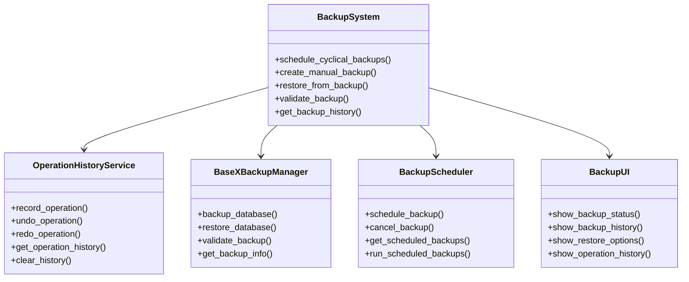
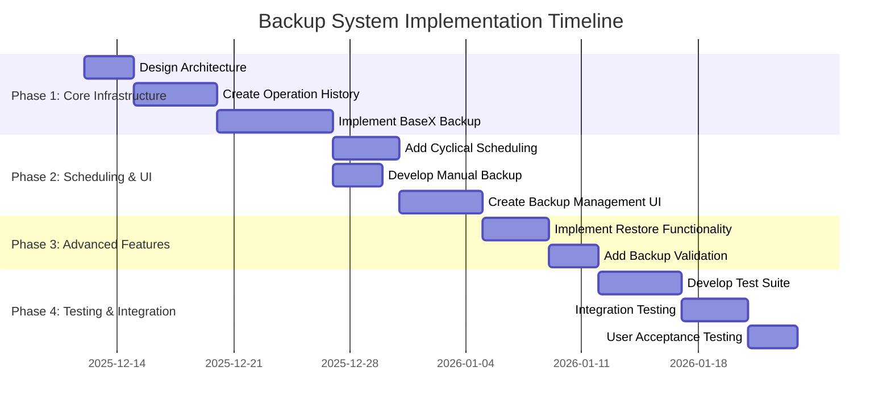

# Lexicographic Curation Workbench - Backup System Implementation Plan
## Executive Summary

This document outlines a comprehensive backup system implementation for the Lexicographic Curation Workbench (LCW), including undo/redo functionality for editors and cyclical/manual backups for the BaseX database. The system is designed to provide robust data protection, operation recovery, and user-friendly backup management.

## Current Infrastructure Analysis

### Existing Components
- ✅ `OperationHistoryService` for merge/split operations (JSON-based)
- ✅ Dashboard with backup status display (last backup time)
- ✅ Basic operation tracking in merge/split service
- ✅ System status monitoring infrastructure

### Missing Components
- ❌ Comprehensive operation history for undo/redo
- ❌ BaseX database backup mechanisms
- ❌ Cyclical backup scheduling
- ❌ Manual backup functionality
- ❌ Backup management UI
- ❌ Restore functionality
- ❌ Backup validation

## System Architecture



## Implementation Phases

### Phase 1: Core Infrastructure (Weeks 1-2)

**1. Enhanced Operation History Service**
- Extend existing `OperationHistoryService` to support all editor operations
- Implement undo/redo stacks with comprehensive operation tracking
- Add operation serialization and persistence
- Integrate with existing merge/split operation history

**2. BaseX Backup Manager**
- Implement full database backup using BaseX EXPORT command
- Create backup metadata tracking and rotation
- Add backup validation and integrity checking
- Implement restore functionality with point-in-time recovery

### Phase 2: Scheduling & UI (Weeks 3-4)

**3. Cyclical Backup Scheduling**
- Implement hourly/daily/weekly backup scheduling
- Add backup job management and monitoring
- Create notification system for backup events
- Integrate with system status monitoring

**4. Manual Backup Functionality**
- Develop manual backup creation interface
- Add backup description and tagging
- Implement backup progress tracking
- Create backup completion notifications

**5. Backup Management UI**
- Design dashboard backup management section
- Create backup history viewer
- Add restore interface with backup selection
- Implement operation history viewer with undo/redo controls

### Phase 3: Advanced Features (Weeks 5-6)

**6. Restore Functionality**
- Implement full database restore
- Add selective restore capabilities
- Create restore validation and preview
- Implement restore progress tracking

**7. Backup Validation**
- Develop comprehensive backup validation
- Add integrity checking algorithms
- Implement backup health monitoring
- Create validation reporting

### Phase 4: Testing & Integration (Weeks 7-8)

**8. Comprehensive Test Suite**
- Unit tests for all backup components
- Integration tests for backup/restore workflows
- Performance tests for large database backups
- Edge case and error condition testing

**9. Integration Testing**
- Test backup system integration with existing features
- Validate undo/redo functionality in editors
- Test backup scheduling and monitoring
- Verify restore functionality and data integrity

## Key Features

### Undo/Redo Functionality
- **Comprehensive Operation Tracking**: Track all editor actions (create, update, delete, merge, split)
- **Multi-level Undo/Redo**: Support multiple levels of undo and redo operations
- **Operation Granularity**: Entry-level and sense-level operation tracking
- **Integration**: Seamless integration with existing merge/split operation history

### Backup System
- **Full Database Backups**: Complete BaseX database backups with metadata
- **Incremental Backups**: Support for incremental backup strategies
- **Manual & Scheduled Backups**: Flexible backup creation options
- **Backup Validation**: Comprehensive integrity checking and validation
- **Restore Functionality**: Point-in-time recovery with validation

### User Interface
- **Dashboard Integration**: Backup status widget in main dashboard
- **Backup Management**: Comprehensive backup history and management
- **Operation History**: Visual operation history with undo/redo controls
- **Restore Interface**: User-friendly restore functionality

## Technical Implementation

### File Structure
```
app/
├── services/
│   ├── operation_history_service.py      # Enhanced operation history
│   ├── basex_backup_manager.py           # BaseX backup management
│   └── backup_scheduler.py               # Backup scheduling
├── api/
│   └── backup_api.py                     # Backup API endpoints
├── static/js/
│   └── backup-manager.js                 # Backup UI JavaScript
├── templates/
│   └── backup_management.html            # Backup management UI
└── models/
    └── backup_models.py                  # Backup data models
```

### Database Schema
```sql
-- Backup metadata
CREATE TABLE backups (
    backup_id VARCHAR(50) PRIMARY KEY,
    db_name VARCHAR(50) NOT NULL,
    timestamp DATETIME NOT NULL,
    type VARCHAR(20) NOT NULL,  -- 'full', 'incremental'
    description TEXT,
    file_path VARCHAR(255) NOT NULL,
    file_size BIGINT NOT NULL,
    status VARCHAR(20) NOT NULL,
    restore_timestamp DATETIME,
    restore_status VARCHAR(20)
);

-- Scheduled backups
CREATE TABLE scheduled_backups (
    schedule_id VARCHAR(50) PRIMARY KEY,
    db_name VARCHAR(50) NOT NULL,
    interval VARCHAR(20) NOT NULL,  -- 'hourly', 'daily', 'weekly'
    time VARCHAR(10) NOT NULL,
    type VARCHAR(20) NOT NULL,
    next_run DATETIME NOT NULL,
    last_run DATETIME,
    last_status VARCHAR(50),
    active BOOLEAN DEFAULT TRUE
);

-- Operation history
CREATE TABLE operation_history (
    operation_id VARCHAR(50) PRIMARY KEY,
    type VARCHAR(50) NOT NULL,
    entry_id VARCHAR(50),
    user_id VARCHAR(50),
    timestamp DATETIME NOT NULL,
    status VARCHAR(20) NOT NULL,
    data JSON NOT NULL
);
```

### API Endpoints

**Operation History:**
- `GET /api/backup/operations` - Get operation history
- `POST /api/backup/operations/undo` - Undo last operation
- `POST /api/backup/operations/redo` - Redo last undone operation

**Backup Management:**
- `POST /api/backup/create` - Create manual backup
- `GET /api/backup/history` - Get backup history
- `POST /api/backup/restore/<backup_id>` - Restore from backup
- `POST /api/backup/schedule` - Schedule cyclical backup

## Implementation Timeline



## Testing Strategy

### Test Coverage Requirements
- **Unit Tests**: 100% coverage for all backup components
- **Integration Tests**: Comprehensive workflow testing
- **Performance Tests**: Large database backup performance
- **Edge Case Testing**: Error conditions and recovery scenarios

### Test Categories
1. **Operation History Tests**: Undo/redo functionality validation
2. **Backup Creation Tests**: Full and incremental backup testing
3. **Restore Tests**: Data integrity and recovery validation
4. **Scheduling Tests**: Cyclical backup scheduling verification
5. **UI Tests**: User interface functionality testing
6. **Integration Tests**: System-wide backup workflow validation

## Success Criteria

### Functional Requirements
- ✅ All editor operations tracked for undo/redo
- ✅ Multi-level undo/redo functionality working
- ✅ BaseX database backup and restore operational
- ✅ Cyclical and manual backup scheduling functional
- ✅ Backup validation and integrity checking implemented
- ✅ User interface for backup management complete

### Performance Requirements
- Backup creation time < 5 minutes for 300K+ entries
- Restore time < 10 minutes for full database
- Undo/redo operations < 1 second response time
- Backup validation < 2 minutes for complete validation

### Quality Requirements
- 100% test coverage for backup components
- Zero critical bugs in backup/restore operations
- Comprehensive error handling and recovery
- User-friendly interface with clear feedback

## Next Steps

The implementation plan is now complete and ready for execution. The next phase involves:

1. **Code Implementation**: Begin with operation history service enhancement
2. **TDD Approach**: Develop comprehensive test suite alongside implementation
3. **Incremental Deployment**: Roll out features in logical phases
4. **User Testing**: Validate functionality with lexicographers
5. **Documentation**: Create user guides and technical documentation

## Resources

- **Existing Codebase**: Current operation history infrastructure
- **BaseX Documentation**: Database backup/restore commands
- **Flask Documentation**: API endpoint implementation
- **JavaScript Libraries**: UI component development
- **Testing Frameworks**: pytest, Selenium, Playwright

This comprehensive implementation plan provides a clear roadmap for adding robust backup functionality to the Lexicographic Curation Workbench, ensuring data safety, operation recovery, and user-friendly backup management.