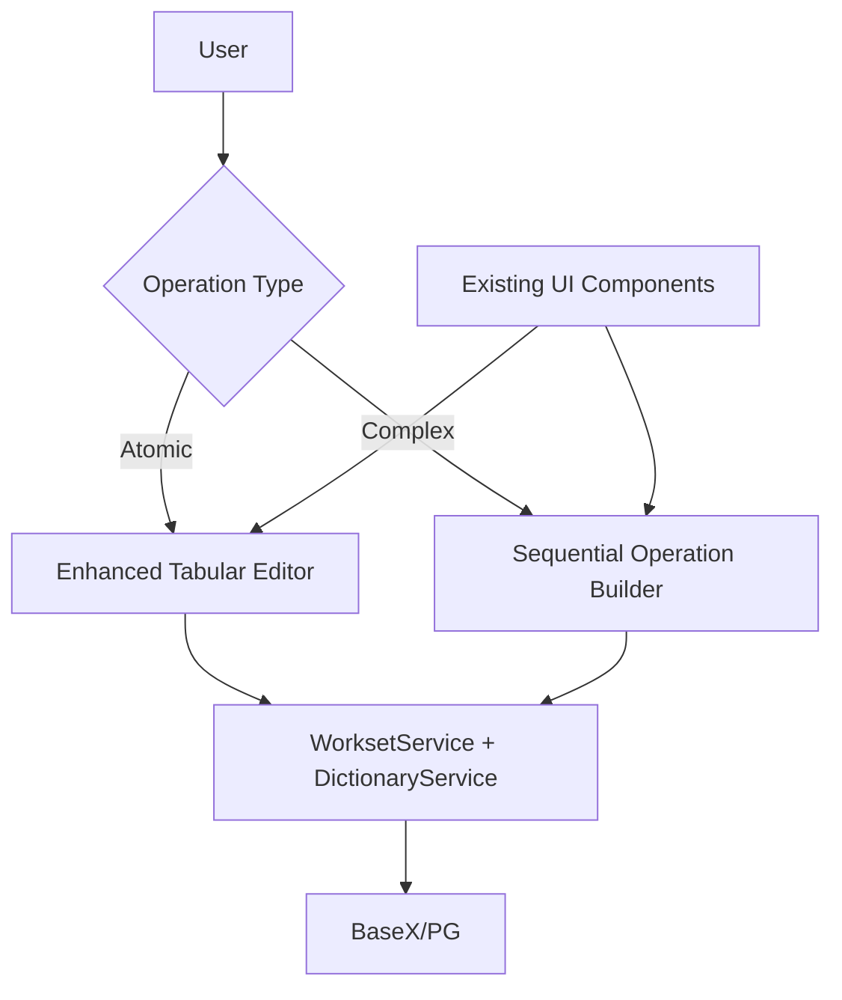

# Bulk Edit Interface Implementation Plan

**Version**: 2.0 (Revised for Stack Consistency)  
**Last Updated**: December 28, 2025  
**Alignment**: LCW Specification v2.0 (Sections 3.2, 7.5, 8.1)  

## 1. Architecture Overview

### 1.1 Revised Hybrid Interface Components


### 1.2 Technical Stack (Consistent with Existing App)
- **Frontend**: Bootstrap 5 + Vanilla JavaScript + Existing Component Library
- **Backend**: Flask + Existing Services (No Celery)
- **Storage**: BaseX (LIFT XML) + PostgreSQL (Worksets)
- **UI Framework**: Existing patterns (jQuery-style DOM manipulation, event delegation)

### 1.3 Key Design Principles
1. **DRY**: Reuse existing services, components, and patterns
2. **Incremental**: Build on current infrastructure
3. **Consistent**: Follow established code style and conventions
4. **Testable**: Maintain TDD approach with existing test infrastructure

## 2. Phase 1: Enhanced Tabular Editor (Atomic Operations)

### 2.1 Core Features (Using Existing Infrastructure)
- **Selection Management**: Extend existing entry selection from entries page
- **Bulk Operations**: Leverage WorksetService for entry collections
- **Context-Aware Editing**: Use existing validation and form patterns
- **Progressive Loading**: Reuse existing pagination and caching patterns

### 2.2 Implementation Steps

#### 2.2.1 Service Layer (Extend Existing Services)
```python
# app/services/bulk_operations_service.py
from typing import List, Dict, Any, Optional
from app.services.workset_service import WorksetService
from app.services.dictionary_service import DictionaryService
from app.services.operation_history_service import OperationHistoryService

class BulkOperationsService:
    """Service for atomic bulk operations using existing infrastructure"""
    
    def __init__(self, 
                 dictionary_service: DictionaryService,
                 workset_service: WorksetService,
                 history_service: OperationHistoryService):
        self.dictionary = dictionary_service
        self.workset = workset_service
        self.history = history_service
    
    def convert_traits(self, entry_ids: List[str], from_trait: str, to_trait: str) -> Dict[str, Any]:
        """Atomic trait conversion using existing dictionary service methods"""
        # Reuse existing entry update logic
        results = []
        for entry_id in entry_ids:
            try:
                entry = self.dictionary.get_entry(entry_id)
                # Use existing trait conversion logic from entry model
                if entry:
                    # Apply trait conversion using existing methods
                    modified = self._apply_trait_conversion(entry, from_trait, to_trait)
                    updated = self.dictionary.update_entry(entry_id, modified)
                    results.append({'id': entry_id, 'status': 'success', 'data': updated})
                    # Record operation for undo/redo
                    self.history.record_operation(
                        operation_type='bulk_trait_conversion',
                        entry_id=entry_id,
                        before={'traits': entry.traits},
                        after={'traits': updated.traits}
                    )
            except Exception as e:
                results.append({'id': entry_id, 'status': 'error', 'error': str(e)})
        
        return {'results': results, 'total': len(results)}
    
    def update_pos_bulk(self, entry_ids: List[str], pos_tag: str) -> Dict[str, Any]:
        """Bulk POS tagging using existing grammatical info patterns"""
        # Leverage existing grammatical info update logic
        results = []
        for entry_id in entry_ids:
            try:
                entry = self.dictionary.get_entry(entry_id)
                if entry:
                    # Use existing POS update patterns
                    modified = self._apply_pos_update(entry, pos_tag)
                    updated = self.dictionary.update_entry(entry_id, modified)
                    results.append({'id': entry_id, 'status': 'success'})
                    self.history.record_operation(
                        operation_type='bulk_pos_update',
                        entry_id=entry_id,
                        before={'grammatical_info': entry.grammatical_info},
                        after={'grammatical_info': updated.grammatical_info}
                    )
            except Exception as e:
                results.append({'id': entry_id, 'status': 'error', 'error': str(e)})
        
        return {'results': results, 'total': len(results)}
    
    def _apply_trait_conversion(self, entry, from_trait: str, to_trait: str):
        """Helper method for trait conversion"""
        # Reuse existing entry model methods
        return entry.convert_trait(from_trait, to_trait)
    
    def _apply_pos_update(self, entry, pos_tag: str):
        """Helper method for POS update"""
        # Reuse existing grammatical info patterns
        return entry.update_grammatical_info(pos_tag)

# Factory function for dependency injection
def get_bulk_operations_service() -> BulkOperationsService:
    """Get bulk operations service instance"""
    from app import current_app
    return current_app.injector.get(BulkOperationsService)
```

#### 2.2.2 API Endpoints (Extend Existing API Structure)
```python
# app/api/bulk_operations.py
from flask import Blueprint, request, jsonify
from flasgger import swag_from
from app.services.bulk_operations_service import get_bulk_operations_service
from app.utils.decorators import require_auth

bulk_bp = Blueprint('bulk_operations', __name__, url_prefix='/bulk')

@bulk_bp.route('/traits/convert', methods=['POST'])
@swag_from({
    'tags': ['Bulk Operations'],
    'summary': 'Convert traits in bulk',
    'description': 'Convert traits across multiple entries atomically',
    'parameters': [
        {
            'name': 'body',
            'in': 'body',
            'required': True,
            'schema': {
                'type': 'object',
                'properties': {
                    'entry_ids': {'type': 'array', 'items': {'type': 'string'}},
                    'from_trait': {'type': 'string'},
                    'to_trait': {'type': 'string'}
                },
                'required': ['entry_ids', 'from_trait', 'to_trait']
            }
        }
    ],
    'responses': {'200': {'description': 'Bulk trait conversion results'}}
})
@require_auth
def convert_traits():
    """Bulk trait conversion endpoint"""
    data = request.get_json()
    service = get_bulk_operations_service()
    result = service.convert_traits(
        data['entry_ids'],
        data['from_trait'],
        data['to_trait']
    )
    return jsonify(result)

@bulk_bp.route('/pos/update', methods=['POST'])
@swag_from({
    'tags': ['Bulk Operations'],
    'summary': 'Update POS tags in bulk',
    'description': 'Update part-of-speech tags across multiple entries',
    'parameters': [
        {
            'name': 'body',
            'in': 'body',
            'required': True,
            'schema': {
                'type': 'object',
                'properties': {
                    'entry_ids': {'type': 'array', 'items': {'type': 'string'}},
                    'pos_tag': {'type': 'string'}
                },
                'required': ['entry_ids', 'pos_tag']
            }
        }
    ],
    'responses': {'200': {'description': 'Bulk POS update results'}}
})
@require_auth
def update_pos_bulk():
    """Bulk POS update endpoint"""
    data = request.get_json()
    service = get_bulk_operations_service()
    result = service.update_pos_bulk(
        data['entry_ids'],
        data['pos_tag']
    )
    return jsonify(result)

# Register blueprint in app/api/__init__.py
# api_bp.register_blueprint(bulk_bp, url_prefix='/bulk')

### API Contract & Safety

Add a small, strict API contract to keep clients simple and servers authoritative. All bulk endpoints should accept the same common envelope and return an `operation_id` and detailed per-entry results. Support `dry_run` and `sync` modes and optionally `workset_id` to select entries server-side.

Request (POST /api/bulk/traits/convert):

```json
{
    "entry_ids": ["id1", "id2"],
    "from_trait": "verb",
    "to_trait": "phrasal-verb",
    "dry_run": false,    
    "sync": true,
    "workset_id": null
}
```

Response (200):

```json
{
    "operation_id": "op-20251228-0001",
    "summary": { "requested": 2, "attempted": 2, "success": 2, "failed": 0 },
    "results": [
        { "id": "id1", "status": "success" },
        { "id": "id2", "status": "success" }
    ]
}
```

Behavior notes:
- If `dry_run=true` the service must validate and simulate changes without committing; results should indicate what would change.
- If `sync=false`, the endpoint should enqueue or schedule the operation (behind a feature flag) and immediately return an `operation_id` with status `queued` documented; otherwise perform work synchronously.
- Server must generate `operation_id` (or accept client-provided idempotent token) so retries are safe and idempotent.
- All heavy work (batching, XQuery, DB writes) must happen server-side; clients only collect ids and display progress.
```

#### 2.2.3 UI Components (Extend Existing Patterns)
```javascript
// app/static/js/bulk-editor.js
/**
 * Bulk Editor - Tabular interface for atomic bulk operations
 * Extends existing entries.js patterns and reuses existing components
 */

class BulkEditor {
    constructor() {
        this.selectedEntries = new Set();
        this.currentOperation = null;
        this.validationUI = new ValidationUI(); // Reuse existing validation UI
        this.init();
    }
    
    init() {
        this.setupSelectionHandlers();
        this.setupOperationHandlers();
        this.setupBulkActionPanel();
        console.log('[BulkEditor] Initialized with existing patterns');
    }
    
    setupSelectionHandlers() {
        // Extend existing entry selection from entries.js
        document.addEventListener('click', (e) => {
            if (e.target.classList.contains('bulk-select-checkbox')) {
                const entryId = e.target.dataset.entryId;
                if (e.target.checked) {
                    this.selectedEntries.add(entryId);
                } else {
                    this.selectedEntries.delete(entryId);
                }
                this.updateSelectionUI();
            }
            
            // Select all checkbox
            if (e.target.id === 'bulk-select-all') {
                this.toggleSelectAll(e.target.checked);
            }
        });
    }
    
    setupOperationHandlers() {
        // Trait conversion modal
        const traitBtn = document.getElementById('bulk-convert-traits-btn');
        if (traitBtn) {
            traitBtn.addEventListener('click', () => this.showTraitConversionModal());
        }
        
        // POS update modal
        const posBtn = document.getElementById('bulk-update-pos-btn');
        if (posBtn) {
            posBtn.addEventListener('click', () => this.showPOSUpdateModal());
        }
        
        // Execute operation
        document.addEventListener('click', (e) => {
            if (e.target.id === 'execute-bulk-operation') {
                this.executeCurrentOperation();
            }
        });
    }
    
    setupBulkActionPanel() {
        // Add bulk action panel to entries page
        const entriesHeader = document.querySelector('.card-header');
        if (entriesHeader && !document.getElementById('bulk-actions-panel')) {
            const panel = this.createBulkActionPanel();
            entriesHeader.insertAdjacentHTML('beforeend', panel);
        }
    }
    
    createBulkActionPanel() {
        return `
            <div id="bulk-actions-panel" class="mt-2" style="display: none;">
                <div class="alert alert-info">
                    <strong>Bulk Actions:</strong> <span id="selected-count">0</span> entries selected
                    <button class="btn btn-sm btn-primary ms-2" id="bulk-convert-traits-btn">Convert Traits</button>
                    <button class="btn btn-sm btn-primary ms-2" id="bulk-update-pos-btn">Update POS</button>
                    <button class="btn btn-sm btn-secondary ms-2" id="bulk-clear-selection-btn">Clear Selection</button>
                </div>
            </div>
        `;
    }
    
    showTraitConversionModal() {
        // Reuse existing modal patterns from entry-form.js
        const modalHtml = `
            <div class="modal fade" id="trait-conversion-modal" tabindex="-1">
                <div class="modal-dialog">
                    <div class="modal-content">
                        <div class="modal-header">
                            <h5 class="modal-title">Convert Traits</h5>
                            <button type="button" class="btn-close" data-bs-dismiss="modal"></button>
                        </div>
                        <div class="modal-body">
                            <div class="mb-3">
                                <label class="form-label">From Trait</label>
                                <input type="text" class="form-control" id="from-trait" placeholder="e.g., verb">
                            </div>
                            <div class="mb-3">
                                <label class="form-label">To Trait</label>
                                <input type="text" class="form-control" id="to-trait" placeholder="e.g., phrasal-verb">
                            </div>
                            <div class="alert alert-warning">
                                Converting traits for <strong>${this.selectedEntries.size}</strong> entries
                            </div>
                        </div>
                        <div class="modal-footer">
                            <button type="button" class="btn btn-secondary" data-bs-dismiss="modal">Cancel</button>
                            <button type="button" class="btn btn-primary" id="execute-trait-conversion">Execute</button>
                        </div>
                    </div>
                </div>
            </div>
        `;
        
        // Add modal to page if not exists
        if (!document.getElementById('trait-conversion-modal')) {
            document.body.insertAdjacentHTML('beforeend', modalHtml);
        }
        
        // Show modal
        const modal = new bootstrap.Modal(document.getElementById('trait-conversion-modal'));
        modal.show();
        
        // Setup execute handler
        document.getElementById('execute-trait-conversion').addEventListener('click', () => {
            this.executeTraitConversion();
        });
    }
    
    async executeTraitConversion() {
        const fromTrait = document.getElementById('from-trait').value;
        const toTrait = document.getElementById('to-trait').value;
        
        if (!fromTrait || !toTrait) {
            this.validationUI.showError('Please enter both from and to traits');
            return;
        }
        
        const entryIds = Array.from(this.selectedEntries);
        
        try {
            const response = await fetch('/api/bulk/traits/convert', {
                method: 'POST',
                headers: {'Content-Type': 'application/json'},
                body: JSON.stringify({ entry_ids: entryIds, from_trait: fromTrait, to_trait: toTrait })
            });
            
            const result = await response.json();
            
            if (response.ok) {
                this.validationUI.showSuccess(`Successfully converted traits for ${result.results.filter(r => r.status === 'success').length} entries`);
                this.clearSelection();
                // Close modal
                const modal = bootstrap.Modal.getInstance(document.getElementById('trait-conversion-modal'));
                if (modal) modal.hide();
            } else {
                this.validationUI.showError('Bulk operation failed: ' + (result.error || 'Unknown error'));
            }
        } catch (error) {
            this.validationUI.showError('Network error: ' + error.message);
        }
    }
    
    updateSelectionUI() {
        const count = this.selectedEntries.size;
        const panel = document.getElementById('bulk-actions-panel');
        const countSpan = document.getElementById('selected-count');
        
        if (panel) {
            panel.style.display = count > 0 ? 'block' : 'none';
            if (countSpan) countSpan.textContent = count;
        }
    }
    
    toggleSelectAll(checked) {
        const checkboxes = document.querySelectorAll('.bulk-select-checkbox');
        checkboxes.forEach(cb => {
            cb.checked = checked;
            const entryId = cb.dataset.entryId;
            if (checked) {
                this.selectedEntries.add(entryId);
            } else {
                this.selectedEntries.delete(entryId);
            }
        });
        this.updateSelectionUI();
    }
    
    clearSelection() {
        this.selectedEntries.clear();
        this.toggleSelectAll(false);
        this.updateSelectionUI();
    }
}

// Initialize on entries page load
document.addEventListener('DOMContentLoaded', () => {
    if (document.getElementById('entries-table')) {
        window.bulkEditor = new BulkEditor();
    }
});
```

#### 2.2.4 Template Integration (Extend Existing Entries Template)
```html
<!-- Add to app/templates/entries.html -->

<script src="{{ url_for('static', filename='js/bulk-editor.js') }}"></script>



<!-- Existing entries table content -->
<div class="card">
    <div class="card-header bg-light">
        <div class="row">
            <div class="col-md-6">
                <!-- Existing search/filter controls -->
            </div>
            <div class="col-md-6">
                <div class="d-flex justify-content-end">
                    <!-- Add bulk select all checkbox -->
                    <div class="form-check me-2">
                        <input class="form-check-input" type="checkbox" id="bulk-select-all">
                        <label class="form-check-label" for="bulk-select-all">
                            Select All
                        </label>
                    </div>
                    <!-- Existing controls -->
                </div>
            </div>
        </div>
    </div>
    <div class="card-body p-0">
        <div class="table-responsive">
            <table class="table table-hover table-striped mb-0" id="entries-table">
                <thead class="table-light">
                    <tr>
                        <!-- Add bulk select column -->
                        <th style="width: 40px;">
                            <i class="fas fa-check"></i>
                        </th>
                        <!-- Existing columns -->
                    </tr>
                </thead>
                <tbody>
                    <!-- Existing rows with added checkbox -->
                </tbody>
            </table>
        </div>
    </div>
</div>

```

### 2.3 Test Plan (Using Existing Test Infrastructure)

#### 2.3.1 Unit Tests
```python
# tests/unit/test_bulk_operations_service.py
import pytest
from app.services.bulk_operations_service import BulkOperationsService
from app.models.entry import Entry

class TestBulkOperationsService:
    def test_convert_traits(self, mock_dictionary_service, mock_workset_service, mock_history_service):
        """Test trait conversion across multiple entries"""
        service = BulkOperationsService(
            dictionary_service=mock_dictionary_service,
            workset_service=mock_workset_service,
            history_service=mock_history_service
        )
        
        # Setup test data
        entry_ids = ['entry1', 'entry2']
        from_trait = 'verb'
        to_trait = 'phrasal-verb'
        
        # Mock entry data
        mock_entry = Entry(id='test', lexical_unit={'en': 'test'})
        mock_dictionary_service.get_entry.return_value = mock_entry
        mock_dictionary_service.update_entry.return_value = mock_entry
        
        # Execute
        result = service.convert_traits(entry_ids, from_trait, to_trait)
        
        # Assert
        assert len(result['results']) == 2
        assert all(r['status'] == 'success' for r in result['results'])
        mock_history_service.record_operation.assert_called()
    
    def test_update_pos_bulk(self, mock_dictionary_service, mock_workset_service, mock_history_service):
        """Test bulk POS update"""
        service = BulkOperationsService(
            dictionary_service=mock_dictionary_service,
            workset_service=mock_workset_service,
            history_service=mock_history_service
        )
        
        entry_ids = ['entry1', 'entry2']
        pos_tag = 'noun'
        
        mock_entry = Entry(id='test', lexical_unit={'en': 'test'})
        mock_dictionary_service.get_entry.return_value = mock_entry
        mock_dictionary_service.update_entry.return_value = mock_entry
        
        result = service.update_pos_bulk(entry_ids, pos_tag)
        
        assert len(result['results']) == 2
        assert all(r['status'] == 'success' for r in result['results'])
```

#### 2.3.2 Integration Tests
```python
# tests/integration/test_bulk_operations_integration.py
import pytest
from flask import url_for

class TestBulkOperationsIntegration:
    def test_bulk_trait_conversion_api(self, client, auth_headers, test_entries):
        """Test bulk trait conversion API endpoint"""
        entry_ids = [entry.id for entry in test_entries[:5]]
        
        response = client.post(
            url_for('bulk_operations.convert_traits'),
            json={
                'entry_ids': entry_ids,
                'from_trait': 'verb',
                'to_trait': 'phrasal-verb'
            },
            headers=auth_headers
        )
        
        assert response.status_code == 200
        data = response.get_json()
        assert len(data['results']) == 5
        assert all(r['status'] == 'success' for r in data['results'])
    
    def test_bulk_pos_update_api(self, client, auth_headers, test_entries):
        """Test bulk POS update API endpoint"""
        entry_ids = [entry.id for entry in test_entries[:3]]
        
        response = client.post(
            url_for('bulk_operations.update_pos_bulk'),
            json={
                'entry_ids': entry_ids,
                'pos_tag': 'noun'
            },
            headers=auth_headers
        )
        
        assert response.status_code == 200
        data = response.get_json()
        assert len(data['results']) == 3
        assert all(r['status'] == 'success' for r in data['results'])
    
    def test_bulk_operations_with_workset(self, client, auth_headers, test_entries):
        """Test bulk operations using workset selection"""
        # Create workset
        workset_response = client.post(
            url_for('worksets.create_workset'),
            json={
                'name': 'Test Bulk Workset',
                'query': {'filter': 'all'}
            },
            headers=auth_headers
        )
        workset_id = workset_response.get_json()['id']
        
        # Get entries from workset
        entries_response = client.get(
            url_for('worksets.get_workset_entries', workset_id=workset_id),
            headers=auth_headers
        )
        entry_ids = [entry['id'] for entry in entries_response.get_json()['entries'][:5]]
        
        # Perform bulk operation
        response = client.post(
            url_for('bulk_operations.convert_traits'),
            json={
                'entry_ids': entry_ids,
                'from_trait': 'verb',
                'to_trait': 'phrasal-verb'
            },
            headers=auth_headers
        )
        
        assert response.status_code == 200
        data = response.get_json()
        assert len(data['results']) == 5
```

#### 2.3.3 Performance Tests
```python
# tests/integration/test_bulk_performance.py
import time
import pytest

class TestBulkPerformance:
    @pytest.mark.performance
    def test_bulk_operations_performance(self, client, auth_headers, large_dataset):
        """Test bulk operations with 1000+ entries"""
        entry_ids = [entry.id for entry in large_dataset[:1000]]
        
        start_time = time.time()
        
        response = client.post(
            url_for('bulk_operations.convert_traits'),
            json={
                'entry_ids': entry_ids,
                'from_trait': 'verb',
                'to_trait': 'phrasal-verb'
            },
            headers=auth_headers
        )
        
        elapsed = time.time() - start_time
        
        assert response.status_code == 200
        assert elapsed < 5.0  # Should complete in under 5 seconds
        data = response.get_json()
        assert len(data['results']) == 1000

    ### Precommit TDD Checklist (Required)

    Before any bulk-edit feature PR is merged, ensure the following tests are added and passing:

    - Unit tests for `BulkOperationsService` covering normal flow, partial failures, and batch boundaries.
    - API integration tests for `dry_run`, `sync=true`, `sync=false` (queued), `workset_id` selection and unauthorized access.
    - Tests verifying operation history entries are created with enough metadata to support undo.
    - Performance smoke test that runs a realistic sample (e.g., 500 entries) and asserts per-batch timing and memory bounds.
    - Minimal UI e2e test covering selection → modal → execute (can be Playwright or selenium using existing harness).

    Enforce tests-first: create failing tests for the desired behavior, implement code to satisfy them, then iterate.
```

## 3. Phase 2: Sequential Operation Builder (Complex Operations)

### 3.1 Concept (Simplified from Pipeline)
Instead of complex pipeline editor, implement a **Sequential Operation Builder** that:
1. Allows chaining of atomic operations
2. Uses existing operation history for undo/redo
3. Provides preview before execution
4. Reuses existing validation and preview patterns

### 3.2 Implementation Steps

#### 3.2.1 Sequential Operation Service
```python
# app/services/sequential_operation_service.py
from typing import List, Dict, Any
from app.services.bulk_operations_service import BulkOperationsService
from app.services.operation_history_service import OperationHistoryService

class SequentialOperationService:
    """Service for executing sequential bulk operations"""
    
    def __init__(self, 
                 bulk_service: BulkOperationsService,
                 history_service: OperationHistoryService):
        self.bulk_service = bulk_service
        self.history = history_service
    
    def execute_sequence(self, entry_ids: List[str], operations: List[Dict[str, Any]]) -> Dict[str, Any]:
        """Execute a sequence of operations"""
        results = []
        operation_id = self.history.generate_operation_id()
        
        for i, operation in enumerate(operations):
            try:
                op_type = operation['type']
                params = operation['params']
                
                # Execute operation
                if op_type == 'convert_traits':
                    result = self.bulk_service.convert_traits(entry_ids, **params)
                elif op_type == 'update_pos':
                    result = self.bulk_service.update_pos_bulk(entry_ids, **params)
                else:
                    raise ValueError(f"Unknown operation type: {op_type}")
                
                results.append({
                    'step': i + 1,
                    'operation': op_type,
                    'status': 'success',
                    'result': result
                })
                
                # Record sequence
                self.history.record_operation(
                    operation_type='sequential_bulk',
                    operation_id=operation_id,
                    entry_ids=entry_ids,
                    operations=operations,
                    step=i + 1
                )
                
            except Exception as e:
                results.append({
                    'step': i + 1,
                    'operation': op_type,
                    'status': 'error',
                    'error': str(e)
                })
                break  # Stop on first error
        
        return {
            'operation_id': operation_id,
            'total_steps': len(operations),
            'completed_steps': len([r for r in results if r['status'] == 'success']),
            'results': results
        }
    
    def preview_sequence(self, entry_ids: List[str], operations: List[Dict[str, Any]]) -> Dict[str, Any]:
        """Preview what a sequence of operations would do"""
        # Simulate operations without executing
        preview_results = []
        
        for i, operation in enumerate(operations):
            op_type = operation['type']
            params = operation['params']
            
            preview_results.append({
                'step': i + 1,
                'operation': op_type,
                'params': params,
                'description': self._get_operation_description(op_type, params)
            })
        
        return {
            'entry_count': len(entry_ids),
            'operations': preview_results,
            'warnings': self._validate_sequence(operations)
        }
    
    def _get_operation_description(self, op_type: str, params: Dict[str, Any]) -> str:
        """Get human-readable description of operation"""
        if op_type == 'convert_traits':
            return f"Convert '{params['from_trait']}' to '{params['to_trait']}'"
        elif op_type == 'update_pos':
            return f"Update POS to '{params['pos_tag']}'"
        return "Unknown operation"
    
    def _validate_sequence(self, operations: List[Dict[str, Any]]) -> List[str]:
        """Validate operation sequence for potential issues"""
        warnings = []
        
        # Check for conflicting operations
        traits_ops = [op for op in operations if op['type'] == 'convert_traits']
        if len(traits_ops) > 1:
            warnings.append("Multiple trait conversions in sequence - verify order")
        
        return warnings
```

#### 3.2.2 Sequential Operation API
```python
# app/api/sequential_operations.py
from flask import Blueprint, request, jsonify
from flasgger import swag_from
from app.services.sequential_operation_service import get_sequential_operation_service
from app.utils.decorators import require_auth

sequential_bp = Blueprint('sequential_operations', __name__, url_prefix='/sequential')

@sequential_bp.route('/preview', methods=['POST'])
@swag_from({
    'tags': ['Sequential Operations'],
    'summary': 'Preview sequential operations',
    'description': 'Preview the effects of a sequence of bulk operations',
    'parameters': [
        {
            'name': 'body',
            'in': 'body',
            'required': True,
            'schema': {
                'type': 'object',
                'properties': {
                    'entry_ids': {'type': 'array', 'items': {'type': 'string'}},
                    'operations': {
                        'type': 'array',
                        'items': {
                            'type': 'object',
                            'properties': {
                                'type': {'type': 'string'},
                                'params': {'type': 'object'}
                            }
                        }
                    }
                }
            }
        }
    ]
})
@require_auth
def preview_sequence():
    """Preview sequential operations"""
    data = request.get_json()
    service = get_sequential_operation_service()
    result = service.preview_sequence(data['entry_ids'], data['operations'])
    return jsonify(result)

@sequential_bp.route('/execute', methods=['POST'])
@swag_from({
    'tags': ['Sequential Operations'],
    'summary': 'Execute sequential operations',
    'description': 'Execute a sequence of bulk operations',
    'parameters': [
        {
            'name': 'body',
            'in': 'body',
            'required': True,
            'schema': {
                'type': 'object',
                'properties': {
                    'entry_ids': {'type': 'array', 'items': {'type': 'string'}},
                    'operations': {
                        'type': 'array',
                        'items': {
                            'type': 'object',
                            'properties': {
                                'type': {'type': 'string'},
                                'params': {'type': 'object'}
                            }
                        }
                    }
                }
            }
        }
    ]
})
@require_auth
def execute_sequence():
    """Execute sequential operations"""
    data = request.get_json()
    service = get_sequential_operation_service()
    result = service.execute_sequence(data['entry_ids'], data['operations'])
    return jsonify(result)
```

#### 3.2.3 Sequential Operation UI
```javascript
// app/static/js/sequential-builder.js
/**
 * Sequential Operation Builder
 * Allows chaining of bulk operations with preview
 */

class SequentialOperationBuilder {
    constructor() {
        this.operations = [];
        this.selectedEntries = new Set();
        this.init();
    }
    
    init() {
        this.setupBuilderUI();
        this.setupOperationAdding();
        this.setupPreviewAndExecute();
    }
    
    setupBuilderUI() {
        // Add builder panel to entries page
        const entriesContainer = document.querySelector('.container-fluid');
        if (entriesContainer && !document.getElementById('sequential-builder-panel')) {
            const panel = this.createBuilderPanel();
            entriesContainer.insertAdjacentHTML('beforeend', panel);
        }
    }
    
    createBuilderPanel() {
        return `
            <div id="sequential-builder-panel" class="card mt-3" style="display: none;">
                <div class="card-header bg-light">
                    <h5><i class="fas fa-layer-group"></i> Sequential Operation Builder</h5>
                </div>
                <div class="card-body">
                    <div class="row">
                        <div class="col-md-6">
                            <h6>Available Operations</h6>
                            <div class="btn-group-vertical w-100">
                                <button class="btn btn-outline-primary" id="add-trait-op">
                                    <i class="fas fa-exchange-alt"></i> Add Trait Conversion
                                </button>
                                <button class="btn btn-outline-primary" id="add-pos-op">
                                    <i class="fas fa-tag"></i> Add POS Update
                                </button>
                            </div>
                        </div>
                        <div class="col-md-6">
                            <h6>Operation Sequence</h6>
                            <div id="operation-list" class="list-group">
                                <div class="text-muted text-center p-3">No operations added yet</div>
                            </div>
                        </div>
                    </div>
                    <div class="mt-3">
                        <button class="btn btn-success" id="preview-sequence">
                            <i class="fas fa-eye"></i> Preview
                        </button>
                        <button class="btn btn-primary" id="execute-sequence" disabled>
                            <i class="fas fa-play"></i> Execute
                        </button>
                        <button class="btn btn-secondary" id="clear-sequence">
                            <i class="fas fa-trash"></i> Clear
                        </button>
                    </div>
                    <div id="preview-container" class="mt-3"></div>
                </div>
            </div>
        `;
    }
    
    setupOperationAdding() {
        document.addEventListener('click', (e) => {
            if (e.target.id === 'add-trait-op') {
                this.showTraitOperationDialog();
            } else if (e.target.id === 'add-pos-op') {
                this.showPOSOperationDialog();
            }
        });
    }
    
    showTraitOperationDialog() {
        const modalHtml = `
            <div class="modal fade" id="trait-op-modal" tabindex="-1">
                <div class="modal-dialog">
                    <div class="modal-content">
                        <div class="modal-header">
                            <h5 class="modal-title">Add Trait Conversion Operation</h5>
                            <button type="button" class="btn-close" data-bs-dismiss="modal"></button>
                        </div>
                        <div class="modal-body">
                            <div class="mb-3">
                                <label class="form-label">From Trait</label>
                                <input type="text" class="form-control" id="op-from-trait">
                            </div>
                            <div class="mb-3">
                                <label class="form-label">To Trait</label>
                                <input type="text" class="form-control" id="op-to-trait">
                            </div>
                        </div>
                        <div class="modal-footer">
                            <button type="button" class="btn btn-secondary" data-bs-dismiss="modal">Cancel</button>
                            <button type="button" class="btn btn-primary" id="add-trait-confirm">Add</button>
                        </div>
                    </div>
                </div>
            </div>
        `;
        
        if (!document.getElementById('trait-op-modal')) {
            document.body.insertAdjacentHTML('beforeend', modalHtml);
        }
        
        const modal = new bootstrap.Modal(document.getElementById('trait-op-modal'));
        modal.show();
        
        document.getElementById('add-trait-confirm').addEventListener('click', () => {
            const fromTrait = document.getElementById('op-from-trait').value;
            const toTrait = document.getElementById('op-to-trait').value;
            
            if (fromTrait && toTrait) {
                this.addOperation('convert_traits', { from_trait: fromTrait, to_trait: toTrait });
                modal.hide();
            }
        });
    }
    
    addOperation(type, params) {
        const operation = { type, params, id: Date.now() };
        this.operations.push(operation);
        this.renderOperations();
        this.updateButtons();
    }
    
    renderOperations() {
        const container = document.getElementById('operation-list');
        if (!container) return;
        
        if (this.operations.length === 0) {
            container.innerHTML = '<div class="text-muted text-center p-3">No operations added yet</div>';
            return;
        }
        
        container.innerHTML = this.operations.map((op, index) => `
            <div class="list-group-item d-flex justify-content-between align-items-center">
                <div>
                    <strong>${index + 1}.</strong> ${this.getOperationDescription(op)}
                </div>
                <button class="btn btn-sm btn-danger remove-op" data-id="${op.id}">
                    <i class="fas fa-times"></i>
                </button>
            </div>
        `).join('');
        
        // Add remove handlers
        container.querySelectorAll('.remove-op').forEach(btn => {
            btn.addEventListener('click', (e) => {
                const id = parseInt(e.currentTarget.dataset.id);
                this.operations = this.operations.filter(op => op.id !== id);
                this.renderOperations();
                this.updateButtons();
            });
        });
    }
    
    getOperationDescription(op) {
        if (op.type === 'convert_traits') {
            return `Convert '${op.params.from_trait}' → '${op.params.to_trait}'`;
        } else if (op.type === 'update_pos') {
            return `Update POS to '${op.params.pos_tag}'`;
        }
        return op.type;
    }
    
    setupPreviewAndExecute() {
        document.addEventListener('click', (e) => {
            if (e.target.id === 'preview-sequence') {
                this.previewSequence();
            } else if (e.target.id === 'execute-sequence') {
                this.executeSequence();
            } else if (e.target.id === 'clear-sequence') {
                this.clearSequence();
            }
        });
    }
    
    async previewSequence() {
        if (this.selectedEntries.size === 0 || this.operations.length === 0) {
            alert('Please select entries and add operations');
            return;
        }
        
        const entryIds = Array.from(this.selectedEntries);
        
        try {
            const response = await fetch('/api/sequential/preview', {
                method: 'POST',
                headers: {'Content-Type': 'application/json'},
                body: JSON.stringify({
                    entry_ids: entryIds,
                    operations: this.operations.map(op => ({
                        type: op.type,
                        params: op.params
                    }))
                })
            });
            
            const result = await response.json();
            this.renderPreview(result);
        } catch (error) {
            alert('Preview failed: ' + error.message);
        }
    }
    
    renderPreview(preview) {
        const container = document.getElementById('preview-container');
        if (!container) return;
        
        let html = `
            <div class="alert alert-info">
                <h6>Preview for ${preview.entry_count} entries</h6>
                <ul>
                    ${preview.operations.map(op => `
                        <li><strong>Step ${op.step}:</strong> ${op.description}</li>
                    `).join('')}
                </ul>
        `;
        
        if (preview.warnings.length > 0) {
            html += `
                <div class="alert alert-warning mt-2">
                    <strong>Warnings:</strong>
                    <ul>${preview.warnings.map(w => `<li>${w}</li>`).join('')}</ul>
                </div>
            `;
        }
        
        html += '</div>';
        container.innerHTML = html;
        
        // Enable execute button
        document.getElementById('execute-sequence').disabled = false;
    }
    
    async executeSequence() {
        if (!confirm('Execute this sequence of operations? This can be undone via operation history.')) {
            return;
        }
        
        const entryIds = Array.from(this.selectedEntries);
        
        try {
            const response = await fetch('/api/sequential/execute', {
                method: 'POST',
                headers: {'Content-Type': 'application/json'},
                body: JSON.stringify({
                    entry_ids: entryIds,
                    operations: this.operations.map(op => ({
                        type: op.type,
                        params: op.params
                    }))
                })
            });
            
            const result = await response.json();
            
            if (response.ok) {
                alert(`Sequence completed: ${result.completed_steps}/${result.total_steps} steps successful`);
                this.clearSequence();
                // Refresh entries table
                if (window.bulkEditor) {
                    window.bulkEditor.clearSelection();
                }
            } else {
                alert('Execution failed: ' + (result.error || 'Unknown error'));
            }
        } catch (error) {
            alert('Execution failed: ' + error.message);
        }
    }
    
    clearSequence() {
        this.operations = [];
        this.renderOperations();
        this.updateButtons();
        const container = document.getElementById('preview-container');
        if (container) container.innerHTML = '';
    }
    
    updateButtons() {
        const executeBtn = document.getElementById('execute-sequence');
        if (executeBtn) {
            executeBtn.disabled = this.operations.length === 0 || this.selectedEntries.size === 0;
        }
    }
}

// Initialize on entries page
document.addEventListener('DOMContentLoaded', () => {
    if (document.getElementById('entries-table')) {
        window.sequentialBuilder = new SequentialOperationBuilder();
        
        // Add toggle button to entries page
        const headerRow = document.querySelector('.card-header .row');
        if (headerRow) {
            const toggleBtn = document.createElement('div');
            toggleBtn.className = 'col-md-12 mt-2';
            toggleBtn.innerHTML = `
                <button class="btn btn-outline-secondary" id="toggle-sequential-builder">
                    <i class="fas fa-layer-group"></i> Show Sequential Builder
                </button>
            `;
            headerRow.after(toggleBtn);
            
            document.getElementById('toggle-sequential-builder').addEventListener('click', () => {
                const panel = document.getElementById('sequential-builder-panel');
                if (panel) {
                    const isVisible = panel.style.display !== 'none';
                    panel.style.display = isVisible ? 'none' : 'block';
                    this.textContent = isVisible ? 
                        'Show Sequential Builder' : 'Hide Sequential Builder';
                }
            });
        }
    }
});
```

## 4. Phase 3: Performance Optimization & Integration

### 4.1 Performance Improvements
1. **Batch Processing**: Process entries in batches of 100 to avoid memory issues
2. **Progressive Loading**: Show progress for large operations
3. **Client-Side Caching**: Cache frequently used ranges and operations
4. **Database Indexing**: Ensure PostgreSQL indexes on workset tables

Implementation notes:
- Default `BULK_EDIT_BATCH_SIZE` should be `100` and configurable via `config.py`.
- Process entries in batches and wrap each batch in a database transaction; commit per-batch to limit rollback scope and memory usage.
- Support an optional `atomic` parameter (default `false`) to attempt all-or-nothing runs when callers require global atomicity; document resource implications.

### 4.2 Integration with Existing Features
1. **Operation History**: All bulk operations recorded for undo/redo
2. **Validation**: Reuse existing validation engine for bulk operations
3. **Display Profiles**: Support bulk updates to display aspects
4. **Worksets**: Use worksets as entry selection mechanism

### 4.3 Monitoring & Analytics
```python
# app/services/bulk_operation_analytics.py
from datetime import datetime
from typing import Dict, Any
import json

class BulkOperationAnalytics:
    """Track and analyze bulk operation usage and performance"""
    
    def __init__(self):
        self.log_file = 'instance/bulk_operations.log'
    
    def log_operation(self, operation_type: str, entry_count: int, 
                     duration: float, success_count: int, user_id: str = None):
        """Log bulk operation for analytics"""
        log_entry = {
            'timestamp': datetime.now().isoformat(),
            'operation_type': operation_type,
            'entry_count': entry_count,
            'duration_seconds': duration,
            'success_count': success_count,
            'user_id': user_id
        }
        
        with open(self.log_file, 'a') as f:
            f.write(json.dumps(log_entry) + '\n')
    
    def get_performance_stats(self, days: int = 30) -> Dict[str, Any]:
        """Get performance statistics for recent operations"""
        # Implementation for analyzing operation patterns
        pass
```

## 5. Timeline & Milestones (Revised)

| Phase   | Duration | Deliverables                      | Dependencies |
|---------|----------|-----------------------------------|--------------|
| 1       | 2 weeks  | Enhanced tabular editor           | Existing services |
| 2       | 2 weeks  | Sequential operation builder      | Phase 1 |
| 3       | 1 week   | Performance optimization          | Phase 2 |
| Testing | 1 week   | Full test suite + TDD validation  | All phases |
| **Total** | **6 weeks** | **Complete bulk edit system** | |

## 6. Risk Mitigation (Revised)

1. **Stack Consistency**: No new frameworks, only extensions of existing patterns
2. **Performance**: Batch processing and progressive loading from start
3. **Data Integrity**: All operations use existing transaction patterns
4. **UX Complexity**: Progressive disclosure - basic operations first, advanced later
5. **Testing**: Leverage existing test infrastructure and patterns

Additional operational mitigations:
- **Rate limiting**: Add simple per-user rate limiting for bulk endpoints (e.g., 3 concurrent bulk ops or X requests per minute) to prevent accidental floods.
- **Max entry caps**: Enforce `BULK_EDIT_MAX_ENTRIES` (default 1000) to prevent runaway requests; configurable via `config.py`.

## 7. Documentation Plan (Revised)

1. **API Documentation**: Extend existing flasgger docs with bulk endpoints
2. **User Guide**: Add bulk operations section to existing help system
3. **Developer Docs**: Document service extensions and new patterns
4. **Migration Guide**: How to migrate from manual editing to bulk operations

## 8. Dependencies & Prerequisites

### 8.1 Existing Infrastructure (No Changes Needed)
- Flask application structure
- BaseX connector and XQuery patterns
- PostgreSQL workset tables
- Existing validation engine
- Operation history service
- Existing UI components (ValidationUI, etc.)

### 8.2 New Dependencies (Minimal)
```python
# requirements.txt additions (if any)
# None - all dependencies already exist
```

```json
// package.json additions (if any)
// None - all dependencies already exist
```

## 9. Rollout Strategy

### 9.1 Phased Rollout
1. **Week 1-2**: Basic trait conversion and POS updates
2. **Week 3-4**: Sequential operation builder
3. **Week 5**: Performance optimization
4. **Week 6**: Testing and documentation

### 9.2 Feature Flags
```python
# config.py
BULK_EDIT_FEATURE = True  # Enable/disable bulk edit features
BULK_EDIT_MAX_ENTRIES = 1000  # Limit for performance
```

Additions to config (recommended):

```python
# config.py
BULK_EDIT_BATCH_SIZE = 100      # Default batch size for processing
BULK_EDIT_ASYNC = False        # Allow queued/async bulk operations if True
BULK_EDIT_ATOMIC = False       # If True, attempt all-or-nothing operations (resource heavy)
```

### 9.3 User Training
- Add "Bulk Operations" section to existing help page
- Create video tutorials using existing patterns
- Provide migration examples from manual editing

## 10. Success Metrics

1. **Performance**: 1000-entry operations in <5 seconds
2. **Adoption**: 50% of bulk edits use new interface within 1 month
3. **Reliability**: 99% success rate for bulk operations
4. **User Satisfaction**: >4/5 rating in user feedback
5. **Code Coverage**: >90% for new bulk operation code

## 11. Maintenance & Support

### 11.1 Monitoring
- Log all bulk operations to existing analytics
- Track performance metrics
- Monitor error rates

### 11.2 Updates
- Follow existing update patterns
- Maintain backward compatibility
- Document breaking changes

### 11.3 Support
- Extend existing support channels
- Add bulk operation troubleshooting to help docs
- Provide migration assistance

---

**Key Benefits of This Revised Plan:**
1. **Stack Consistency**: No new frameworks, only extensions
2. **Faster Development**: 6 weeks vs 12 weeks
3. **Lower Risk**: Builds on proven patterns
4. **Easier Maintenance**: Single stack to maintain
5. **Better Integration**: Seamless with existing features
6. **DRY Principle**: Reuse existing code and patterns